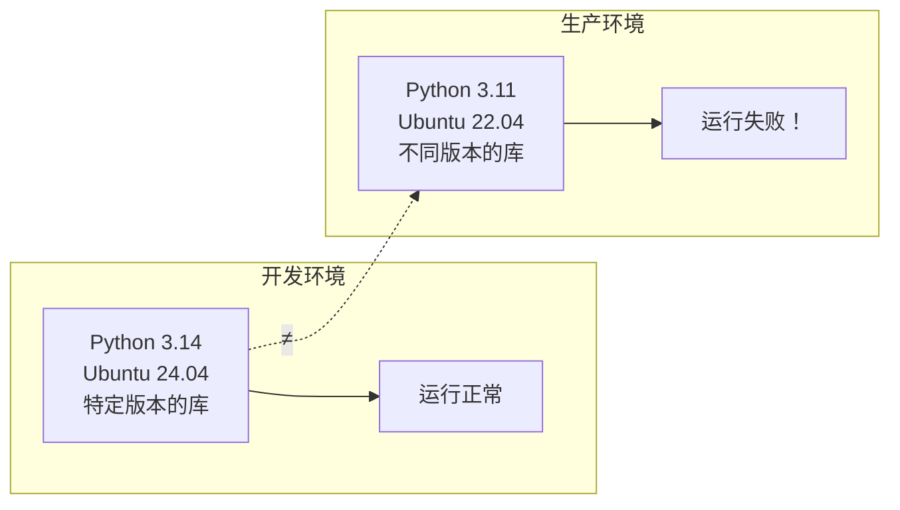
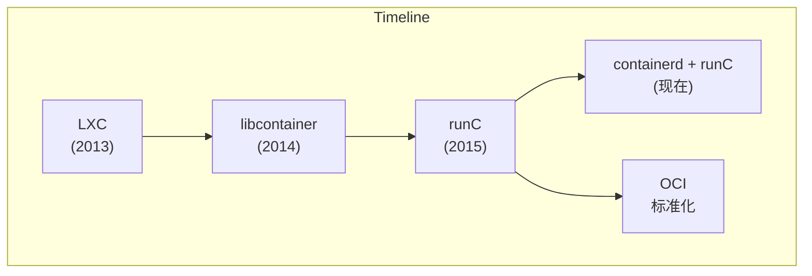
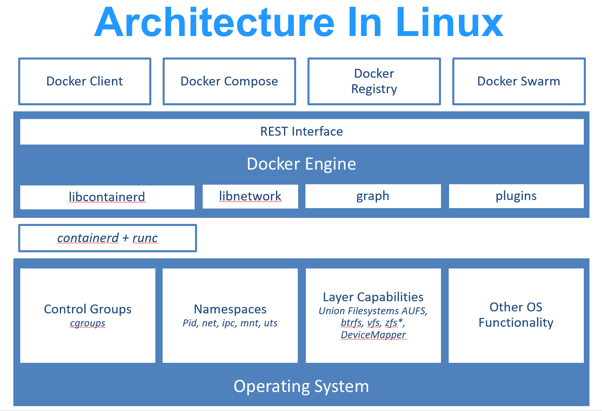

## 1.2 什么是 Docker

Docker 是彻底改变了软件开发和交付方式的革命性技术。本节将从核心概念、与传统虚拟机的对比、技术基础以及历史生态等多个维度，带你深入理解什么是 Docker。

### 1.2.1 一句话理解 Docker

> **Docker 是一种轻量级的虚拟化技术，它让应用程序及其依赖环境可以被打包成一个标准化的单元，在任何地方都能一致地运行。** 如果用一个生活中的类比：**Docker 之于软件，就像集装箱之于货物**。

在集装箱发明之前，货物的运输是一件麻烦的事情——不同的货物需要不同的包装、不同的装卸方式，换一种运输工具就要重新装卸。集装箱的出现改变了这一切：无论里面装的是什么，集装箱的外形是标准的，可以用同样的方式装卸、堆放和运输。

Docker 做的事情类似：无论你的应用是用 Python、Java、Node.js 还是其他语言写的，无论它需要什么样的依赖库和环境，一旦被打包成 Docker 镜像，就可以用同样的方式在任何支持 Docker 的机器上运行。

### 1.2.2 Docker 的核心价值

笔者认为，Docker 解决的是软件开发中最古老的问题之一：**“在我机器上明明能跑啊！”**



有了 Docker：

```mermaid
flowchart LR
    subgraph Dev ["开发环境"]
        direction TB
        A["Docker 镜像<br/>(包含所有依赖)"] --> B["运行正常"]
    end
    subgraph Prod ["生产环境"]
        direction TB
        C["同一个镜像<br/>(完全一致)"] --> D["运行正常！"]
    end
    A === "=" === C
```

### 1.2.3 Docker vs 虚拟机

很多人第一次接触 Docker 时会问：**“这不就是虚拟机吗？”** 答案是：**不是，而且差别很大。**

#### 传统虚拟机

传统虚拟机技术是虚拟出一套完整的硬件，在其上运行一个完整的操作系统，再在该系统上运行应用：


#### Docker 容器

而 Docker 容器内的应用直接运行于宿主的内核，容器内没有自己的内核，也没有进行硬件虚拟：


#### 关键区别

相关信息如下表：

| 特性 | Docker 容器 | 传统虚拟机 |
|------|-------------|------------|
| **启动速度** | 秒级 | 分钟级 |
| **资源占用** | MB 级别 | GB 级别 |
| **性能** | 接近原生 | 有明显损耗 |
| **隔离级别** | 进程级隔离 | 完全隔离 |
| **单机数量** | 可运行上千个 | 通常几十个 |

> 笔者经常用这个类比来解释：虚拟机像是每个应用都住在一栋独立的房子里 (有自己的地基、水电系统)，而容器像是大家住在同一栋公寓楼里的不同房间 (共享地基和水电系统，但各自独立)。

### 1.2.4 Docker 的技术基础

Docker 使用 [Go 语言](https://golang.google.cn/)开发，基于 Linux 内核的以下技术：

- **[Namespace](https://en.wikipedia.org/wiki/Linux_namespaces)**：实现资源隔离 (进程、网络、文件系统等)
- **[Cgroups](https://zh.wikipedia.org/wiki/Cgroups)**：实现资源限制 (CPU、内存、I/O 等)
- **[Union FS](https://en.wikipedia.org/wiki/Union_mount)**：实现分层存储 (如 OverlayFS)

> 如果你对这些底层技术感兴趣，可以阅读本书的[底层实现](../12_implementation/README.md)章节。

#### 概述

总体概述了以下内容。

#### Docker 架构演进

Docker 的底层实现经历了多次演进：



- **LXC** (2013)：Docker 最初基于 Linux Containers
- **libcontainer** (2014，v0.7)：Docker 自研的容器运行时
- **runC** (2015，v1.11)：捐献给 OCI 的标准容器运行时
- **containerd**：高级容器运行时，管理容器生命周期



> `runc` 是一个 Linux 命令行工具，用于根据 [OCI 容器运行时规范](https://github.com/opencontainers/runtime-spec)创建和运行容器。

> `containerd` 是一个守护程序，它管理容器生命周期，提供了在一个节点上执行容器和管理镜像的最小功能集。

### 1.2.5 Docker 的历史与生态

**Docker** 最初是 `dotCloud` 公司创始人 [Solomon Hykes](https://github.com/shykes) 在法国期间发起的一个公司内部项目，于 [2013 年 3 月以 Apache 2.0 授权协议开源](https://en.wikipedia.org/wiki/Docker_(software))。

Docker 的发展历程：

- **2013 年 3 月**：开源发布
- **2013 年底**：dotCloud 公司改名为 Docker，Inc。
- **2015 年**：成立[开放容器联盟 (OCI)](https://opencontainers.org/)，推动容器标准化
- **至今**：[GitHub 项目](https://github.com/moby/moby)超过 7 万星标

Docker 的成功推动了整个容器生态的发展，催生了 Kubernetes、Podman 等众多相关项目。笔者认为，Docker 最大的贡献不仅是技术本身，更是它 **让容器技术从系统管理员的工具变成了每个开发者都能使用的标准工具**。
