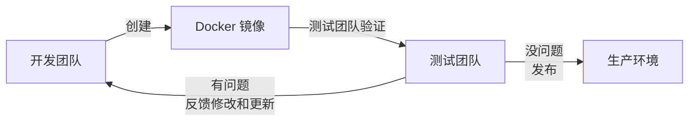
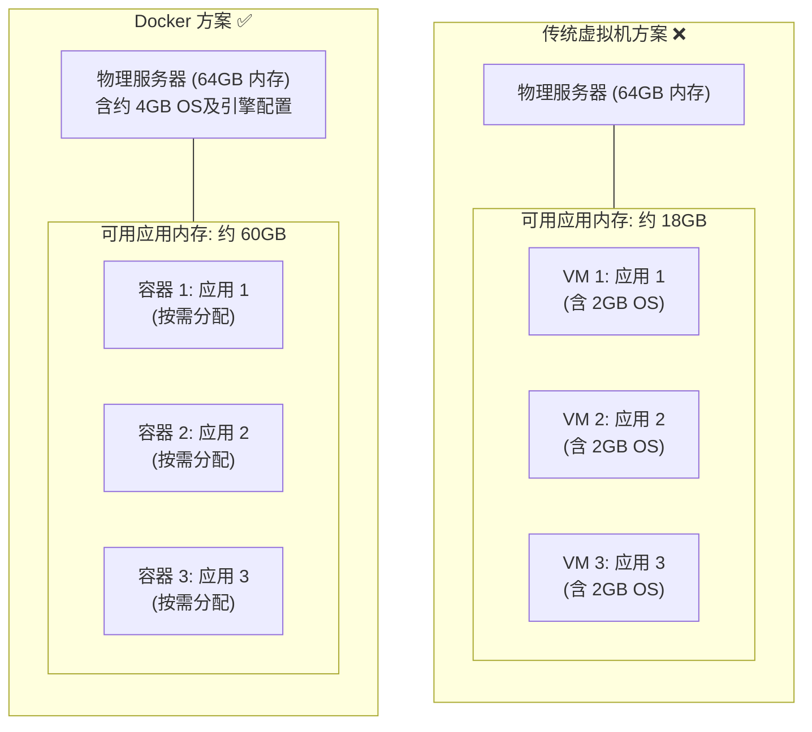
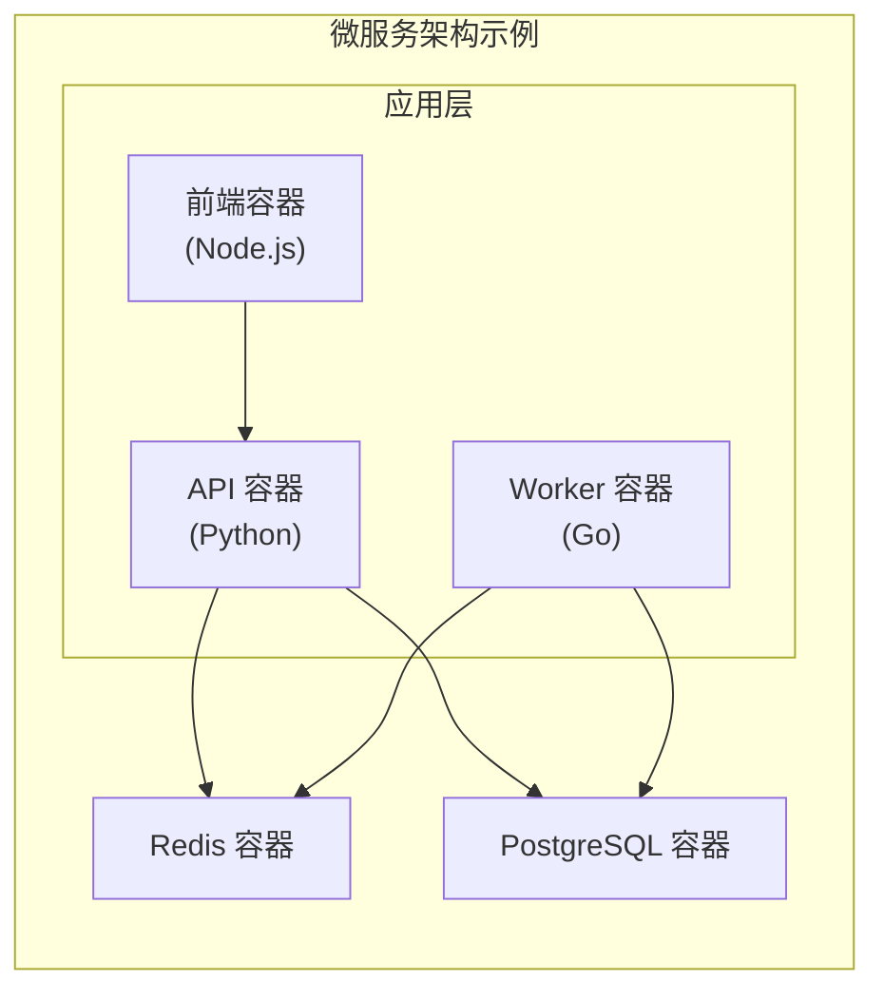

## 1.3 为什么要使用 Docker？

在回答 “为什么用 Docker” 之前，笔者想先问一个问题：**你有没有经历过这些场景？**

### 1.3.1 没有 Docker 的世界

在 Docker 出现之前，软件开发和运维面临着诸多棘手的问题。我们先来看看以下三个典型的痛点场景。

#### 场景一：“在我电脑上明明能跑”

```bash
周五下午 5:00
├── 开发者：代码写完了，本地测试通过，提交！🎉
├── 周一早上 9:00
│   └── 测试："这个功能在测试环境跑不起来"
└── 开发者：" 不可能，在我电脑上明明能跑啊……"
```

笔者统计过，这个问题通常由以下原因导致：

- Python/Node/Java 版本不一致
- 依赖库版本不一致
- 操作系统配置不一致
- 某些环境变量没有设置
- “哦，忘了说我本地装了个 XXX”

#### 场景二：环境配置的噩梦

```bash
新同事入职
├── Day 1：领电脑，配环境
├── Day 2：继续配环境，遇到问题
├── Day 3：换种方法配环境
├── Day 4：问老同事怎么配的，他也忘了
└── Day 5：终于能跑起来了！但不知道为什么……
```

#### 场景三：服务器迁移的恐惧

```bash
运维："我们需要把服务迁移到新服务器"
开发："旧服务器上的配置文档在哪？"
运维："当时是一个已经离职的同事配的……"
所有人：😱
```

### 1.3.2 Docker 如何解决这些问题

Docker 的出现为上述问题提供了完美的解决方案。它通过 “一次构建，到处运行” 的核心理念，从根本上改变了软件交付的方式。

#### 核心理念：一次构建，到处运行



### 1.3.3 Docker 的核心优势

除了解决上述痛点，Docker 还拥有诸多显著的技术优势，包括环境一致性、秒级启动、高效的资源利用等。

#### 1. 环境一致性

Docker 镜像包含了应用运行所需的 **一切**：代码、运行时、系统工具、库、配置。这意味着：

- ✅ 开发环境和生产环境完全一致
- ✅ 不会再有 “在我机器上能跑” 的问题
- ✅ 新人入职，一条命令就能启动开发环境

```bash
## 新同事入职第一天

$ git clone https://github.com/company/project.git
$ docker compose up
## 完整的开发环境就准备好了

...
```

#### 2. 秒级启动

传统虚拟机启动需要几分钟 (引导操作系统)，而 Docker 容器启动通常只需要 **几秒甚至几百毫秒**。

笔者实测数据：

| 启动内容 | 虚拟机 | Docker 容器 |
|---------|--------|-------------|
| 空系统 | ~60 秒 | ~0.5 秒 |
| MySQL | ~90 秒 | ~3 秒 |
| 完整 Web 应用 | ~120 秒 | ~5 秒 |

这个差异对以下场景尤为重要：

- **CI/CD 流水线**：每次构建节省几分钟，一天累积下来就是几小时
- **弹性扩容**：流量高峰时能快速启动更多实例
- **开发体验**：快速重启服务进行调试

#### 3. 资源效率

Docker 容器共享宿主机内核，无需为每个应用运行完整的操作系统。以一台 64GB 内存的物理服务器为例：
- **传统虚拟机方案**：每个虚拟机都需要运行完整的操作系统（每个额外占用如 2GB 内存），产生大量资源开销，实际可用于应用的内存可能只有约 18GB。
- **Docker 方案**：容器直接共享宿主机系统，只需付出很少的基础开销（OS及引擎约 4GB），即可将约 60GB 的内存全部用于实际应用。



#### 4. 持续交付和部署

Docker 完美契合 DevOps 的工作流程：


使用 [Dockerfile](../04_image/4.5_build.md) 定义镜像构建过程，使得：

- 构建过程 **可重复、可追溯**
- 任何人都能从代码重建完全相同的镜像
- 配合 [GitHub Actions](../21_case_devops/21.2_github_actions.md) 等 CI 系统实现自动化

#### 5. 轻松迁移

Docker 可以在几乎任何平台上运行：

- ✅ 本地开发机 (macOS、Windows、Linux)
- ✅ 公有云 (AWS、Azure、GCP、阿里云、腾讯云)
- ✅ 私有云和自建数据中心
- ✅ 边缘设备和 IoT

**同一个镜像，在任何地方运行结果都一致。** 这让应用迁移变得前所未有的简单。

#### 6. 微服务架构的基石

现代微服务架构几乎都依赖容器技术。Docker 让你可以：

- **隔离服务**：每个服务运行在独立容器中，互不干扰
- **独立扩展**：哪个服务负载高，就单独扩展哪个
- **独立部署**：更新一个服务不影响其他服务
- **技术多样**：不同服务可以用不同语言和框架



### 1.3.4 Docker 不适合的场景

笔者认为，技术选型要客观。Docker 并非银弹，以下场景可能不太适合：

- **需要完全隔离的场景**：容器共享宿主机内核，隔离性不如虚拟机。如果需要运行不受信任的代码，虚拟机可能更安全。
- **需要特殊内核的场景**：容器使用宿主机内核。如果应用需要特定版本的内核或内核模块，可能需要虚拟机。
- **Windows 原生应用**：虽然 Docker 支持 Windows 容器，但生态不如 Linux 容器成熟。传统 Windows 应用的容器化仍有挑战。
- **桌面应用**：Docker 主要面向服务端应用。桌面 GUI 应用的容器化虽然可行，但通常得不偿失。

### 1.3.5 与传统虚拟机的对比总结

下表对比了容器技术与传统虚拟机的区别：

| 特性 | Docker 容器 | 传统虚拟机 |
|:------|:-----------|:-----------|
| 启动速度 | 秒级 | 分钟级 |
| 磁盘占用 | MB 级别 | GB 级别 |
| 性能 | 接近原生 | 有 5-20% 损耗 |
| 单机支持量 | 上千个容器 | 几十个虚拟机 |
| 隔离性 | 进程级别 | 完全隔离 |
| 最佳场景 | 微服务、CI/CD、开发环境 | 多租户、高安全需求 |
