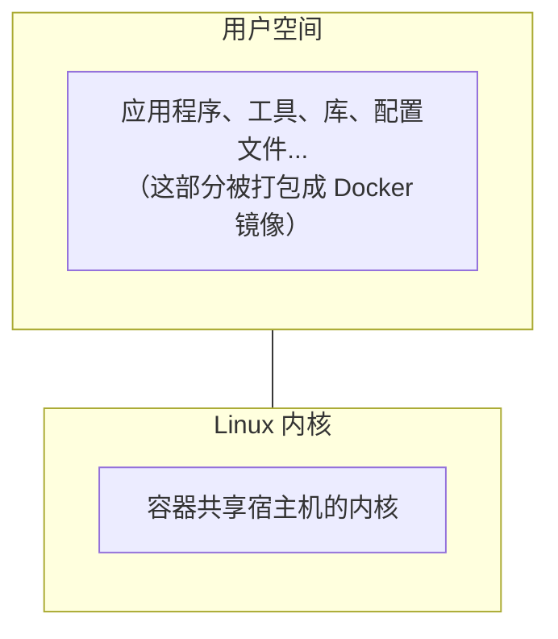
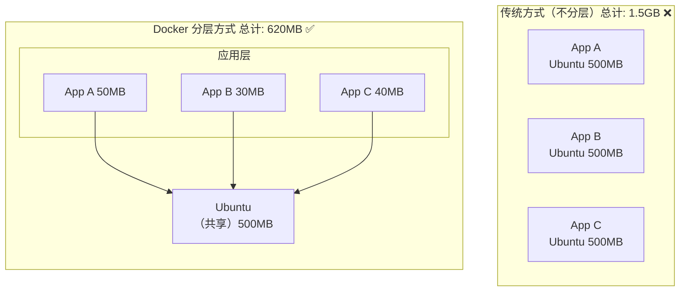
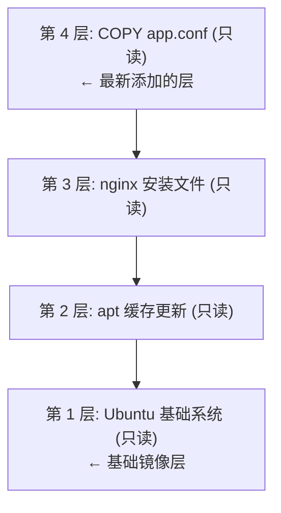

## 2.1 镜像

Docker 镜像作为容器运行的基石，其设计理念和实现机制至关重要。本节将深入探讨镜像的本质、与操作系统的关系、内容构成以及核心的分层存储机制。

### 2.1.1 一句话理解镜像

> **Docker 镜像是一个只读的模板，包含了运行应用所需的一切：代码、运行时、库、环境变量和配置文件。** 如果用一个类比：**镜像就像是一张光盘或 ISO 文件**。你可以用同一张光盘在不同电脑上安装系统，而光盘本身不会被修改。同样，一个镜像可以创建多个容器，而镜像本身保持不变。

### 2.1.2 镜像与操作系统的关系

我们都知道，操作系统分为 **内核** 和 **用户空间**：



对于 Linux 而言，内核启动后会挂载 `root` 文件系统来提供用户空间支持。**Docker 镜像** 本质上就是一个 `root` 文件系统。

例如，官方镜像 `ubuntu:24.04` 包含了一套完整的 Ubuntu 24.04 最小系统的 root 文件系统——但 **不包含 Linux 内核** (因为容器共享宿主机的内核)。

### 2.1.3 镜像包含什么？

Docker 镜像是一个特殊的文件系统，包含：

| 内容类型 | 示例 |
|---------|------|
| **程序文件** | 应用二进制文件、Python/Node 解释器 |
| **库文件** | libc、OpenSSL、各种依赖库 |
| **配置文件** | nginx.conf、my.cnf 等 |
| **环境变量** | PATH、LANG 等预设值 |
| **元数据** | 启动命令、暴露端口、数据卷定义 |

**关键特性**：
- ✅ 镜像是 **只读** 的
- ✅ 镜像 **不包含** 动态数据
- ✅ 镜像构建后 **内容不会改变**

### 2.1.4 分层存储：镜像的核心设计

镜像的分层存储机制是 Docker 最具创新性的特性之一。通过 Union FS 技术，Docker 能够高效地构建和管理镜像。

#### 为什么需要分层？

笔者认为，分层存储是 Docker 最巧妙的设计之一。

假设你有三个应用，都基于 Ubuntu 运行：



#### 分层是如何工作的？

笔者用一个实际的 Dockerfile 来解释分层：

```docker
FROM ubuntu:24.04          # 第 1 层：基础系统（约 78MB）
RUN apt-get update         # 第 2 层：更新包索引
RUN apt-get install nginx  # 第 3 层：安装 nginx
COPY app.conf /etc/nginx/  # 第 4 层：复制配置文件
```

构建后的镜像结构：



每一层的特点：

- **只读**：构建完成后不可修改
- **可共享**：多个镜像可以共享相同的层
- **有缓存**：未变化的层不会重新构建

#### 分层存储的 “陷阱”

> ⚠️ **笔者特别提醒**：理解这一点可以帮你避免构建出臃肿的镜像。**关键原理**：每一层的文件变化会被记录，但 **删除操作只是标记，不会真正减小镜像体积**。

```docker
## 错误示范 ❌

FROM ubuntu:24.04
RUN apt-get update
RUN apt-get install -y build-essential  # 安装编译工具（约 200MB）
RUN make && make install                  # 编译应用
RUN apt-get remove build-essential        # 试图删除编译工具
## 结果：镜像仍然包含 200MB 的编译工具！

```

```docker
## 正确做法 ✅

FROM ubuntu:24.04
RUN apt-get update && \
    apt-get install -y build-essential && \
    make && make install && \
    apt-get remove -y build-essential && \
    apt-get autoremove -y && \
    rm -rf /var/lib/apt/lists/*
## 在同一层完成安装、使用、清理

```

#### 查看镜像的分层

```bash
## 查看镜像的历史（每层的构建记录）

$ docker history nginx:latest

IMAGE          CREATED       CREATED BY                                      SIZE
a6bd71f48f68   2 weeks ago   CMD ["nginx" "-g" "daemon off;"]                0B
<missing>      2 weeks ago   STOPSIGNAL SIGQUIT                              0B
<missing>      2 weeks ago   EXPOSE map[80/tcp:{}]                           0B
<missing>      2 weeks ago   ENTRYPOINT ["/docker-entrypoint.sh"]            0B
<missing>      2 weeks ago   COPY 30-tune-worker-processes.sh /docker-ent…   4.62kB
...
```

### 2.1.5 镜像的标识

Docker 镜像有多种标识方式：

#### 1. 镜像名称和标签

格式：`[仓库地址/]仓库名[:标签]`

```bash
## 完整格式

registry.example.com/myproject/myapp:v1.2.3

## 简写（使用 Docker Hub）

nginx:1.25
ubuntu:24.04

## 省略标签（默认使用 latest）

nginx  # 等同于 nginx:latest
```

#### 2. 镜像 ID (Content-Addressable)

每个镜像有一个基于内容计算的唯一 ID：

```bash
$ docker images
REPOSITORY   TAG       IMAGE ID       CREATED        SIZE
nginx        latest    a6bd71f48f68   2 weeks ago    187MB
ubuntu       24.04     ca2b0f26964c   3 weeks ago    78.1MB
```

#### 3. 镜像摘要

更精确的标识，基于镜像内容的 SHA256 哈希：

```bash
$ docker images --digests
REPOSITORY  TAG     DIGEST                                                                    IMAGE ID
nginx       latest  sha256:6db391d1c0cfb30588ba0bf72ea999404f2764184d8b8d10d89e8a9c6... a6bd71f48f68
```

> 💡 笔者建议：在生产环境使用镜像摘要而非标签，因为标签可以被覆盖，但摘要是不可变的。

### 2.1.6 镜像的来源

Docker 镜像可以通过以下方式获取：

| 方式 | 说明 | 示例 |
|------|------|------|
| **从 Registry 拉取** | 最常用的方式 | `docker pull nginx` |
| **从 Dockerfile 构建** | 自定义镜像 | `docker build -t myapp .` |
| **从容器提交** | 保存容器状态 (不推荐)| `docker commit` |
| **从文件导入** | 离线传输 | `docker load < image.tar` |
