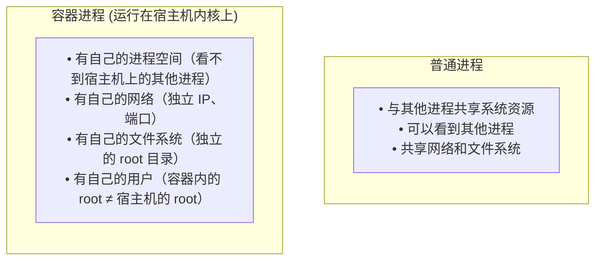
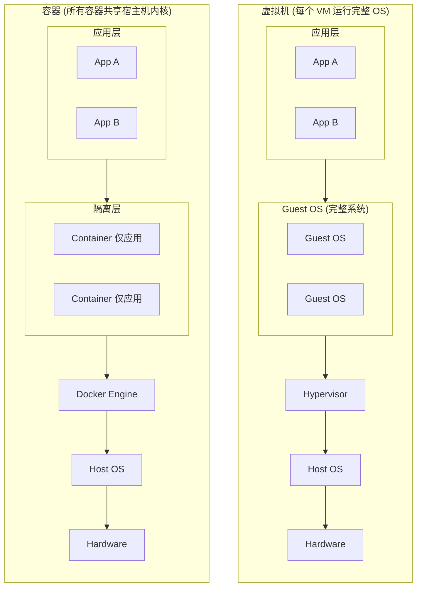
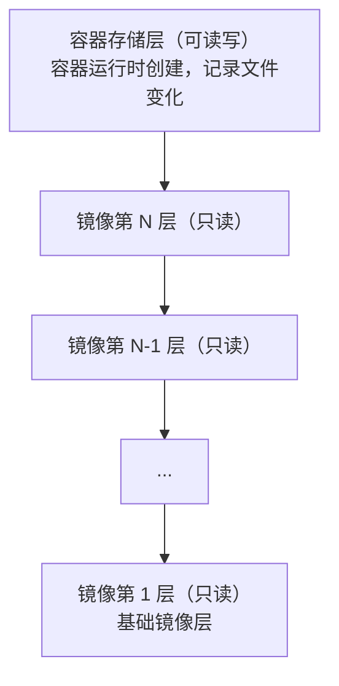
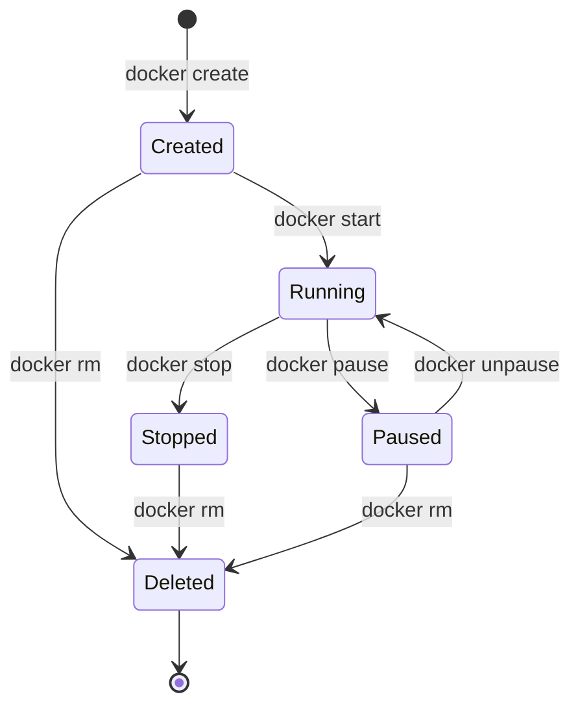

## 2.2 Docker 容器

容器是 Docker 技术的核心，是应用实际运行的载体。本节将从容器的本质、与虚拟机的区别、存储层机制以及生命周期管理等方面，全面解析 Docker 容器。

### 一句话理解容器

> **容器是镜像的运行实例。如果把镜像比作程序，那么容器就是进程。** 用面向对象编程的术语来说：**镜像是类 (Class)，容器是对象 (Instance)**。

- 一个镜像可以创建多个容器
- 每个容器相互独立，互不影响
- 容器可以被创建、启动、停止、删除、暂停

### 容器的本质

> 💡 **笔者认为，理解这一点是理解 Docker 的关键****容器的本质是一个特殊的进程。**



这种隔离是通过 Linux 内核的 **Namespace** 技术实现的。

### 容器 vs 虚拟机：核心区别

很多初学者会混淆容器和虚拟机。笔者用一张图来说明：



| 特性 | 容器 | 虚拟机 |
|------|------|--------|
| **隔离级别** | 进程级 (Namespace)| 硬件级 (Hypervisor)|
| **启动时间** | 秒级 (甚至毫秒)| 分钟级 |
| **资源占用** | MB 级别 | GB 级别 |
| **性能损耗** | 几乎为零 | 5-20% |
| **内核** | 共享宿主机内核 | 各自独立内核 |

### 容器的存储层

理解容器的存储层机制对于数据的持久化和镜像的优化至关重要。本节将介绍容器的可写层以及 Copy-on-Write 机制。

#### 镜像层 + 容器层

当容器运行时，Docker 会在镜像的只读层之上创建一个 **可写层** (容器存储层)：



#### Copy-on-Write (写时复制)

当容器需要修改镜像层中的文件时：

1. Docker 将该文件 **复制** 到容器存储层
2. 在容器层中进行修改
3. 原始镜像层保持不变

```bash
读取文件：直接从镜像层读取（共享，高效）
修改文件：复制到容器层，然后修改（只有这个容器能看到修改）
```

#### ⚠️ 容器存储层的生命周期

> **笔者特别强调**：这是新手最容易踩的坑！**容器存储层与容器生命周期绑定。容器删除，数据就没了！**

```bash
## 创建容器，写入数据

$ docker run -it ubuntu bash
root@abc123:/# echo "important data" > /data.txt
root@abc123:/# exit

## 删除容器

$ docker rm abc123

## 数据丢了！没有任何办法恢复！

```

#### 正确的数据持久化方式

按照 Docker 最佳实践，容器存储层应该保持 **无状态**。需要持久化的数据应该使用：

| 方式 | 说明 | 适用场景 |
|------|------|---------|
| **[数据卷 (Volume) ](../08_data_network/data/volume.md)** | Docker 管理的存储 | 数据库、应用数据 |
| **[绑定挂载 (Bind Mount) ](../08_data_network/data/bind-mounts.md)** | 挂载宿主机目录 | 开发时共享代码 |

```bash
## 使用数据卷（推荐）

$ docker run -v mydata:/var/lib/mysql mysql

## 使用绑定挂载

$ docker run -v /host/path:/container/path nginx
```

这些位置的读写 **会跳过容器存储层**，直接写入宿主机，性能更好，也不会随容器删除而丢失。

### 容器的生命周期

掌握容器的生命周期对于管理和调试 Docker 应用非常重要。如图 2-1 所示，容器会经历从创建到删除的完整状态流转。



图 2-1 容器生命周期状态流转图

#### 概述

总体概述了以下内容。

#### 常用生命周期命令

运行以下命令：

```bash
## 创建并启动容器（最常用）

$ docker run nginx

## 分步操作

$ docker create nginx    # 创建容器（不启动）
$ docker start abc123    # 启动容器

## 停止容器

$ docker stop abc123     # 优雅停止（发送 SIGTERM，等待后发送 SIGKILL）
$ docker kill abc123     # 强制停止（直接发送 SIGKILL）

## 暂停/恢复（不常用，但有时有用）

$ docker pause abc123    # 暂停容器内所有进程
$ docker unpause abc123  # 恢复

## 删除容器

$ docker rm abc123       # 删除已停止的容器
$ docker rm -f abc123    # 强制删除运行中的容器
```

### 容器与进程的关系

> **核心概念**：容器的生命周期 = 主进程 (PID 1) 的生命周期

```bash
## 主进程运行，容器运行

## 主进程退出，容器停止

```

这就是为什么：

```bash
## 这个容器会立即退出（bash 没有输入就退出了）

$ docker run ubuntu

## 这个容器会持续运行（nginx 作为守护进程持续运行）

$ docker run nginx
```

详细解释请参考[后台运行](../05_container/5.2_daemon.md)章节。

### 容器的隔离性

Docker 容器通过以下 Namespace 实现隔离：

| Namespace | 隔离内容 | 效果 |
|-----------|---------|------|
| **PID** | 进程 ID | 容器内 PID 1 是应用进程，看不到宿主机其他进程 |
| **NET** | 网络 | 独立的网络栈、IP 地址、端口 |
| **MNT** | 文件系统 | 独立的根目录和挂载点 |
| **UTS** | 主机名 | 独立的主机名和域名 |
| **IPC** | 进程间通信 | 独立的信号量、消息队列 |
| **USER** | 用户 | 独立的用户和组 ID |

> 想深入了解？请阅读[底层实现 - 命名空间](../11_implementation/18.2_namespace.md)。
