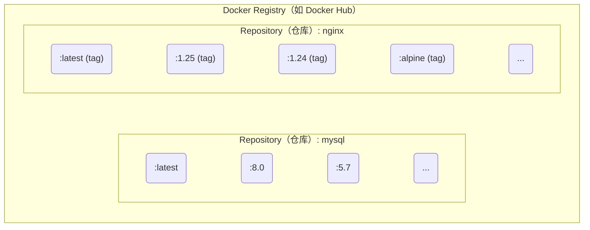

## 2.3 Docker Registry

Docker Registry 是镜像分发和管理的核心组件。本节将介绍 Registry 的基本概念、公共和私有服务的选择，以及镜像的安全管理。

### 2.3.1 一句话理解 Registry

> **Docker Registry 是存储和分发 Docker 镜像的服务，类似于代码的 GitHub 或包管理的 npm。**

镜像构建完成后，可以在当前机器上运行。但如果需要在其他服务器上使用这个镜像，就需要一个集中的存储和分发服务——这就是 Docker Registry。

### 2.3.2 核心概念

要熟练使用 Docker Registry，首先需要理清它与仓库 (Repository)、标签 (Tag) 之间的关系。

#### Registry、仓库、标签的关系

Docker Registry 中可以包含多个 Repository，每个 Repository 可以包含多个 Tag。如图 2-2 所示，它们之间具有清晰的层级关系。



图 2-2 Registry、Repository 与 Tag 的层级关系

相关基本概念具体如下：

| 概念 | 说明 | 示例 |
|------|------|------|
| **Registry** | 存储镜像的服务 | Docker Hub、ghcr.io |
| **Repository (仓库)** | 同一软件的镜像集合 | `nginx`、`mysql`、`mycompany/myapp` |
| **Tag (标签)** | 仓库内的版本标识 | `latest`、`1.25`、`alpine` |

#### 镜像的完整名称

一个完整的 Docker 镜像名称由 Registry 地址、用户名/组织名、仓库名和标签组成。了解其结构有助于我们更准确地定位镜像。基本格式如下：

```bash
[registry地址/][用户名/]仓库名[:标签]
```

示例：

```bash
## 完整格式

registry.example.com/mycompany/myapp:v1.2.3
│                    │         │     │
│                    │         │     └── 标签
│                    │         └── 仓库名
│                    └── 用户名/组织名
└── Registry 地址

## Docker Hub 官方镜像（省略 registry 和用户名）

nginx:1.25
ubuntu:24.04

## Docker Hub 用户镜像

jwilder/nginx-proxy:latest

## 其他 Registry

ghcr.io/username/myapp:v1.0
gcr.io/google-containers/pause:3.6
```

> 💡 **笔者提示**：如果不指定 Registry 地址，默认使用 Docker Hub。如果不指定标签，默认使用 `latest`。

### 2.3.3 公共 Registry 服务

公共 Registry 服务为开发者提供了便捷的镜像获取途径。其中最著名的是 Docker Hub。

#### 默认的 Docker Hub

[Docker Hub](https://hub.docker.com/) 是最大的公共 Registry，也是 Docker 的默认 Registry。

**特点**：

- 拥有大量[官方镜像](https://hub.docker.com/search?q=&type=image&image_filter=official) (nginx、mysql、redis 等)
- 免费账户可以创建公开仓库
- 付费账户支持私有仓库

```bash
## 从 Docker Hub 拉取镜像

$ docker pull nginx              # 官方镜像
$ docker pull bitnami/redis      # 第三方镜像

## 推送镜像到 Docker Hub

$ docker login
$ docker push username/myapp:v1.0
```

#### 其他公共 Registry

除了 Docker Hub，还有以下几个常见的公共 Registry：

| Registry | 地址 | 说明 |
|----------|------|------|
| **GitHub Container Registry** | ghcr.io | GitHub 提供，与 GitHub Actions 集成好 |
| **Google Container Registry** | gcr.io | Google Cloud 提供，Kubernetes 镜像常用 |
| **Quay.io** | quay.io | Red Hat 提供 |
| **阿里云容器镜像服务** | registry.cn-*.aliyuncs.com | 国内访问快 |
| **腾讯云容器镜像服务** | ccr.ccs.tencentyun.com | 国内访问快 |

### 2.3.4 镜像加速器

由于网络原因，在国内直接访问 Docker Hub 可能会很慢。可以配置 **镜像加速器** (Registry Mirror) 来加速下载。配置示例如下：

```json
// /etc/docker/daemon.json
{
  "registry-mirrors": [
    "https://your-accelerator-url"
  ]
}
```

详细配置方法请参考[镜像加速器](../03_install/3.9_mirror.md)章节。

> ⚠️ **笔者提醒**：镜像加速器的可用性经常变化，使用前建议先测试是否可用。

### 2.3.5 私有 Registry

出于安全和隐私的考虑，企业往往需要搭建自己的私有 Registry。以下是几种常见的搭建方案。

#### 官方 Registry 镜像

Docker 官方提供了 [registry](https://hub.docker.com/_/registry/) 镜像，可以快速搭建私有 Registry：

```bash
## 启动一个本地 Registry

$ docker run -d -p 5000:5000 --name registry registry:2

## 推送镜像到本地 Registry

$ docker tag myapp:v1.0 localhost:5000/myapp:v1.0
$ docker push localhost:5000/myapp:v1.0

## 从本地 Registry 拉取

$ docker pull localhost:5000/myapp:v1.0
```

#### 企业级解决方案

官方 Registry 功能较为基础，企业环境常用以下方案：

| 方案 | 特点 |
|------|------|
| **[Harbor](https://goharbor.io/)** | CNCF 项目，功能全面 (用户管理、漏洞扫描、镜像签名)|
| **[Nexus Repository](../06_repository/6.4_nexus3_registry.md)** | 支持多种制品类型 (Docker、Maven、npm 等)|
| **云厂商服务** | 阿里云 ACR、腾讯云 TCR、AWS ECR 等 |

笔者建议：

- 小团队：可以先用官方 Registry，够用即可
- 中大型团队：推荐 Harbor，功能完善且开源免费
- 已使用云服务：直接用云厂商的 Registry 服务更省心

### 2.3.6 镜像的推送和拉取

掌握镜像的推送 (Push) 和拉取 (Pull) 是使用 Docker Registry 的基本功。

#### 完整工作流程

如图 2-3 所示，镜像从开发环境构建后推送到 Registry，再由生产环境拉取并运行。

```bash
开发者机器                    Registry                    生产服务器
     │                           │                             │
     │  docker build             │                             │
     │  构建镜像                  │                             │
     │                           │                             │
     │  docker push ─────────────▶                             │
     │  推送镜像                  │  存储镜像                   │
     │                           │                             │
     │                           │  ◀───────────── docker pull │
     │                           │                  拉取镜像    │
     │                           │                             │
     │                           │                  docker run │
     │                           │                  运行容器    │
```

图 2-3 镜像构建、推送与拉取流程

#### 常用命令

```bash
## 登录 Registry

$ docker login                      # 登录 Docker Hub
$ docker login registry.example.com # 登录其他 Registry

## 拉取镜像

$ docker pull nginx:1.25

## 标记镜像（准备推送）

$ docker tag myapp:latest registry.example.com/myteam/myapp:v1.0

## 推送镜像

$ docker push registry.example.com/myteam/myapp:v1.0

## 登出

$ docker logout
```

### 2.3.7 镜像的安全性

在使用公共镜像或维护私有镜像时，安全性是不容忽视的重要环节。

#### 使用官方镜像

Docker Hub 的[官方镜像](https://hub.docker.com/search?q=&type=image&image_filter=official) (标有 “Official Image” 标识) 经过 Docker 团队审核，相对更安全。示例如下：

```bash
## 官方镜像示例

nginx          # ✅ 官方
mysql          # ✅ 官方
redis          # ✅ 官方

## 第三方镜像（需要自行评估可信度）

bitnami/redis  # ⚠️ 需要评估
someuser/myapp # ⚠️ 需要评估
```

#### 镜像签名

当前更推荐使用 Sigstore / Notation 体系进行镜像签名与验证。`Docker Content Trust (DCT)` 已进入退场阶段，不建议作为新项目主方案。

> 注意：Cosign 默认会把签名写回镜像所在仓库，请使用你有推送权限的镜像地址。

```bash
## 准备一个你有写权限的镜像地址
$ export IMAGE=<你的仓库名>/nginx:1.27
$ docker pull nginx:1.27
$ docker tag nginx:1.27 $IMAGE
$ docker push $IMAGE

## 生成签名密钥（会生成 cosign.key / cosign.pub）
$ cosign generate-key-pair

## 使用 Cosign 签名与验证
$ cosign sign --key cosign.key $IMAGE
$ cosign verify --key cosign.pub $IMAGE
```

#### 漏洞扫描

```bash
## 使用 Docker Scout 扫描镜像漏洞

$ docker scout cves nginx:latest

## 使用 Trivy（开源工具）

$ trivy image nginx:latest
```
