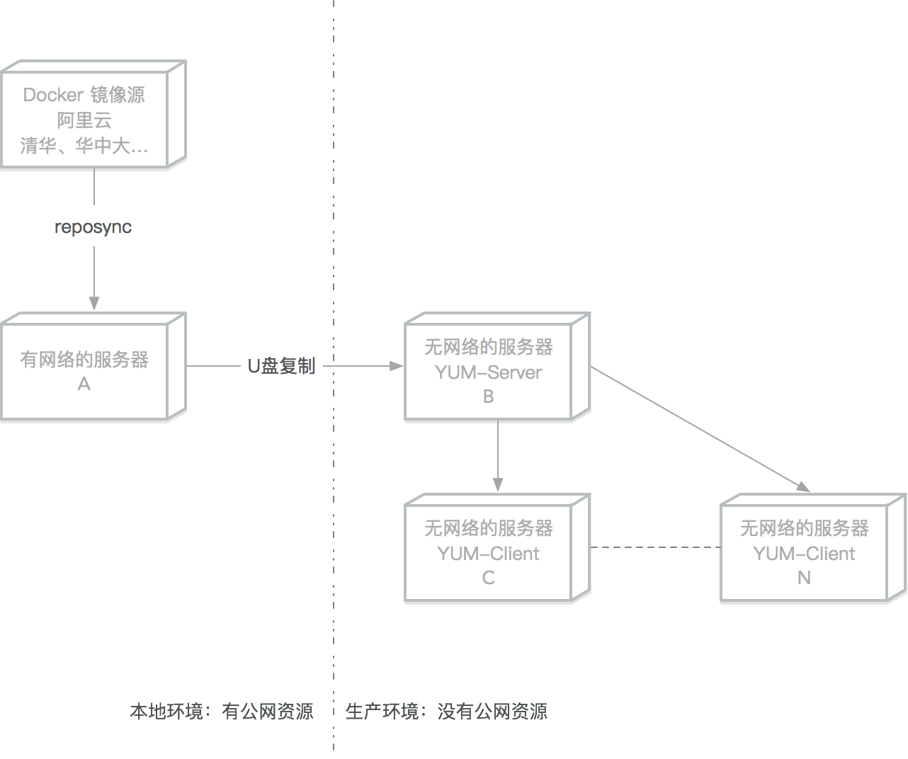

## 3.6 Linux 离线安装

生产环境中一般都是没有公网资源的，本文介绍如何在生产服务器上离线部署 `Docker`

括号内的字母表示该操作需要在哪些服务器上执行



### 3.6.1 CentOS/Rocky/AlmaLinux 离线安装 Docker

在无法连接外网的安全环境中，离线安装是唯一的选择。本节介绍如何在 RHEL 系发行版中进行离线安装。

> 注意：Docker 官方当前支持的 RHEL 兼容平台基线已是 **CentOS Stream 9/10**。下面的离线示例建议统一按 `el9` 软件包和 `dnf` 流程准备，Rocky Linux 9、AlmaLinux 9 也可先在测试环境按相同思路验证。

### 3.6.1.1 本地 RPM 文件安装：推荐

推荐这种方式，是因为在生产环境中一般会选定某个指定的 Docker 软件版本使用。

#### 查询可用的软件版本

```bash
$ sudo dnf -y install dnf-plugins-core
$ sudo dnf config-manager --add-repo https://download.docker.com/linux/rhel/docker-ce.repo
$ sudo dnf list docker-ce --showduplicates | sort -r
```
```bash
docker-ce.x86_64            3:29.4.0-1.el9                      docker-ce-stable
docker-ce.x86_64            3:29.3.1-1.el9                      docker-ce-stable
docker-ce.x86_64            3:29.3.0-1.el9                      docker-ce-stable
```

#### 下载到指定文件夹

```bash
sudo dnf install --downloadonly --downloaddir=/tmp/docker_offline_install/ \
  docker-ce-<VERSION_STRING> \
  docker-ce-cli-<VERSION_STRING> \
  containerd.io \
  docker-buildx-plugin \
  docker-compose-plugin
```

下载完成后，把 `/tmp/docker_offline_install/` 目录中的全部 RPM 文件复制到离线目标服务器。

#### 在目标服务器进入文件夹后安装

* 离线安装时，不要使用 `rpm --nodeps --force` 跳过依赖检查；应先把完整依赖包集复制到目标服务器，再让 `dnf` 从本地 RPM 安装。

```bash
$ sudo dnf install ./*.rpm
```

#### 锁定软件版本（可选）

**下载锁定版本软件**

可参考下文的网络源搭建

```bash
$ sudo dnf install 'dnf-command(versionlock)'
```
**锁定软件版本**

```bash
$ sudo dnf versionlock add docker-ce docker-ce-cli containerd.io docker-buildx-plugin docker-compose-plugin
```
**查看锁定列表**

```bash
$ sudo dnf versionlock list
```
**锁定后无法再更新**

```bash
$ sudo dnf upgrade docker-ce
```
**解锁指定软件**

```bash
$ sudo dnf versionlock delete docker-ce docker-ce-cli containerd.io docker-buildx-plugin docker-compose-plugin
```
**解锁所有软件**

```bash
$ sudo dnf versionlock clear
```

#### 3.6.1.2 本地仓库服务器搭建安装 Docker

##### 挂载 ISO 镜像搭建本地 File 源

```bash
## 删除其他网络源

$ sudo rm -f /etc/yum.repos.d/*

## 挂载光盘或者iso镜像

$ sudo mount /dev/cdrom /mnt
```
```bash
## 添加本地源

$ sudo tee /etc/yum.repos.d/local-base.repo <<EOF
[local_base]
name=local_base
baseurl=file:///mnt
enabled=1
gpgcheck=0
EOF
```
```bash
## 测试刚才的本地源,安装createrepo软件

$ sudo dnf clean all
$ sudo dnf install -y createrepo_c httpd
```

##### 根据本地文件搭建 BaseOS/AppStream 网络源

```bash
## 安装apache 服务器

## 新建centos目录

$ sudo mkdir -p /var/www/html/base

## 复制光盘内的文件到刚才新建的目录

$ sudo cp -R /mnt/* /var/www/html/base/
$ sudo createrepo_c /var/www/html/base/
$ sudo systemctl enable --now httpd
```

##### 下载 Docker CE 仓库内容

在有网络的服务器上同步 Docker CE RPM 包：

```bash
$ sudo dnf -y install dnf-plugins-core
$ sudo dnf config-manager --add-repo https://download.docker.com/linux/rhel/docker-ce.repo
$ mkdir -p /tmp/docker-ce
$ sudo dnf reposync --repo=docker-ce-stable --download-path=/tmp/docker-ce
```

##### 创建仓库索引

把下载的 docker-ce 文件夹复制到离线的服务器

```bash
## 把 docker-ce 文件夹复制到 /var/www/html/docker-ce

$ sudo createrepo_c /var/www/html/docker-ce/
```

##### DNF 客户端设置

```bash
$ sudo rm -f /etc/yum.repos.d/*
$ sudo tee /etc/yum.repos.d/local-files.repo <<EOF
[local_base]
name=local_base

## 改成仓库服务器地址

baseurl=http://x.x.x.x/base
enabled=1
gpgcheck=0
proxy=_none_
[docker-ce-stable]
name=docker-ce-stable

## 改成仓库服务器地址

baseurl=http://x.x.x.x/docker-ce
enabled=1
gpgcheck=0
proxy=_none_
EOF

```

##### 安装 Docker

```bash
$ sudo dnf makecache
$ sudo dnf install docker-ce docker-ce-cli containerd.io docker-buildx-plugin docker-compose-plugin
$ sudo systemctl enable --now docker
$ sudo docker run hello-world
```
