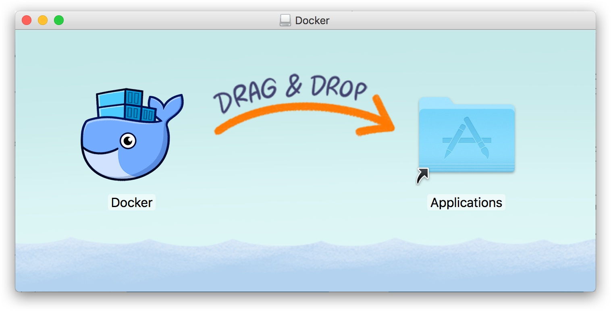
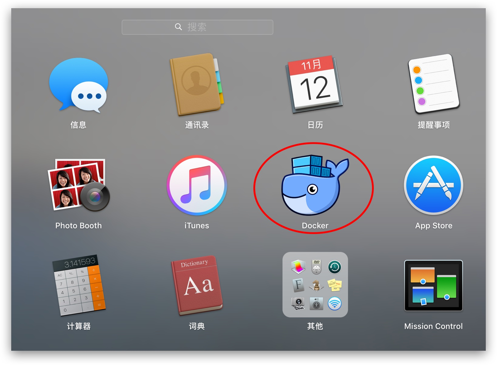
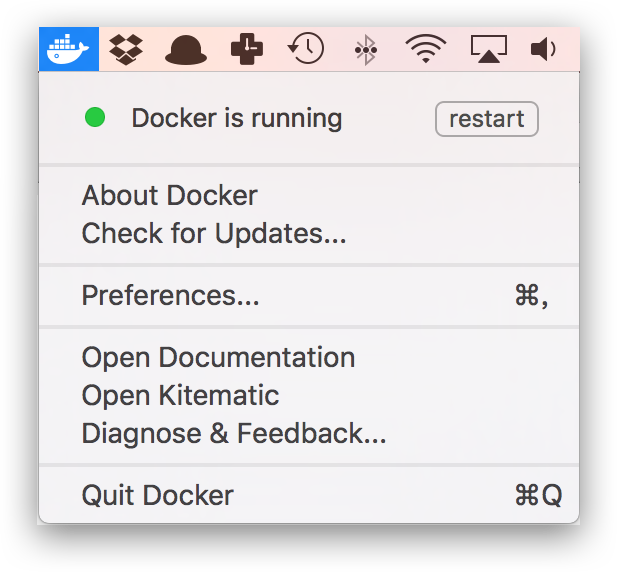
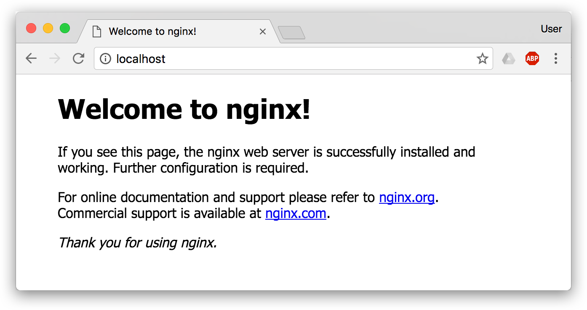

## 3.7 macOS

### Mac 用户的特殊考虑

macOS 上没有原生 Linux 内核，Docker 需要运行在一个轻量级虚拟机中。Docker Desktop 完全封装了这个复杂性，让 Mac 用户可以像 Linux 用户一样使用 Docker。但有几点需要特别了解：

**性能特性**：

- Apple Silicon（M 系列芯片）比 Intel Mac 的性能更好，且拥有原生支持
- 文件 I/O 性能：macOS 与容器之间的卷挂载性能不如 Linux（这是虚拟化的代价）
- 内存使用：Docker Desktop 本身会消耗一定内存用于虚拟机管理

**许可考虑**：

- 小型企业（少于 250 名员工且年收入低于 1000 万美元）、个人使用、教育和非商业开源项目可免费使用
- 超出上述范围的商业用途需要付费订阅

### 3.7.1 系统要求

[Docker Desktop for Mac](https://docs.docker.com/desktop/setup/install/mac-install/) 支持当前版本及前两个主要版本的 macOS（具体以官方 [安装文档](https://docs.docker.com/desktop/setup/install/mac-install/) 为准），并且至少需要 4 GB 内存。对于 Apple Silicon 机型，若需要兼容部分 Intel 命令行工具，官方建议安装 Rosetta 2。

### 3.7.2 安装

> [!WARNING]
> **商业许可限制**：Docker Desktop 对小型企业（少于 250 名员工且年收入低于 1000 万美元）、个人使用、教育和非商业开源项目仍然免费。超出上述范围的商业用途需要付费订阅。企业用户请注意合规风险。

Docker Desktop 为 Mac 用户提供了标准的图形化安装体验。官方当前主要提供 DMG 交互安装和命令行/企业部署安装；这里先介绍最常见的 DMG 安装方式。

#### 手动下载安装

如果需要手动下载，可直接使用 [Docker Desktop for Mac Intel 版](https://desktop.docker.com/mac/main/amd64/Docker.dmg) 安装包。

> 如果你的电脑搭载的是 Apple Silicon 芯片（`arm64` 架构），请使用 [Docker Desktop for Mac Apple Silicon 版](https://desktop.docker.com/mac/main/arm64/Docker.dmg)。

如同 macOS 其它软件一样，安装也非常简单，双击下载的 `.dmg` 文件，然后将那只叫 [Moby](https://www.docker.com/blog/call-me-moby-dock/) 的鲸鱼图标拖拽到 `Application` 文件夹即可 (其间需要输入用户密码)。



### 3.7.3 运行

从应用中找到 Docker 图标并点击运行。



运行之后，会在右上角菜单栏看到多了一个鲸鱼图标，这个图标表明了 Docker 的运行状态。


每次点击鲸鱼图标会弹出操作菜单。



之后，你可以在终端通过命令检查安装后的 Docker 版本。

```bash
$ docker version
$ docker info
```
如果 `docker version` 和 `docker info` 都能正常返回信息，就可以尝试运行一个 [Nginx 服务器](https://hub.docker.com/_/nginx/)：

```bash
$ docker run -d -p 80:80 --name webserver nginx
```
服务运行后，可以访问 [http://localhost](http://localhost)。如果看到了 `Welcome to nginx!`，就说明 Docker Desktop for Mac 安装成功了。



要停止并删除 Nginx 容器，执行下面的命令：

```bash
$ docker stop webserver
$ docker rm webserver
```

### 3.7.4 镜像加速

如果在使用过程中发现拉取 Docker 镜像十分缓慢，可以配置 Docker [国内镜像加速](3.9_mirror.md)。
