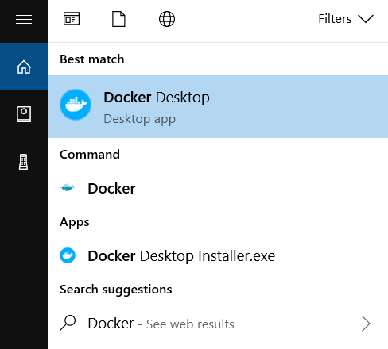

## 3.8 Windows 10/11

在 Windows 平台上，Docker Desktop 提供了完整的 Docker 开发环境。本节介绍在 Windows 10/11 上的安装和配置。

### Windows 上的 Docker：运行原理理解

与 macOS 类似，Windows 也没有原生 Linux 容器支持。Docker Desktop for Windows 有两种运行后端可选：

**WSL 2（Windows Subsystem for Linux 2）** - 推荐：
- 利用 Hyper-V 虚拟化运行真正的 Linux 内核
- 性能更好，文件系统集成更深
- 现代 Windows 10/11 的标准选择
- 支持在 Linux 和 Windows 之间的无缝文件访问

**Hyper-V** - 传统方案：
- 纯虚拟化方式
- 性能略低于 WSL 2
- 在某些企业网络环境下仍被使用

**实践建议**：WSL 2 和 Hyper-V 在功能上都能满足 Docker Desktop 的日常开发需求，选择哪种后端应以机器能力、企业策略和你的工作流为准；如果系统只满足其中一种后端的前置条件，安装器才会自动选择可用的那一种。

### 3.8.1 系统要求

[Docker Desktop for Windows](https://docs.docker.com/desktop/setup/install/windows-install/) 支持 Docker 官方文档列出的受支持 Windows 10/11 64 位版本。若使用 WSL 2 后端，需要启用 WSL 2，并满足官方要求的 `WSL 2.1.5` 或更高版本；若使用 Hyper-V 后端，则需要启用 Hyper-V 和 Containers 功能。Windows 10 64 位支持 Enterprise、Pro 和 Education 22H2（build 19045），Windows 11 64 位支持 Enterprise、Pro 和 Education 23H2（build 22631）或更高版本，且官方建议主机至少具备 8 GB 内存。

### 3.8.2 安装

> [!WARNING]
> **商业许可限制**：Docker Desktop 对小型企业（少于 250 名员工且年收入少于 1000 万美元）、个人使用、教育和非商业开源项目仍然免费。对于其他商业用途，以及政府机构使用，需要付费订阅。企业用户请注意合规风险。

**手动下载安装**

官方当前提供三个主要入口：

- [Docker Desktop for Windows x86_64 安装包](https://desktop.docker.com/win/main/amd64/Docker%20Desktop%20Installer.exe)
- [Docker Desktop for Windows Microsoft Store 版本](https://apps.microsoft.com/detail/XP8CBJ40XLBWKX)
- [Docker Desktop for Windows Arm 早期访问版](https://desktop.docker.com/win/main/arm64/Docker%20Desktop%20Installer.exe)

下载好对应安装包后，双击 `Docker Desktop Installer.exe` 开始安装。

**使用**[**winget**](https://learn.microsoft.com/windows/package-manager/winget/)**安装**

```powershell
$ winget install Docker.DockerDesktop
```

### 3.8.3 在 WSL2 运行 Docker

若你的环境使用 WSL 2 后端，请先确认 `wsl --version` 满足 Docker 官方的版本要求，并按 Docker Desktop 的 WSL 说明启用对应功能。

### 3.8.4 运行

在 Windows 搜索栏输入 **Docker** 点击 **Docker Desktop** 开始运行。



Docker 启动之后会在 Windows 任务栏出现鲸鱼图标。


等待片刻，当鲸鱼图标静止时，说明 Docker 启动成功，之后你可以打开 PowerShell 使用 Docker。

> 推荐使用 Windows Terminal 在终端使用 Docker。

### 3.8.5 镜像加速

如果在使用过程中发现拉取 Docker 镜像十分缓慢，可以配置 Docker [国内镜像加速](3.9_mirror.md)。
