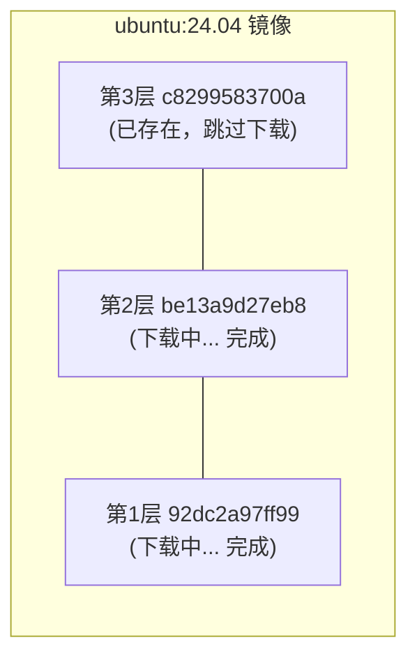

## 4.1 获取镜像

从 Docker 镜像仓库获取镜像可谓是 Docker 运作的第一步。本节将介绍如何使用 `docker pull` 命令下载镜像，以及如何理解下载过程。

### docker pull 命令

从镜像仓库获取镜像的命令是 `docker pull`：

```bash
docker pull [选项] [Registry地址/]仓库名[:标签]
```

#### 镜像名称格式

Docker 镜像名称由 Registry 地址、用户名、仓库名和标签组成。其标准格式如下：

```bash
docker.io / library / ubuntu : 24.04
────┬────   ───┬───   ──┬───   ──┬──
    │         │        │        │
Registry地址  用户名    仓库名    标签
 (可省略)    (可省略)
```

| 组成部分 | 说明 | 默认值 |
|---------|------|--------|
| Registry 地址 | 镜像仓库地址 | `docker.io` (Docker Hub)|
| 用户名 | 镜像所属用户/组织 | `library` (官方镜像)|
| 仓库名 | 镜像名称 | 必须指定 |
| 标签 | 版本标识 | `latest` |

#### 示例

运行以下命令：

```bash
## 完整格式

$ docker pull docker.io/library/ubuntu:24.04

## 省略 Registry（默认 Docker Hub）

$ docker pull library/ubuntu:24.04

## 省略 library（官方镜像）

$ docker pull ubuntu:24.04

## 省略标签（默认 latest）

$ docker pull ubuntu

## 拉取第三方镜像

$ docker pull bitnami/redis:latest

## 从其他 Registry 拉取

$ docker pull ghcr.io/username/myapp:v1.0
```

---

### 下载过程解析

当我们执行 `docker pull` 命令时，Docker 会输出详细的下载进度。让我们以 `ubuntu:24.04` 为例来解析这些信息。

运行以下命令：

```bash
$ docker pull ubuntu:24.04
24.04: Pulling from library/ubuntu
92dc2a97ff99: Pull complete
be13a9d27eb8: Pull complete
c8299583700a: Pull complete
Digest: sha256:4bc3ae6596938cb0d9e5ac51a1152ec9dcac2a1c50829c74abd9c4361e321b26
Status: Downloaded newer image for ubuntu:24.04
docker.io/library/ubuntu:24.04
```

#### 输出解读

相关信息如下表：

| 输出内容 | 说明 |
|---------|------|
| `Pulling from library/ubuntu` | 正在从官方 ubuntu 仓库拉取 |
| `92dc2a97ff99: Pull complete` | 各层的下载状态 (显示层 ID 前 12 位)|
| `Digest: sha256:...` | 镜像内容的唯一摘要 |
| `docker.io/library/ubuntu:24.04` | 镜像的完整名称 |

#### 分层下载

从输出可以看到，镜像是 **分层下载** 的：



如果本地已有相同的层，Docker 会跳过下载，节省带宽和时间。

---

### 常用选项

`docker pull` 命令支持多种选项来满足不同的下载需求，例如下载所有标签、指定平台架构等。

| 选项 | 说明 | 示例 |
|------|------|------|
| `--all-tags, -a` | 拉取所有标签 | `docker pull -a ubuntu` |
| `--platform` | 指定平台架构 | `docker pull --platform linux/arm64 nginx` |
| `--quiet, -q` | 静默模式 | `docker pull -q nginx` |

#### 概述

总体概述了以下内容。

#### 指定平台

在 Apple Silicon Mac 上拉取 x86 镜像：

```bash
$ docker pull --platform linux/amd64 nginx
```

---

### 拉取后运行

拉取镜像后，可以基于它启动容器：

```bash
## 拉取镜像

$ docker pull ubuntu:24.04

## 运行容器

$ docker run -it --rm ubuntu:24.04 bash
root@e7009c6ce357:/# cat /etc/os-release
PRETTY_NAME="Ubuntu 24.04 LTS"
...
root@e7009c6ce357:/# exit
```

**参数说明**：

| 参数 | 说明 |
|------|------|
| `-it` | 交互式终端模式 |
| `--rm` | 退出后自动删除容器 |
| `bash` | 启动命令 |

> 💡 `docker run` 在需要时会自动 `pull` 镜像，因此通常不需要单独执行 `docker pull`。

---

### 镜像加速

从 Docker Hub 下载可能较慢。可以配置镜像加速器：

```json
// /etc/docker/daemon.json (Linux)
// ~/.docker/daemon.json (Docker Desktop)
{
  "registry-mirrors": [
    "https://your-accelerator-url"
  ]
}
```

配置后重启 Docker：

```bash
$ sudo systemctl restart docker  # Linux
## 或在 Docker Desktop 中重启

## 或在 Docker Desktop 中重启

```

详见[镜像加速器](../03_install/3.9_mirror.md)章节。

---

### 验证镜像完整性

为了确保下载的镜像没有被篡改且内容一致，我们可以校验镜像的摘要 (Digest)。

#### 查看镜像摘要

运行以下命令：

```bash
$ docker images --digests ubuntu
REPOSITORY   TAG     DIGEST                                                                    IMAGE ID
ubuntu       24.04   sha256:4bc3ae6596938cb0d9e5ac51a1152ec9dcac2a1c50829c74abd9c4361e321b26   ca2b0f26964c
```

#### 使用摘要拉取

用摘要拉取可确保获取完全相同的镜像：

```bash
$ docker pull ubuntu@sha256:4bc3ae6596938cb0d9e5ac51a1152ec9dcac2a1c50829c74abd9c4361e321b26
```

> 笔者建议：生产环境使用摘要而非标签，因为标签可能被覆盖，摘要则是不可变的。

---

### 常见问题

在使用 `docker pull` 过程中，可能会遇到下载速度慢、镜像不存在或磁盘空间不足等问题。以下是一些常见问题的排查思路。

#### Q：下载速度很慢

1. 配置镜像加速器
2. 检查网络连接
3. 尝试拉取更小的镜像版本 (如 `alpine` 变体)

#### Q：提示镜像不存在

运行以下命令：

```bash
Error: pull access denied, repository does not exist
```

可能原因：

- 镜像名拼写错误
- 私有镜像未登录 (需要 `docker login`)
- 镜像确实不存在

#### Q：磁盘空间不足

运行以下命令：

```bash
## 清理未使用的镜像

$ docker image prune

## 清理所有未使用资源

$ docker system prune
```

---
