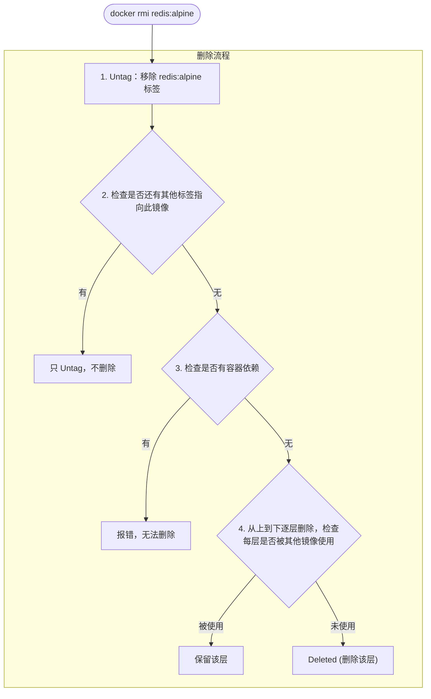

## 4.3 删除本地镜像

当不再需要某个镜像时，我们可以将其删除以释放存储空间。本节介绍删除镜像的常用方法。

### 4.3.1 基本用法

使用 `docker image rm` 删除本地镜像：

```bash
$ docker image rm [选项] <镜像1> [<镜像2> ...]
```
> 💡 `docker rmi` 是 `docker image rm` 的简写，两者等效。

---

### 4.3.2 镜像标识方式

删除镜像时，可以使用多种方式指定镜像：

| 方式 | 说明 | 示例 |
|------|------|------|
| **短 ID** | ID 的前几位 (通常 3-4 位)| `docker rmi 501` |
| **长 ID** | 完整的镜像 ID | `docker rmi 501ad78535f0...` |
| **镜像名:标签** | 仓库名和标签 | `docker rmi redis:alpine` |
| **镜像摘要** | 精确的内容摘要 | `docker rmi nginx@sha256:...` |

#### 使用短 ID 删除

```bash
$ docker image ls
REPOSITORY   TAG     IMAGE ID       SIZE
redis        alpine  501ad78535f0   30MB
nginx        latest  e43d811ce2f4   142MB

## 只需输入足够区分的前几位

$ docker rmi 501
Untagged: redis:alpine
Deleted: sha256:501ad78535f0...
```

#### 使用镜像名删除

```bash
$ docker rmi redis:alpine
Untagged: redis:alpine
Deleted: sha256:501ad78535f0...
```

#### 使用摘要删除

摘要删除最精确，适用于 CI/CD 场景：

```bash
## 查看镜像摘要

$ docker images --digests
REPOSITORY   TAG    DIGEST                   IMAGE ID
nginx        latest sha256:b4f0e0bdeb5...    e43d811ce2f4

## 使用摘要删除

$ docker rmi nginx@sha256:b4f0e0bdeb578043c1ea6862f0d40cc4afe32a4a582f3be235a3b164422be228
```
---

### 4.3.3 理解输出信息

执行删除命令后，Docker 会输出一系列的操作记录，理解这些信息有助于我们掌握镜像删除的机制。

删除镜像时会看到两类信息：**Untagged** 和 **Deleted**

```bash
$ docker rmi redis:alpine
Untagged: redis:alpine
Untagged: redis@sha256:f1ed3708f538b537eb9c2a7dd50dc90a706f7debd7e1196c9264edeea521a86d
Deleted: sha256:501ad78535f015d88872e13fa87a828425117e3d28075d0c117932b05bf189b7
Deleted: sha256:96167737e29ca8e9d74982ef2a0dda76ed7b430da55e321c071f0dbff8c2899b
Deleted: sha256:32770d1dcf835f192cafd6b9263b7b597a1778a403a109e2cc2ee866f74adf23
```

#### Untagged vs Deleted

| 操作 | 含义 |
|------|------|
| **Untagged** | 移除镜像的标签 |
| **Deleted** | 删除镜像的存储层 |

#### 删除流程

Docker 会检测镜像是否有容器依赖或其他标签指向，只有在确认为无用资源时才会真正删除存储层。


---

### 4.3.4 批量删除

手动一个一个删除镜像非常繁琐，Docker 提供了 `image prune` 命令和 shell 组合命令来实现批量清理。

#### 删除所有虚悬镜像

虚悬镜像 (dangling)：没有标签的镜像，通常是旧版本被新版本覆盖后产生的

```bash
## 查看虚悬镜像

$ docker images -f dangling=true

## 删除虚悬镜像

$ docker image prune

## 不提示确认

$ docker image prune -f
```

#### 删除所有未使用的镜像

```bash
## 删除所有没有被容器使用的镜像

$ docker image prune -a

## 保留最近 24 小时的

$ docker image prune -a --filter "until=24h"
```

#### 按条件删除

```bash
## 删除所有 redis 镜像

$ docker rmi $(docker images -q redis)

## 删除 mongo:8.0 之前的所有镜像

$ docker rmi $(docker images -q -f before=mongo:8.0)

## 删除某个时间之前的镜像

$ docker image prune -a --filter "until=168h"  # 7天前
```
---

### 4.3.5 删除失败的常见原因

在删除镜像时，Docker 可能会提示错误并拒绝执行。这通常是为了防止误删正在使用的资源。

#### 原因一：有容器依赖

```bash
$ docker rmi nginx
Error: conflict: unable to remove repository reference "nginx"
(must force) - container abc123 is using its referenced image
```
**解决方案**：

```bash
## 方案1：先删除依赖的容器

$ docker rm abc123
$ docker rmi nginx

## 方案2：强制删除镜像（容器仍可运行，但无法再创建新容器）

$ docker rmi -f nginx
```

#### 原因二：多个标签指向同一镜像

```bash
$ docker images
REPOSITORY   TAG     IMAGE ID
ubuntu       24.04   ca2b0f26964c
ubuntu       latest  ca2b0f26964c   # 同一个镜像

$ docker rmi ubuntu:24.04
Untagged: ubuntu:24.04

## 只是移除标签，镜像仍存在（因为还有 ubuntu:latest 指向它）
```
当同一个镜像有多个标签时，`docker rmi` 只是删除指定的标签，不会删除镜像本身。

#### 原因三：被其他镜像依赖：中间层

```bash
$ docker rmi some_base_image
Error: image has dependent child images
```
中间层镜像被其他镜像依赖，无法删除。需要先删除依赖它的镜像。

---

### 4.3.6 常用过滤条件

| 过滤条件 | 说明 | 示例 |
|---------|------|------|
| `dangling=true` | 虚悬镜像 | `-f dangling=true` |
| `before=镜像` | 在某镜像之前 | `-f before=mongo:3.2` |
| `since=镜像` | 在某镜像之后 | `-f since=mongo:3.2` |
| `label=key=value` | 按标签过滤 | `-f label=version=1.0` |
| `reference=pattern` | 按名称模式 | `-f reference='*:latest'` |

---

### 4.3.7 清理策略

针对不同的环境 (开发环境 vs 生产环境)，我们应该采用不同的镜像清理策略。

#### 开发环境

```bash
## 定期清理虚悬镜像

$ docker image prune -f

## 一键清理所有未使用资源

$ docker system prune -a
```

#### CI/CD 环境

```bash
## 只保留最近使用的镜像

$ docker image prune -a --filter "until=72h" -f
```

#### 查看空间占用

```bash
$ docker system df
TYPE            TOTAL   ACTIVE   SIZE      RECLAIMABLE
Images          15      3        2.5GB     1.8GB (72%)
Containers      5       2        100MB     80MB (80%)
Local Volumes   8       2        500MB     400MB (80%)
Build Cache     0       0        0B        0B
```
---
