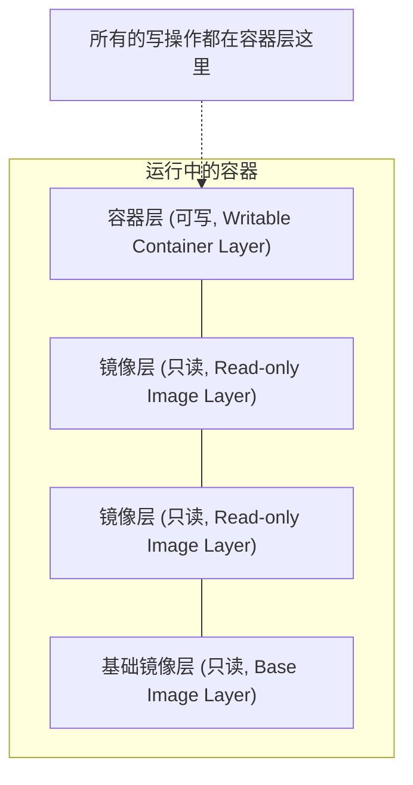

## 4.7 实现原理

Docker 镜像是怎么实现增量的修改和维护的？为什么容器启动如此之快？这一切都归功于 Docker 的镜像分层存储设计。

### 镜像与分层存储

在之前的章节中，我们一直强调镜像包含操作系统完整的 `root` 文件系统，其体积往往是庞大的。因此在 Docker 设计时，就充分利用 **Union FS** 的技术，将其设计为分层存储的架构。

Docker 镜像并不是一个单纯的文件，而是由一组文件系统叠加构成的。

最底层的镜像称为 **基础镜像（Base Image）**，通常是各种 Linux 发行版的 root 文件系统，如 Ubuntu、Debian、CentOS 等。

当我们在基础镜像之上构建新的镜像时（例如安装了 Nginx），Docker 并不是复制一份基础镜像，而是在基础镜像之上，**新建一个层（Layer）**，并在该层中仅记录为了安装 Nginx 而发生的文件变更（添加、修改、删除）。

这种分层存储结构使得镜像的复用、分发变得非常高效：

*   **复用**：如果多个镜像都基于同一个基础镜像（例如都基于 `ubuntu:24.04`），那么宿主机只需要下载一份 `ubuntu:24.04`，所有镜像都可以共享它。
*   **轻量**：镜像仅仅记录了与基础镜像的差异，因此体积非常小。

### 容器层与读写

我们要理解的一个关键概念是：**镜像的每一层都是只读的（Read-only）**。

那么，既然镜像只读，容器为什么能写文件呢？

当容器启动时，Docker 会在镜像的最上层，添加一个新的**可写层（Writable Layer）**，通常被称为**容器层**。

*   **读取文件**：当容器需要读取文件时，Docker 会从最上层（容器层）开始向下层（镜像层）寻找，直到找到该文件为止。
*   **修改文件**：当容器需要修改某个文件时，Docker 会从下层镜像中将该文件复制到上层的容器层，然后对副本进行修改。这被称为**写时复制（Copy-on-Write, CoW）** 策略。
*   **删除文件**：当容器删除某个文件时，Docker 并不是真的去下层删除它（因为下层是只读的），而是在容器层创建一个特殊的“白障（Whiteout）”文件，用来标记该文件已被删除，从而在容器视图中隐藏它。

这就是为什么：

1.  **容器删除后数据会丢失**：因为所有的数据修改都保存在最上层的容器层中，容器销毁时，这个层也就随之销毁了。（除非使用了数据卷，详见[数据管理](../08_data_network/README.md)）。
2.  **镜像不可变**：无论我们在容器里删除了多少文件，基础镜像的体积并不会减小，因为它们依然存在于底层的只读层中。

### 内容寻址与镜像 ID

Docker 镜像的每一层都有一个唯一的 ID，这个 ID 是根据该层的内容计算出来的哈希值（SHA256）。这意味着：

*   **内容即 ID**：只要层的内容有一丁点变化，ID 就会变。
*   **安全性**：确保了镜像内容的完整性，下载过程中如果数据损坏，ID 校验就会失败。
*   **去重**：如果两个不同的镜像（甚至是不同来源的镜像）包含相同的层（ID 相同），Docker 引擎在本地只会存储一份，绝不重复下载。

### 联合文件系统

Docker 使用联合文件系统（Union FS）来实现这种分层挂载。常见的驱动包括 `overlay2`（目前推荐）、`aufs`（早期使用）、`btrfs`、`zfs` 等。

虽然实现细节不同，但它们都遵循上述的 **分层 + CoW** 模型。

> 想要深入了解 Overlay2 等文件系统的具体实现原理，包括 WorkDir、UpperDir、LowerDir 等底层细节，请阅读 **[第十四章 底层实现](../14_implementation/README.md)**中的**[联合文件系统](../14_implementation/14.4_ufs.md)** 章节。
