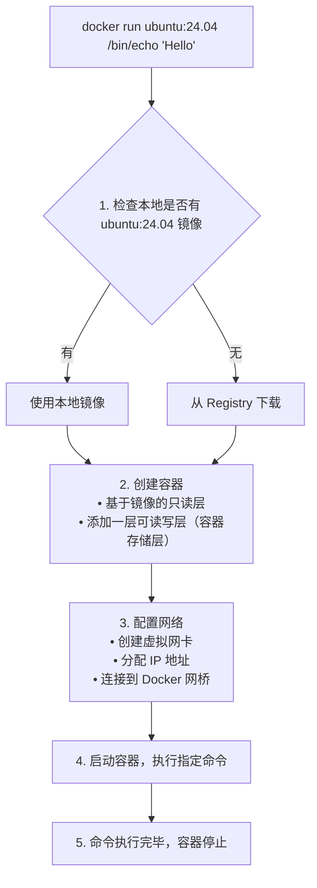

## 5.1 启动容器

本节将详细介绍 Docker 容器的启动方式，包括新建启动和重新启动已停止的容器。

### 启动方式概述

启动容器有两种方式：

- **新建并启动**：基于镜像创建新容器
- **重新启动**：将已终止的容器重新运行

由于 Docker 容器非常轻量，实际使用中常常是随时删除和新建容器，而不是反复重启同一个容器。

### 新建并启动

本节涵盖了相关内容与详细描述，主要探讨以下几个方面：

#### 基本语法

运行以下命令：

```bash
docker run [选项] 镜像 [命令] [参数...]
```

#### 最简单的例子

输出 “Hello World” 后容器自动终止：

```bash
$ docker run ubuntu:24.04 /bin/echo 'Hello world'
Hello world
```

这与直接执行 `/bin/echo 'Hello world'` 几乎没有区别，但实际上已经启动了一个完整的 Ubuntu 容器来执行这条命令。

#### 交互式容器

启动一个可以交互的 bash 终端：

```bash
$ docker run -it ubuntu:24.04 /bin/bash
root@af8bae53bdd3:/#
```

**参数说明**：

| 参数 | 作用 |
|------|------|
| `-i` | 保持标准输入 (stdin) 打开，允许输入 |
| `-t` | 分配伪终端 (pseudo-TTY)，提供终端界面 |
| `-it` | 两者组合使用，获得交互式终端 |

在交互模式下可以执行命令：

```bash
root@af8bae53bdd3:/# pwd
/
root@af8bae53bdd3:/# ls
bin boot dev etc home lib lib64 media mnt opt proc root run sbin srv sys tmp usr var
root@af8bae53bdd3:/# exit  # 退出容器
```

### docker run 的完整流程

执行 `docker run` 时，Docker 在后台完成以下操作：



### 常用启动选项

本节涵盖了相关内容与详细描述，主要探讨以下几个方面：

#### 基础选项

相关信息如下表：

| 选项 | 说明 | 示例 |
|------|------|------|
| `-d` | 后台运行 (detach)| `docker run -d nginx` |
| `-it` | 交互式终端 | `docker run -it ubuntu bash` |
| `--name` | 指定容器名称 | `docker run --name myapp nginx` |
| `--rm` | 退出后自动删除容器 | `docker run --rm ubuntu echo hi` |

#### 端口映射

运行以下命令：

```bash
## 将容器的 80 端口映射到宿主机的 8080 端口

$ docker run -d -p 8080:80 nginx

## 随机映射端口

$ docker run -d -P nginx

## 只绑定到 localhost

$ docker run -d -p 127.0.0.1:8080:80 nginx
```

#### 数据卷挂载

运行以下命令：

```bash
## 挂载命名卷

$ docker run -v mydata:/data nginx

## 挂载宿主机目录

$ docker run -v /host/path:/container/path nginx

## 只读挂载

$ docker run -v /host/path:/container/path:ro nginx
```

#### 环境变量

运行以下命令：

```bash
## 设置单个环境变量

$ docker run -e MYSQL_ROOT_PASSWORD=secret mysql

## 从文件加载环境变量

$ docker run --env-file .env myapp
```

#### 资源限制

运行以下命令：

```bash
## 限制内存

$ docker run -m 512m nginx

## 限制 CPU

$ docker run --cpus=1.5 nginx
```

### 启动已终止容器

使用 `docker start` 重新启动已停止的容器：

```bash
## 查看所有容器（包括已停止的）

$ docker ps -a
CONTAINER ID  IMAGE   STATUS                     NAMES
af8bae53bdd3  ubuntu  Exited (0) 2 minutes ago   myubuntu

## 重新启动

$ docker start myubuntu

## 启动并附加终端

$ docker start -ai myubuntu
```

### 容器内进程的特点

容器内只运行指定的应用程序及其必需资源：

```bash
root@ba267838cc1b:/# ps
  PID TTY          TIME CMD
    1 ?        00:00:00 bash
   11 ?        00:00:00 ps
```

可见容器中仅运行了 `bash` 进程。这种特点使得 Docker 对资源的利用率极高。

> 💡 笔者提示：容器内的 PID 1 进程很重要——它是容器的主进程，该进程退出则容器停止。详见[后台运行](5.2_daemon.md)章节。

### 常见问题

本节涵盖了相关内容与详细描述，主要探讨以下几个方面：

#### Q：容器启动后立即退出

**原因**：主进程执行完毕或无法保持运行

```bash
## 这个容器会立即退出（echo 执行完就结束了）

$ docker run ubuntu echo "hello"

## 解决：使用能持续运行的命令

$ docker run -d nginx  # nginx 是持续运行的服务
```

详细解释见[后台运行](5.2_daemon.md)。

#### Q：无法连接容器内的服务

**原因**：未正确映射端口

```bash
## 错误：没有 -p 参数，外部无法访问

$ docker run -d nginx

## 正确：映射端口

$ docker run -d -p 80:80 nginx
```

#### Q：容器内修改的文件丢失

**原因**：未使用数据卷，数据保存在容器存储层

```bash
## 使用数据卷持久化

$ docker run -v mydata:/app/data myapp
```

详见[数据管理](../08_data_network/README.md)。
