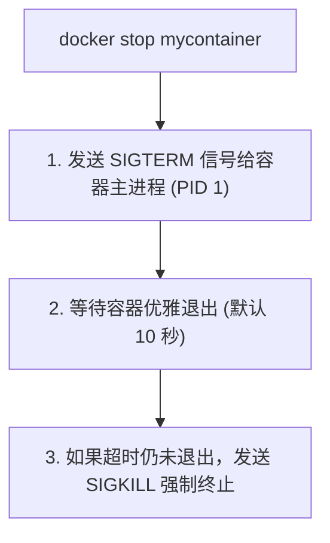
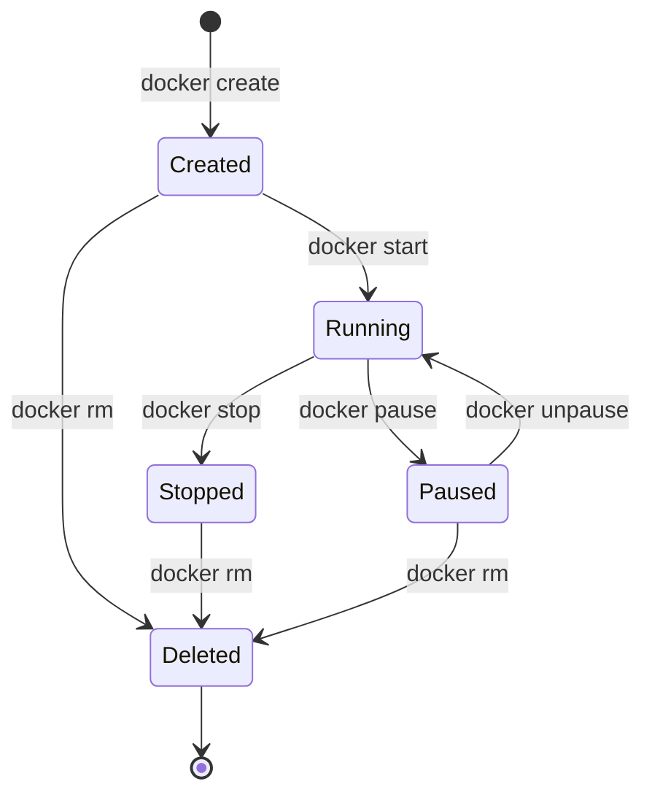

## 5.3 终止

本节将介绍如何终止一个运行中的容器，以及几种不同的终止方式及其区别。

### 5.3.1 终止方式概述

终止容器有三种方式：

| 方式 | 命令 | 说明 |
|------|------|------|
| **优雅停止** | `docker stop` | 先发 SIGTERM，超时后发 SIGKILL |
| **强制停止** | `docker kill` | 直接发 SIGKILL |
| **自动终止** | - | 容器主进程退出时自动停止 |

---

### 5.3.2 docker stop (推荐)

#### docker stop 基本用法

```bash
$ docker stop 容器名或ID
```

#### 工作原理



#### 自定义超时时间

```bash
## 等待 30 秒后强制终止

$ docker stop -t 30 mycontainer

## 立即发送 SIGKILL（相当于 docker kill）

$ docker stop -t 0 mycontainer
```

#### 停止多个容器

```bash
## 停止多个指定容器

$ docker stop container1 container2 container3

## 停止所有运行中的容器

$ docker stop $(docker ps -q)
```

---

### 5.3.3 docker kill

#### 基本用法

```bash
$ docker kill 容器名或ID
```

#### 与 stop 的区别

| 命令 | 信号 | 使用场景 |
|------|------|---------|
| `docker stop` | SIGTERM → SIGKILL | 正常停止，让应用优雅退出 |
| `docker kill` | SIGKILL | 应用无响应，强制终止 |

#### 发送自定义信号

```bash
## 发送 SIGHUP（让进程重新加载配置）

$ docker kill -s HUP mycontainer

## 发送 SIGTERM

$ docker kill -s TERM mycontainer
```

---

### 5.3.4 容器自动终止

容器的生命周期与主进程绑定。主进程退出时，容器自动停止：

```bash
## 主进程是交互式 bash

$ docker run -it ubuntu bash
root@abc123:/# exit    # 退出 bash → 容器停止

## 主进程执行完毕

$ docker run ubuntu echo "Hello"    # echo 执行完 → 容器停止
```

---

### 5.3.5 查看已停止的容器

```bash
$ docker ps -a
CONTAINER ID   IMAGE    COMMAND       STATUS                      NAMES
ba267838cc1b   ubuntu   "/bin/bash"   Exited (0) 2 minutes ago    myubuntu
c5d3a5e8f7b2   nginx    "nginx"       Up 5 minutes                mynginx
```

**STATUS 字段说明**：

| 状态 | 说明 |
|------|------|
| `Up X minutes` | 运行中 |
| `Exited (0)` | 正常退出 (退出码 0)|
| `Exited (1)` | 异常退出 (非零退出码)|
| `Exited (137)` | 被 SIGKILL 终止 (128 + 9)|
| `Exited (143)` | 被 SIGTERM 终止 (128 + 15)|

---

### 5.3.6 重新启动容器

#### 启动已停止的容器

```bash
$ docker start 容器名或ID

## 启动并附加终端

$ docker start -ai 容器名
```

#### 重启运行中的容器

```bash
## 先停止再启动

$ docker restart 容器名

## 自定义停止超时

$ docker restart -t 30 容器名
```

---

### 5.3.7 生命周期状态图



---

### 5.3.8 批量操作

#### 停止所有容器

```bash
$ docker stop $(docker ps -q)
```

#### 删除所有已停止的容器

```bash
$ docker container prune
```

#### 停止并删除所有容器

```bash
$ docker stop $(docker ps -q) && docker container prune -f
```

---

### 5.3.9 常见问题

#### Q：容器停止很慢

原因：应用没有正确处理 SIGTERM 信号，需要等待超时后强制终止。

解决方案：

1. 在应用中正确处理 SIGTERM
2. 使用 `docker stop -t 0` 立即终止
3. 检查 Dockerfile 中的 `STOPSIGNAL` 配置

#### Q：如何让容器优雅退出

确保容器主进程正确处理信号：

```dockerfile
## Dockerfile 示例

FROM node:22
...
## 使用 exec 形式确保信号能传递给 node 进程

CMD ["node", "server.js"]
```

#### Q：容器无法停止

```bash
## 强制终止

$ docker kill 容器名

## 如果仍无法停止，检查系统资源

$ docker inspect 容器名
```

---
