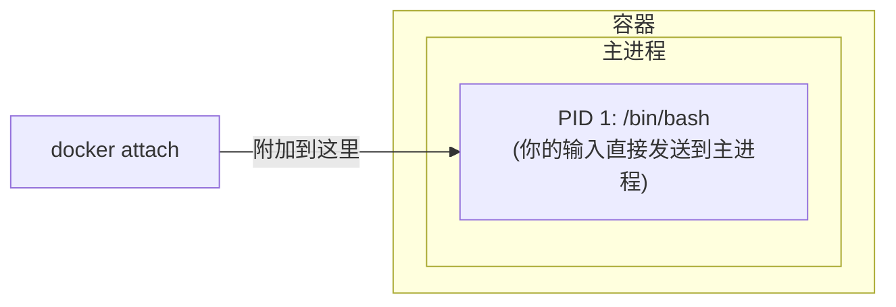
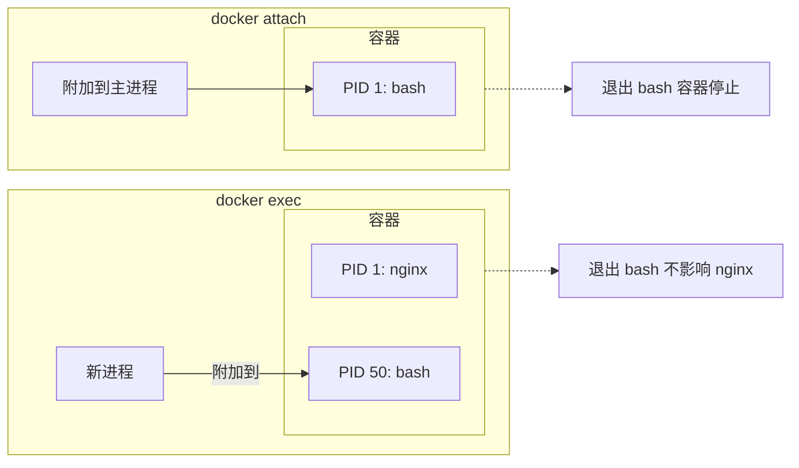

## 5.4 进入容器

本节涵盖了相关内容与详细描述，主要探讨以下几个方面：

### 5.4.1 为什么需要进入容器

使用 `-d` 参数启动容器后，容器在后台运行。以下场景需要进入容器内部操作：

| 场景 | 示例 |
|------|------|
| **调试问题** | 查看日志、检查配置、排查错误 |
| **临时操作** | 执行数据库迁移、清理缓存 |
| **检查状态** | 查看进程、网络连接、文件系统 |
| **开发测试** | 交互式测试命令、验证环境 |

### 5.4.2 两种进入方式

Docker 提供两种进入容器的命令：

| 命令 | 推荐程度 | 特点 |
|------|---------|------|
| `docker exec` | ✅ **推荐** | 启动新进程，退出不影响容器 |
| `docker attach` | ⚠️ 谨慎使用 | 附加到主进程，退出可能停止容器 |

---

### 5.4.3 docker exec (推荐)

本节涵盖了相关内容与详细描述，主要探讨以下几个方面：

#### docker exec 基本用法

运行以下命令：

```bash
## 进入容器并启动交互式 shell

$ docker exec -it 容器名 /bin/bash

## 或使用 sh（适用于 Alpine 等精简镜像）

$ docker exec -it 容器名 /bin/sh
```

#### 参数说明

相关信息如下表：

| 参数 | 作用 |
|------|------|
| `-i` | 保持标准输入打开 (interactive)|
| `-t` | 分配伪终端 (TTY)|
| `-it` | 两者组合，获得完整交互体验 |
| `-u` | 指定用户 (如 `-u root`)|
| `-w` | 指定工作目录 |
| `-e` | 设置环境变量 |

#### docker exec 示例

运行以下命令：

```bash
## 启动一个后台容器

$ docker run -dit --name myubuntu ubuntu
69d137adef7a...

## 进入容器（交互式 shell）

$ docker exec -it myubuntu bash
root@69d137adef7a:/# ls
bin  boot  dev  etc  home  lib  ...
root@69d137adef7a:/# exit

## 容器仍在运行！

$ docker ps
CONTAINER ID   IMAGE    STATUS         NAMES
69d137adef7a   ubuntu   Up 2 minutes   myubuntu
```

#### 执行单条命令

不进入交互模式，直接执行命令：

```bash
## 查看容器内进程

$ docker exec myubuntu ps aux

## 查看配置文件

$ docker exec myubuntu cat /etc/nginx/nginx.conf

## 以 root 用户执行

$ docker exec -u root myubuntu apt update
```

#### 只用 -i 不用 -t 的区别

运行以下命令：

```bash
## 只用 -i：可以执行命令，但没有提示符

$ docker exec -i myubuntu bash
ls           # 输入命令
bin          # 输出结果
boot
dev
...

## 用 -it：有完整的终端体验

$ docker exec -it myubuntu bash
root@69d137adef7a:/#    # 有提示符
```

> 💡 通常使用 `-it` 组合。只有在脚本中需要通过管道传入命令时才只用 `-i`。

---

### 5.4.4 docker attach (谨慎使用)

本节涵盖了相关内容与详细描述，主要探讨以下几个方面：

#### docker attach 基本用法

运行以下命令：

```bash
$ docker attach 容器名
```

#### 工作原理

`attach` 会附加到容器的 **主进程** (PID 1) 的标准输入输出：



#### docker attach 示例

运行以下命令：

```bash
## 启动容器

$ docker run -dit --name myubuntu ubuntu
243c32535da7...

## 附加到容器

$ docker attach myubuntu
root@243c32535da7:/#
```

#### ⚠️ 重要警告

**从 attach 会话中输入 `exit` 或按 `Ctrl+D` 会导致容器停止！**

```bash
$ docker attach myubuntu
root@243c32535da7:/# exit    # 这会停止容器！

$ docker ps
CONTAINER ID   IMAGE    STATUS                     NAMES
243c32535da7   ubuntu   Exited (0) 2 seconds ago   myubuntu
```

**原因**：attach 附加到主进程，退出主进程就等于退出容器。

#### 安全退出 attach

使用 `Ctrl+P` 然后 `Ctrl+Q` 可以从 attach 会话中 **分离**，而不停止容器：

```bash
$ docker attach myubuntu
root@243c32535da7:/# 
## 按 Ctrl+P 然后 Ctrl+Q

read escape sequence

$ docker ps    # 容器仍在运行
CONTAINER ID   IMAGE    STATUS         NAMES
243c32535da7   ubuntu   Up 5 minutes   myubuntu
```

---

### 5.4.5 exec vs attach 对比

相关信息如下表：

| 特性 | docker exec | docker attach |
|------|-------------|---------------|
| **工作方式** | 在容器内启动新进程 | 附加到主进程 |
| **退出影响** | 不影响容器 | 可能停止容器 |
| **多终端** | 可以开多个 | 共享同一个会话 |
| **适用场景** | 调试、临时操作 | 查看主进程输出 |
| **推荐程度** | ✅ 推荐 | ⚠️ 特殊场景使用 |



---

### 5.4.6 最佳实践

本节涵盖了相关内容与详细描述，主要探讨以下几个方面：

#### 1. 首选 docker exec

运行以下命令：

```bash
## 进入容器调试

$ docker exec -it myapp bash

## 查看日志

$ docker exec myapp tail -f /var/log/app.log

## 执行数据库迁移

$ docker exec myapp python manage.py migrate
```

#### 2. 生产环境避免进入容器

笔者建议：生产环境应尽量避免进入容器直接操作，而是通过：

- 日志系统查看日志 (如 `docker logs` 或集中式日志)
- 监控系统查看状态
- 重新部署而非手动修改

#### 3. 无 shell 镜像的处理

某些精简镜像 (如基于 `scratch` 或 `distroless`) 没有 shell：

```bash
## 这会失败

$ docker exec -it myapp bash
OCI runtime exec failed: exec failed: unable to start container process: exec: "bash": executable file not found

## 解决方案：使用调试容器（Docker Desktop 或 Kubernetes debug）

$ docker debug myapp
```

---

### 5.4.7 常见问题

本节涵盖了相关内容与详细描述，主要探讨以下几个方面：

#### Q：exec 进入后看不到其他终端的操作

这是正常的。exec 启动的是独立进程，多个 exec 会话互不影响。

#### Q：容器没有 bash

尝试使用 sh：

```bash
$ docker exec -it myapp /bin/sh
```

#### Q：需要 root 权限

运行以下命令：

```bash
$ docker exec -u root -it myapp bash
```

---
