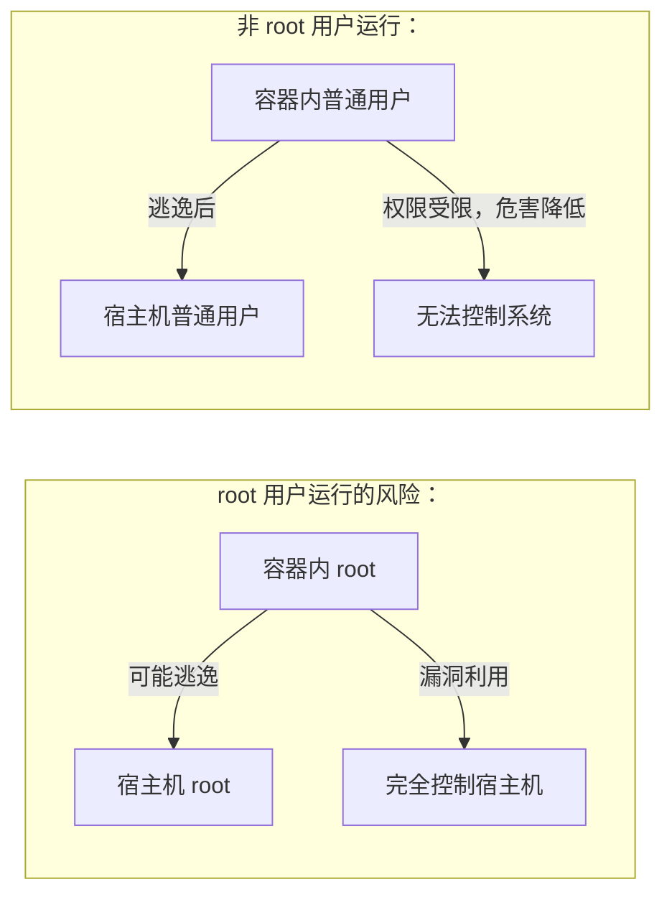

## 7.11 USER 指定当前用户

本节涵盖了相关内容与详细描述，主要探讨以下几个方面：

### 7.11.1 基本语法

如下代码块所示，展示了相关示例：

```docker
USER <用户名>[:<用户组>]
USER <UID>[:<GID>]
```

`USER` 指令切换后续指令 (RUN、CMD、ENTRYPOINT) 的执行用户。

---

### 7.11.2 为什么要使用 USER

> 笔者强调：以非 root 用户运行容器是最重要的安全实践之一。



---

### 7.11.3 基本用法

本节涵盖了相关内容与详细描述，主要探讨以下几个方面：

#### 创建并切换用户

如下代码块所示，展示了相关示例：

```docker
FROM node:20-alpine

## 1. 创建用户和组

RUN addgroup -g 1001 appgroup && \
    adduser -u 1001 -G appgroup -D appuser

## 2. 设置目录权限

WORKDIR /app
COPY --chown=appuser:appgroup . .

## 3. 切换用户

USER appuser

## 4. 后续命令以 appuser 身份运行

CMD ["node", "server.js"]
```

#### 使用 UID/GID

如下代码块所示，展示了相关示例：

```docker
## 也可以使用数字

USER 1001:1001
```

---

### 7.11.4 用户必须已存在

`USER` 指令只能切换到 **已存在** 的用户：

```docker
## ❌ 错误：用户不存在

USER nonexistent
## Error: unable to find user nonexistent

## ✅ 正确：先创建用户

RUN useradd -r -s /bin/false appuser
USER appuser
```

#### 概述

总体概述了以下内容。

#### 创建用户的方式

**Debian/Ubuntu**：

```docker
RUN groupadd -r appgroup && \
    useradd -r -g appgroup appuser
```

**Alpine**：

```docker
RUN addgroup -g 1001 -S appgroup && \
    adduser -u 1001 -S -G appgroup appuser
```

| 选项 | 说明 |
|------|------|
| `-r` (useradd) / `-S` (adduser) | 创建系统用户 |
| `-g` | 指定主组 |
| `-G` | 指定附加组 |
| `-u` | 指定 UID |
| `-s /bin/false` | 禁用登录 shell |

---

### 7.11.5 运行时切换用户

本节涵盖了相关内容与详细描述，主要探讨以下几个方面：

#### 使用 gosu (推荐)

在 ENTRYPOINT 脚本中切换用户时，不要使用 `su` 或 `sudo`，应使用 [gosu](https://github.com/tianon/gosu)：

```docker
FROM debian:bookworm

## 创建用户

RUN groupadd -r redis && useradd -r -g redis redis

## 安装 gosu

RUN apt-get update && apt-get install -y gosu && rm -rf /var/lib/apt/lists/*

COPY docker-entrypoint.sh /usr/local/bin/
ENTRYPOINT ["docker-entrypoint.sh"]
CMD ["redis-server"]
```

**docker-entrypoint.sh**：

```bash
#!/bin/bash
set -e

## 以 root 执行初始化

chown -R redis:redis /data

## 用 gosu 切换到 redis 用户运行服务

exec gosu redis "$@"
```

#### 为什么不用 su/sudo

相关信息如下表：

| 问题 | su/sudo | gosu |
|------|---------|------|
| TTY 要求 | 需要 | 不需要 |
| 信号传递 | 不正确 | 正确 |
| 子进程 | 是 | exec 替换 |
| 容器中使用 | ❌ | ✅ |

---

### 7.11.6 运行时覆盖用户

使用 `-u` 或 `--user` 参数：

```bash
## 以指定用户运行

$ docker run -u 1001:1001 myimage

## 以 root 运行（调试时）

$ docker run -u root myimage
```

---

### 7.11.7 文件权限处理

切换用户后，确保应用有权访问文件：

```docker
FROM node:20-alpine

## 创建用户

RUN adduser -D -u 1001 appuser

WORKDIR /app

## 方式1：使用 --chown

COPY --chown=appuser:appuser . .

## 方式2：手动 chown（减少层数）

## COPY . .

## RUN chown -R appuser:appuser /app

USER appuser
CMD ["node", "server.js"]
```

---

### 7.11.8 最佳实践

本节涵盖了相关内容与详细描述，主要探讨以下几个方面：

#### 1。始终使用非 root 用户

如下代码块所示，展示了相关示例：

```docker
## ✅ 推荐

RUN adduser -D appuser
USER appuser
CMD ["myapp"]

## ❌ 避免

CMD ["myapp"]  # 以 root 运行
```

#### 2。使用固定 UID/GID

便于在宿主机和容器间共享文件：

```docker
## 使用常见的非 root UID

RUN addgroup -g 1000 -S appgroup && \
    adduser -u 1000 -S -G appgroup appuser
USER 1000:1000
```

#### 3。多阶段构建中的 USER

如下代码块所示，展示了相关示例：

```docker
## 构建阶段可以用 root

FROM node:20 AS builder
WORKDIR /app
COPY . .
RUN npm install && npm run build

## 生产阶段用非 root

FROM node:20-alpine
RUN adduser -D appuser
WORKDIR /app
COPY --from=builder --chown=appuser:appuser /app/dist .
USER appuser
CMD ["node", "server.js"]
```

---

### 7.11.9 常见问题

本节涵盖了相关内容与详细描述，主要探讨以下几个方面：

#### Q：权限被拒绝

运行以下命令：

```bash
permission denied: '/app/data.log'
```

**解决**：确保目录权限正确

```docker
RUN mkdir -p /app/data && chown appuser:appuser /app/data
```

#### Q：无法绑定低于 1024 的端口

非 root 用户无法绑定 80、443 等端口。

**解决**：

1. 使用高端口 (如 8080)
2. 在运行时映射端口：`docker run -p 80:8080`

---
