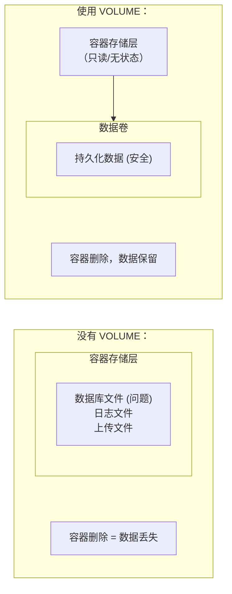

## 7.8 VOLUME 定义匿名卷

本节涵盖了相关内容与详细描述，主要探讨以下几个方面：

### 基本语法

如下代码块所示，展示了相关示例：

```docker
VOLUME ["/路径1", "/路径2"]
VOLUME /路径
```

`VOLUME` 指令创建挂载点，并标记为外部挂载的卷。

---

### 为什么使用 VOLUME

> **核心原则**：容器存储层应该保持无状态，任何运行时数据都应该存储在卷中。



---

### 基本用法

本节涵盖了相关内容与详细描述，主要探讨以下几个方面：

#### 定义单个卷

如下代码块所示，展示了相关示例：

```docker
FROM mysql:8.0
VOLUME /var/lib/mysql
```

#### 定义多个卷

如下代码块所示，展示了相关示例：

```docker
FROM myapp
VOLUME ["/data", "/logs", "/config"]
```

---

### VOLUME 的行为

本节涵盖了相关内容与详细描述，主要探讨以下几个方面：

#### 1。自动创建匿名卷

如果运行时未指定挂载，Docker 会自动创建匿名卷：

```bash
$ docker run mysql:8.0
$ docker volume ls
DRIVER    VOLUME NAME
local     a1b2c3d4e5f6...  # 自动创建的匿名卷
```

#### 2。可被命名卷覆盖

运行以下命令：

```bash
## 使用命名卷替代匿名卷

$ docker run -v mysql_data:/var/lib/mysql mysql:8.0
```

#### 3。可被 Bind Mount 覆盖

运行以下命令：

```bash
## 使用宿主机目录替代

$ docker run -v /my/data:/var/lib/mysql mysql:8.0
```

---

### VOLUME 在构建时的特殊行为

> ⚠️ **重要**：VOLUME 之后对该目录的修改会被丢弃！

```docker
FROM ubuntu
VOLUME /data

## ❌ 这个文件不会出现在镜像中！

RUN echo "hello" > /data/test.txt
```

**原因**：VOLUME 指令之后，Docker 将该目录视为外部挂载点，不再记录对它的修改。

#### 概述

总体概述了以下内容。

#### 正确做法

如下代码块所示，展示了相关示例：

```docker
FROM ubuntu

## ✅ 先写入文件

RUN mkdir -p /data && echo "hello" > /data/test.txt

## 再声明 VOLUME

VOLUME /data
```

---

### 常见使用场景

本节涵盖了相关内容与详细描述，主要探讨以下几个方面：

#### 数据库持久化

如下代码块所示，展示了相关示例：

```docker
FROM postgres:15
VOLUME /var/lib/postgresql/data
```

#### 日志目录

如下代码块所示，展示了相关示例：

```docker
FROM nginx
VOLUME /var/log/nginx
```

#### 上传文件目录

如下代码块所示，展示了相关示例：

```docker
FROM myapp
VOLUME /app/uploads
```

---

### 查看 VOLUME 定义

运行以下命令：

```bash
## 查看镜像定义的 VOLUME

$ docker inspect mysql:8.0 --format '{{json .Config.Volumes}}' | jq
{
  "/var/lib/mysql": {}
}

## 查看容器挂载的卷

$ docker inspect mycontainer --format '{{json .Mounts}}' | jq
```

---

### VOLUME vs docker run -v

| 特性 | Dockerfile VOLUME | docker run -v |
|------|-------------------|---------------|
| **定义时机** | 镜像构建时 | 容器运行时 |
| **默认行为** | 创建匿名卷 | 可指定命名卷或路径 |
| **灵活性** | 低（固定路径） | 高（可任意指定） |
| **适用场景** | 定义必须持久化的路径 | 灵活的数据管理 |

---

### 在 Compose 中

在 Compose 中配置如下：

```yaml
services:
  db:
    image: postgres:15
    volumes:
      # 命名卷（推荐）

      - postgres_data:/var/lib/postgresql/data
      # Bind Mount

      - ./init.sql:/docker-entrypoint-initdb.d/init.sql

volumes:
  postgres_data:  # 声明命名卷
```

---

### 安全注意事项

本节涵盖了相关内容与详细描述，主要探讨以下几个方面：

#### 概述

总体概述了以下内容。

#### 匿名卷可能导致数据丢失

运行以下命令：

```bash
## 使用 --rm 运行的容器，匿名卷会在容器删除时一起删除

$ docker run --rm mysql:8.0
## 容器停止后，数据丢失！

...
```

**解决**：始终使用命名卷

```bash
$ docker run -v mysql_data:/var/lib/mysql mysql:8.0
```

---

### 最佳实践

本节涵盖了相关内容与详细描述，主要探讨以下几个方面：

#### 1。定义必须持久化的路径

如下代码块所示，展示了相关示例：

```docker
## 数据库必须使用卷

FROM postgres:15
VOLUME /var/lib/postgresql/data
```

#### 2。不要在 VOLUME 后修改目录

如下代码块所示，展示了相关示例：

```docker
## ❌ 避免

VOLUME /app/data
RUN cp init-data.json /app/data/

## ✅ 正确

RUN mkdir -p /app/data && cp init-data.json /app/data/
VOLUME /app/data
```

#### 3。文档中说明 VOLUME 用途

如下代码块所示，展示了相关示例：

```docker
## 持久化用户上传的文件

VOLUME /app/uploads

## 持久化数据库数据

VOLUME /var/lib/mysql
```

---
