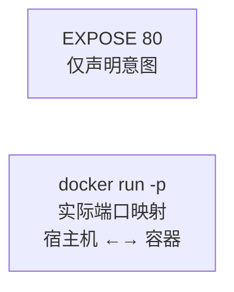

## 7.9 EXPOSE 声明端口

本节涵盖了相关内容与详细描述，主要探讨以下几个方面：

### 基本语法

如下代码块所示，展示了相关示例：

```docker
EXPOSE <端口> [<端口>/<协议>...]
```

`EXPOSE` 声明容器运行时提供服务的端口。这是一个**文档性质的声明**，告诉使用者容器会监听哪些端口。

---

### 基本用法

如下代码块所示，展示了相关示例：

```docker
## 声明单个端口

EXPOSE 80

## 声明多个端口

EXPOSE 80 443

## 声明 TCP 和 UDP 端口

EXPOSE 80/tcp
EXPOSE 53/udp
```

---

### EXPOSE 的作用

本节涵盖了相关内容与详细描述，主要探讨以下几个方面：

#### 1。文档说明

告诉镜像使用者，容器将在哪些端口提供服务：

```docker
## 使用者一看就知道这是 web 应用

EXPOSE 80 443
```

```bash
## 查看镜像暴露的端口

$ docker inspect nginx --format '{{.Config.ExposedPorts}}'
map[80/tcp:{}]
```

#### 2。配合 -P 使用

使用 `docker run -P` 时，Docker 会自动映射 EXPOSE 的端口到宿主机随机端口：

```docker
## Dockerfile

EXPOSE 80
```

```bash
$ docker run -P nginx
$ docker port $(docker ps -q)
80/tcp -> 0.0.0.0:32768
```

---

### EXPOSE vs -p

相关信息如下表：

| 特性 | EXPOSE | -p |
|------|--------|-----|
| **位置** | Dockerfile | docker run 命令 |
| **作用** | 声明/文档 | 实际端口映射 |
| **是否必需** | 否 | 是 (外部访问时)|
| **映射发生时** | 不发生 | 运行时发生 |



#### 概述

总体概述了以下内容。

#### 没有 EXPOSE 也能 -p

如下代码块所示，展示了相关示例：

```docker
## 即使没有 EXPOSE，也可以使用 -p

FROM nginx
## 没有 EXPOSE

...
```

```bash
## 仍然可以映射端口

$ docker run -p 8080:80 mynginx
```

---

### 常见误解

本节涵盖了相关内容与详细描述，主要探讨以下几个方面：

#### 误解：EXPOSE 会打开端口

如下代码块所示，展示了相关示例：

```docker
## ❌ 错误理解：这不会让容器可从外部访问

EXPOSE 80
```

EXPOSE 不会：

- 自动进行端口映射
- 让服务可从外部访问
- 在容器启动时开启端口监听

EXPOSE 只是元数据声明。容器是否实际监听该端口，取决于容器内的应用。

#### 正确理解

如下代码块所示，展示了相关示例：

```docker
## Dockerfile

FROM nginx
EXPOSE 80    # 1. 声明：这个容器会在 80 端口提供服务
```

```bash
## 运行：需要 -p 才能从外部访问

$ docker run -p 8080:80 nginx    # 2. 映射：宿主机 8080 → 容器 80
```

---

### 最佳实践

本节涵盖了相关内容与详细描述，主要探讨以下几个方面：

#### 1。总是声明应用使用的端口

如下代码块所示，展示了相关示例：

```docker
## Web 服务

FROM nginx
EXPOSE 80 443

## 数据库

FROM postgres
EXPOSE 5432

## Redis

FROM redis
EXPOSE 6379
```

#### 2。使用明确的协议

如下代码块所示，展示了相关示例：

```docker
## 默认是 TCP

EXPOSE 80

## 明确指定 UDP

EXPOSE 53/udp

## 同时支持 TCP 和 UDP

EXPOSE 53/tcp 53/udp
```

#### 3。与应用实际端口保持一致

如下代码块所示，展示了相关示例：

```docker
## ✅ 好：EXPOSE 与应用端口一致

ENV PORT=3000
EXPOSE 3000
CMD ["node", "server.js"]

## ❌ 差：EXPOSE 与应用端口不一致（误导）

EXPOSE 80
CMD ["node", "server.js"]  # 实际监听 3000
```

---

### 使用环境变量

如下代码块所示，展示了相关示例：

```docker
ARG PORT=80
EXPOSE $PORT
```

---

### 在 Compose 中

在 Compose 中配置如下：

```yaml
services:
  web:
    build: .
    ports:
      - "8080:80"    # 映射端口（类似 -p）
    expose:
      - "80"         # 仅声明（类似 EXPOSE）
```

`expose` 在 Compose 中仅用于容器间通信的文档说明，不进行端口映射。

---
