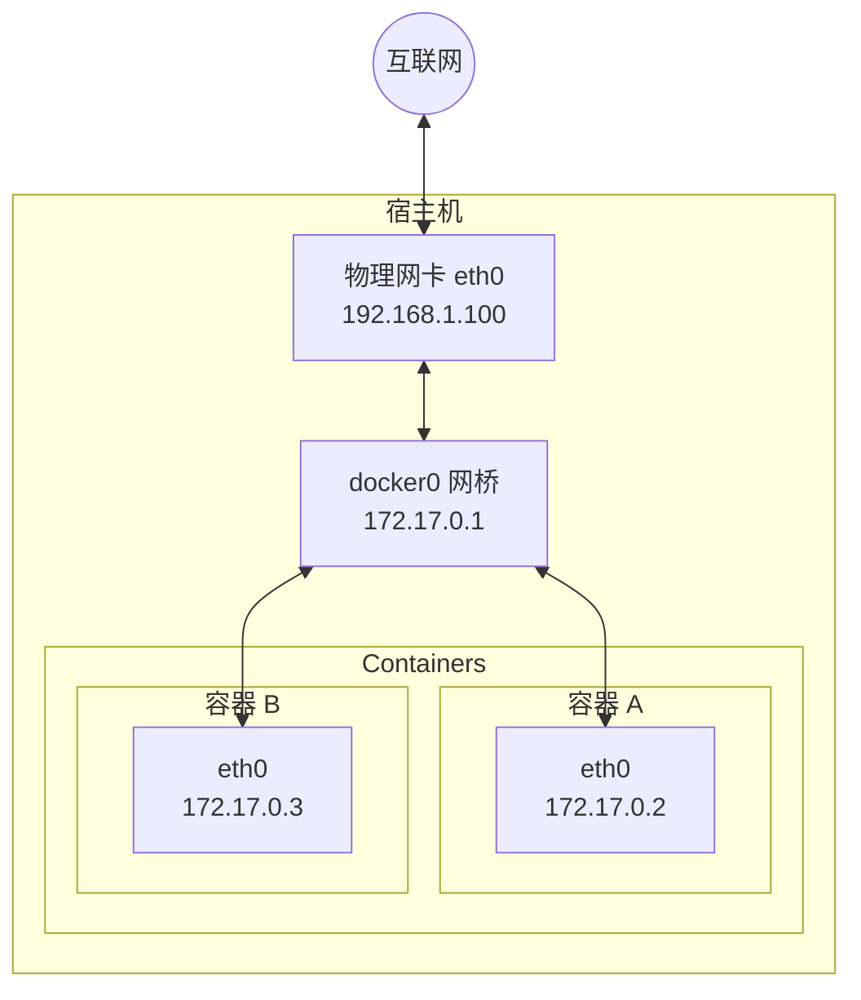
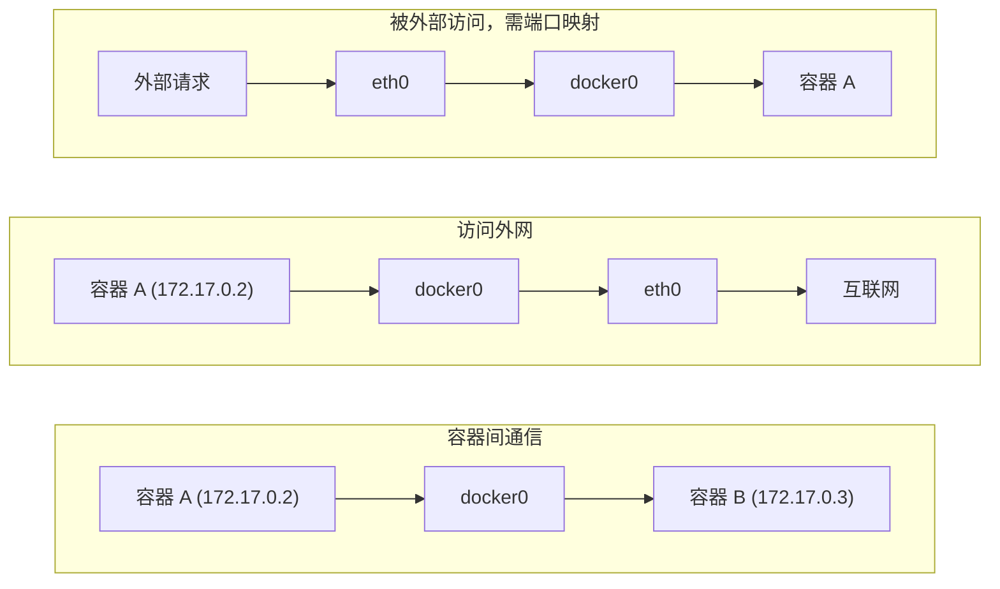
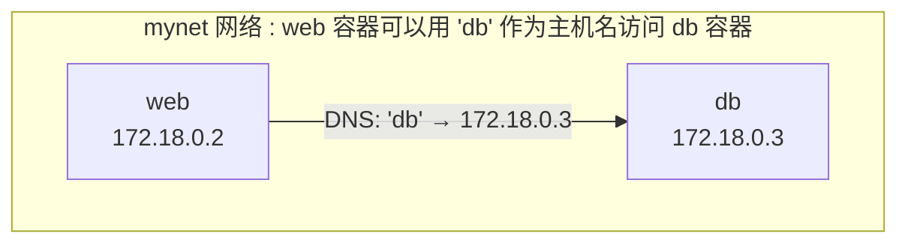
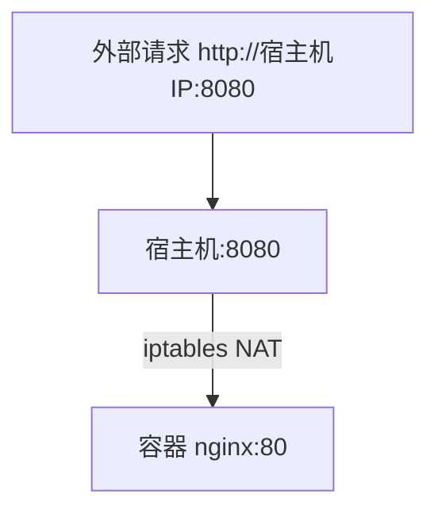

# 网络配置

本节涵盖了相关内容与详细描述，主要探讨以下几个方面：

## Docker 网络概述

Docker 容器需要网络来：
- 与外部世界通信 (访问互联网、被外部访问)
- 容器之间相互通信
- 与宿主机通信

Docker 在安装时会自动配置网络基础设施，大多数情况下开箱即用。

## 默认网络架构

Docker 启动时自动创建以下网络组件：



### 核心组件

| 组件 | 说明 |
|------|------|
| **docker0** | 虚拟网桥，充当交换机角色 |
| **veth pair** | 虚拟网卡对，一端在容器内，一端连接网桥 |
| **容器 eth0** | 容器内的网卡 |
| **IP 地址** | 自动从 172.17.0.0/16 网段分配 |

### 数据流向

如下代码块所示，展示了相关示例：



---

## Docker 网络类型

查看默认网络：

```bash
$ docker network ls
NETWORK ID     NAME      DRIVER    SCOPE
abc123...      bridge    bridge    local
def456...      host      host      local
ghi789...      none      null      local
```

| 网络类型 | 说明 | 适用场景 |
|---------|------|---------|
| **bridge** | 默认类型，容器连接到虚拟网桥 | 大多数单机场景 |
| **host** | 容器直接使用宿主机网络栈 | 需要最高网络性能时 |
| **none** | 禁用网络 | 完全隔离的容器 |
| **overlay** | 跨主机网络 | Docker Swarm 集群 |
| **macvlan** | 容器拥有独立 MAC 地址 | 需要直接接入物理网络 |

---

## 用户自定义网络 (推荐)

本节涵盖了相关内容与详细描述，主要探讨以下几个方面：

### 为什么要用自定义网络

默认 bridge 网络的局限：

| 问题 | 自定义网络的优势 |
|------|-----------------|
| 只能用 IP 通信 | 支持容器名 DNS 解析 |
| 所有容器在同一网络 | 更好的隔离性 |
| 需要 --link（已废弃） | 原生支持服务发现 |

### 创建自定义网络

运行以下命令：

```bash
## 创建网络

$ docker network create mynet

## 查看网络详情

$ docker network inspect mynet
```

### 使用自定义网络

运行以下命令：

```bash
## 启动容器并连接到自定义网络

$ docker run -d --name web --network mynet nginx
$ docker run -d --name db --network mynet postgres

## 在 web 容器中可以直接用容器名访问 db

$ docker exec web ping db
PING db (172.18.0.3): 56 data bytes
64 bytes from 172.18.0.3: seq=0 ttl=64 time=0.083 ms
```

### 容器名 DNS 解析

自定义网络自动提供 DNS 服务：



---

## 容器互联

本节涵盖了相关内容与详细描述，主要探讨以下几个方面：

### 同一网络内的容器

同一自定义网络内的容器可以直接通信：

```bash
## 创建网络

$ docker network create app-net

## 启动应用和数据库

$ docker run -d --name redis --network app-net redis
$ docker run -d --name app --network app-net myapp

## app 容器中可以用 redis:6379 连接 Redis

...
```

### 连接到多个网络

一个容器可以连接到多个网络：

```bash
## 启动容器

$ docker run -d --name multi-net-container --network frontend nginx

## 再连接到另一个网络

$ docker network connect backend multi-net-container

## 查看容器的网络

$ docker inspect multi-net-container --format '{{json .NetworkSettings.Networks}}'
```

### ⚠️ --link 已废弃

运行以下命令：

```bash
## 旧方式（不推荐）

$ docker run --link db:database myapp

## 新方式（推荐）

$ docker network create mynet
$ docker run --network mynet --name db postgres
$ docker run --network mynet --name app myapp
```

---

## 端口映射

容器默认只能在 Docker 网络内访问。要从外部访问容器，需要端口映射：

### 基本语法

运行以下命令：

```bash
## -p 宿主机端口:容器端口

$ docker run -d -p 8080:80 nginx
```

### 映射方式

| 参数 | 说明 | 示例 |
|------|------|------|
| `-p 8080:80` | 指定端口映射 | 宿主机 8080 → 容器 80 |
| `-p 80` | 随机宿主机端口 | 随机端口 → 容器 80 |
| `-P` | 自动映射所有暴露端口 | 随机端口 → 所有 EXPOSE 端口 |
| `-p 127.0.0.1:8080:80` | 只绑定本地 | 仅本机可访问 |
| `-p 8080:80/udp` | UDP 端口 | UDP 协议 |

### 查看端口映射

运行以下命令：

```bash
$ docker port mycontainer
80/tcp -> 0.0.0.0:8080
```

### 端口映射示意图

如下代码块所示，展示了相关示例：



---

## 网络隔离

不同网络之间默认隔离：

```bash
## 创建两个网络

$ docker network create frontend
$ docker network create backend

## 容器 A 在 frontend

$ docker run -d --name web --network frontend nginx

## 容器 B 在 backend  

$ docker run -d --name db --network backend postgres

## web 无法直接访问 db（不同网络）

$ docker exec web ping db
ping: db: Name or service not known
```

这种隔离有助于安全：前端容器无法直接访问数据库网络。

---

## 常用命令

运行以下命令：

```bash
## 列出网络

$ docker network ls

## 创建网络

$ docker network create mynet

## 查看网络详情

$ docker network inspect mynet

## 连接容器到网络

$ docker network connect mynet mycontainer

## 断开网络连接

$ docker network disconnect mynet mycontainer

## 删除网络

$ docker network rm mynet

## 清理未使用的网络

$ docker network prune
```

---

## 本章小结

| 概念 | 要点 |
|------|------|
| **默认网络** | docker0 网桥，172.17.0.0/16 网段 |
| **自定义网络** | 推荐使用，支持容器名 DNS 解析 |
| **端口映射** | `-p 宿主机端口:容器端口` 暴露服务 |
| **网络隔离** | 不同网络默认隔离，增强安全性 |
| **--link** | 已废弃，使用自定义网络替代 |

## 延伸阅读

- [配置 DNS](dns.md)：自定义 DNS 设置
- [端口映射](port_mapping.md)：高级端口配置
- [Compose 网络](../../10_compose/10.5_compose_file.md)：Compose 中的网络配置
