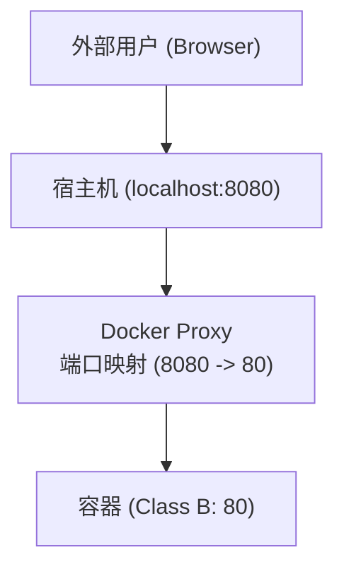

## 外部访问容器

本节涵盖了相关内容与详细描述，主要探讨以下几个方面：

### 为什么要映射端口

容器运行在自己的隔离网络环境中 (通常是 Bridge 模式)。这意味着：
- **容器之间**：可以通过 IP 或容器名 (自定义网络) 互通。
- **宿主机访问容器**：可以通过容器 IP 访问。
- **外部网络访问容器**：❌ 默认无法直接访问。

为了让外部 (如你的浏览器、其他局域网机器) 访问容器内的服务，我们需要将容器的端口**映射**到宿主机的端口。



---

### 端口映射方式

本节涵盖了相关内容与详细描述，主要探讨以下几个方面：

#### 1。指定映射

Docker 提供了多种方式来指定端口映射，最常用的是 `-p` 参数。


使用 `-p <宿主机端口>:<容器端口>` 格式。

```bash
## 将宿主机的 8080 端口映射到容器的 80 端口

$ docker run -d -p 8080:80 nginx
```

此时访问 `http://localhost:8080` 即可看到 Nginx 页面。

**多种格式**：

| 格式 | 含义 | 示例 |
|------|------|------|
| `ip:hostPort:containerPort` | 绑定指定 IP 的特定端口 | `-p 127.0.0.1:8080:80` (仅本机访问) |
| `ip::containerPort` | 绑定指定 IP 的随机端口 | `-p 127.0.0.1::80` |
| `hostPort:containerPort` | 绑定所有 IP (0.0.0.0) 的特定端口 | `-p 8080:80` (默认) |
| `containerPort` | 绑定所有 IP 的随机端口 | `-p 80` |

#### 2。随机映射

如果您不关心宿主机使用哪个端口，可以使用随机映射功能。


使用 `-P` (大写) 参数，Docker 会随机映射 Dockerfile 中 `EXPOSE` 指令暴露的所有端口到宿主机的高端口 (49000-49900)。

```bash
$ docker run -d -P nginx
```

查看映射结果：

```bash
$ docker ps
CONTAINER ID   PORTS
abc123456      0.0.0.0:49153->80/tcp
```

此时 Nginx 被映射到了宿主机的 49153 端口。

---

### 查看端口映射

本节涵盖了相关内容与详细描述，主要探讨以下几个方面：

#### docker port

我们可以使用 `docker port` 命令来查看当前容器的端口映射规则。


运行以下命令：

```bash
$ docker port mycontainer
80/tcp -> 0.0.0.0:8080
80/tcp -> [::]:8080
```

#### docker ps

运行以下命令：

```bash
$ docker ps
CONTAINER ID   IMAGE     PORTS                  NAMES
abc123456      nginx     0.0.0.0:8080->80/tcp   web
```

---

### 最佳实践与安全

本节涵盖了相关内容与详细描述，主要探讨以下几个方面：

#### 1。限制监听 IP

为了保证服务的安全性，我们应该谨慎选择绑定的 IP 地址。


默认情况下，`-p 8080:80` 会监听 `0.0.0.0:8080`，这意味着任何人只要能连接你的宿主机 IP，就能访问该服务。

如果不希望对外暴露 (例如数据库服务)，应绑定到 `127.0.0.1`：

```bash
## 仅允许本机访问

$ docker run -d -p 127.0.0.1:3306:3306 mysql
```

#### 2。避免端口冲突

如果宿主机 8080 已经被占用了，容器将无法启动。

**解决**：
- 更换宿主机端口：`-p 8081:80`
- 让 Docker 自动分配：`-p 80`

#### 3。UDP 映射

默认是 TCP 协议。如果要映射 UDP 服务 (如 DNS，Syslog)：

```bash
$ docker run -d -p 53:53/udp dns-server
```

---

### 实现原理

Docker 使用 `docker-proxy` 进程 (用户态) 或 `iptables` DNAT 规则 (内核态) 来实现端口转发。

当流量到达宿主机端口时，iptables 规则将其目标地址修改为容器 IP 并转发：

```bash
## 简化的 iptables 逻辑

iptables -t nat -A DOCKER -p tcp --dport 8080 -j DNAT --to-destination 172.17.0.2:80
```

这也是为什么你在容器内部看到的访问来源 IP 通常是网关 IP (如 172.17.0.1)，而不是真实的外部 Client IP (除非使用 host 网络模式)。

---
