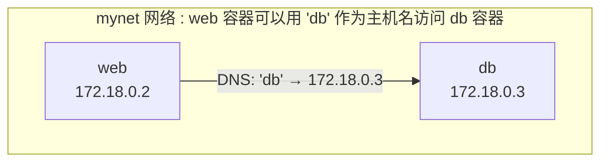

## 9.3 自定义网络

在生产环境中，推荐使用用户自定义网络代替默认的 bridge 网络。自定义网络提供了更好的隔离性和服务发现能力。

### 9.4.1 为什么要用自定义网络

默认 bridge 网络存在以下局限，而自定义网络可以很好地解决这些问题：

| 问题 | 自定义网络的优势 |
|------|-----------------| 
| 只能用 IP 通信 | 支持容器名 DNS 解析 |
| 所有容器在同一网络 | 更好的隔离性 |
| 需要 --link (已废弃)| 原生支持服务发现 |

### 9.4.2 创建自定义网络

使用 `docker network create` 命令可以创建自定义网络：

```bash
## 创建网络

$ docker network create mynet

## 查看网络详情

$ docker network inspect mynet
```

### 9.4.3 使用自定义网络

启动容器时通过 `--network` 参数指定连接的网络：

```bash
## 启动容器并连接到自定义网络

$ docker run -d --name web --network mynet nginx
$ docker run -d --name db --network mynet postgres

## 在 web 容器中可以直接用容器名访问 db

$ docker exec web ping db
PING db (172.18.0.3): 56 data bytes
64 bytes from 172.18.0.3: seq=0 ttl=64 time=0.083 ms
```

### 9.4.4 容器名 DNS 解析

自定义网络自动提供 DNS 服务。Docker 守护进程在 `127.0.0.11` 运行了一个嵌入式 DNS 服务器，容器内的 DNS 请求会被转发到这里：

- 如果是容器名，解析为容器 IP
- 如果是外部域名 (如 google.com)，转发给上游 DNS



### 9.4.5 常用网络命令

以下是 Docker 网络管理中常用的命令：

```bash
## 列出网络

$ docker network ls

## 创建网络

$ docker network create mynet

## 查看网络详情

$ docker network inspect mynet

## 连接容器到网络

$ docker network connect mynet mycontainer

## 断开网络连接

$ docker network disconnect mynet mycontainer

## 删除网络

$ docker network rm mynet

## 清理未使用的网络

$ docker network prune
```
