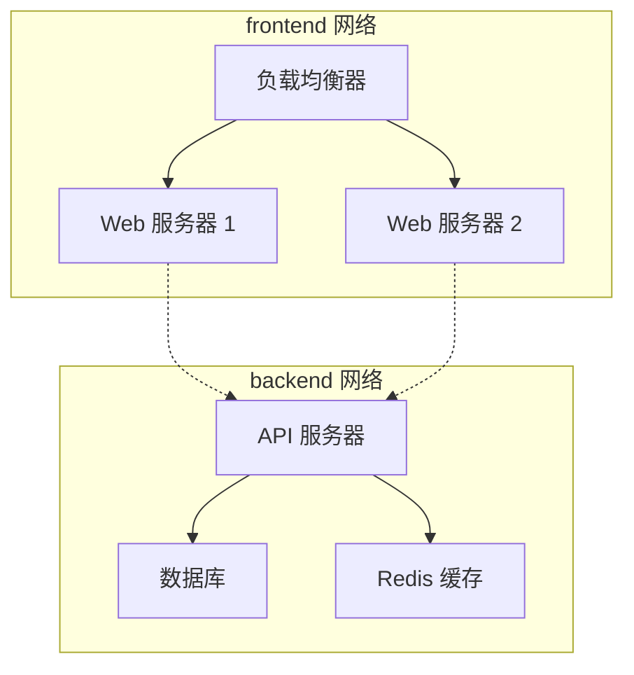

## 9.7 网络隔离

Docker 网络提供了天然的隔离能力，不同网络之间的容器默认无法通信。这是 Docker 网络安全的重要基础。

### 9.7.1 网络隔离原理

不同网络之间默认隔离，容器只能与同一网络中的容器直接通信：

```bash
## 创建两个网络

$ docker network create frontend
$ docker network create backend

## 容器 A 在 frontend

$ docker run -d --name web --network frontend nginx

## 容器 B 在 backend  

$ docker run -d --name db --network backend postgres

## web 无法直接访问 db（不同网络）

$ docker exec web ping db
ping: db: Name or service not known
```

### 9.7.2 安全优势

这种隔离机制带来以下安全优势：

| 场景 | 说明 |
|------|------|
| **前后端分离** | 前端容器无法直接访问数据库网络 |
| **微服务隔离** | 不同微服务组可以使用不同网络 |
| **多租户** | 不同租户的容器在不同网络中完全隔离 |
| **最小权限** | 容器只能访问必要的网络资源 |

### 9.7.3 跨网络通信

如果确实需要某个容器跨网络通信，可以将其同时连接到多个网络：

```bash
## 创建一个中间件容器，连接到两个网络

$ docker run -d --name api --network frontend myapi
$ docker network connect backend api

## 现在 api 容器既可以访问 frontend 中的 web，也可以访问 backend 中的 db
```

这种方式让你可以精确控制哪些容器可以跨网络通信，遵循最小权限原则。

### 9.7.4 典型网络架构

一个典型的多层应用网络架构如下：



在这种架构中，API 服务器同时连接到 `frontend` 和 `backend` 网络，充当两个网络之间的桥梁。负载均衡器和 Web 服务器无法直接访问数据库，增强了安全性。
