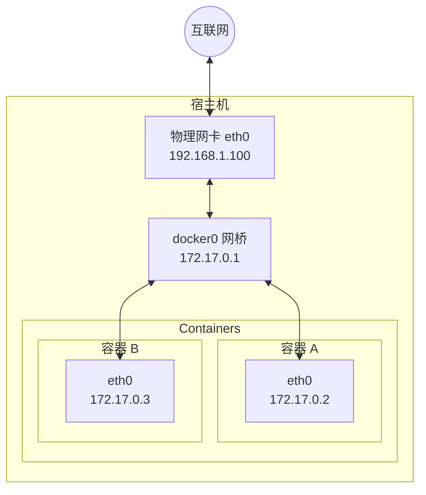

# 网络配置

Docker 容器需要网络来与外部世界通信、容器之间相互通信以及与宿主机通信。Docker 在安装时会自动配置网络基础设施，大多数情况下开箱即用。

## 概述

Docker 启动时自动创建以下网络组件：

本章将详细介绍 Docker 网络配置的各个方面。

## 本章内容

* [配置 DNS](9.1_dns.md)
* [外部访问容器](9.5_port_mapping.md)
* [网络类型](9.2_network_types.md)
* [自定义网络](9.3_custom_network.md)
* [容器互联](9.4_container_linking.md)
* [网络隔离](9.6_network_isolation.md)
