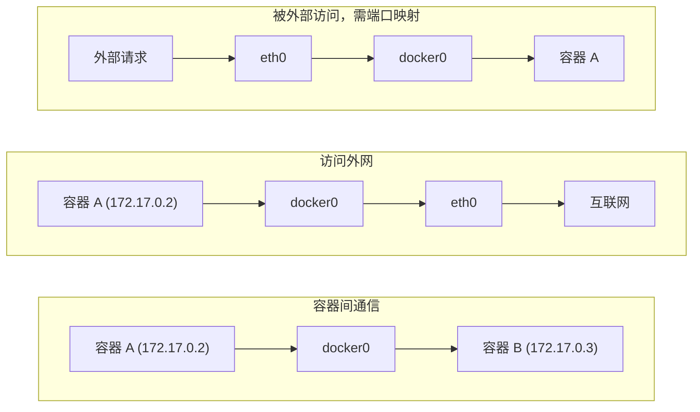

## 9.3 Docker 网络类型

Docker 提供了多种网络驱动来满足不同的使用场景。安装 Docker 后，系统会自动创建三个默认网络：

```bash
$ docker network ls
NETWORK ID     NAME      DRIVER    SCOPE
abc123...      bridge    bridge    local
def456...      host      host      local
ghi789...      none      null      local
```

### 9.3.1 网络类型对比

各网络类型的特点和适用场景如下：

| 网络类型 | 说明 | 适用场景 |
|---------|------|---------| 
| **bridge** | 默认类型，容器连接到虚拟网桥 | 大多数单机场景 |
| **host** | 容器直接使用宿主机网络栈 | 需要最高网络性能时 |
| **none** | 禁用网络 | 完全隔离的容器 |
| **overlay** | 跨主机网络 | Docker Swarm 集群 |
| **macvlan** | 容器拥有独立 MAC 地址 | 需要直接接入物理网络 |

### 9.3.2 Bridge 网络 (默认)

Bridge 是 Docker 默认使用的网络模式。Docker 启动时会自动创建 `docker0` 虚拟网桥，所有未指定网络的容器都会连接到这个网桥上。

核心组件如下：

| 组件 | 说明 |
|------|------|
| **docker0** | 虚拟网桥，充当交换机角色 |
| **veth pair** | 虚拟网卡对，一端在容器内，一端连接网桥 |
| **容器 eth0** | 容器内的网卡 |
| **IP 地址** | 自动从 172.17.0.0/16 网段分配 |

### 9.3.3 Host 网络

使用 `--network host` 参数启动的容器会直接使用宿主机的网络栈，不再拥有独立的网络命名空间。容器内的端口就是宿主机的端口，无需端口映射。

```bash
$ docker run -d --network host nginx
```

这种模式下网络性能最高，但容器之间和宿主机之间没有网络隔离。

### 9.3.4 None 网络

使用 `--network none` 参数启动的容器只有 `lo` 回环网卡，完全没有外部网络连接。适用于只需要运行计算任务、不需要网络的容器。

```bash
$ docker run -it --network none alpine ip addr
1: lo: <LOOPBACK,UP,LOWER_UP> ...
    inet 127.0.0.1/8 scope host lo
```

### 9.3.5 数据流向

容器网络中的数据流向可以分为以下几种情况：


