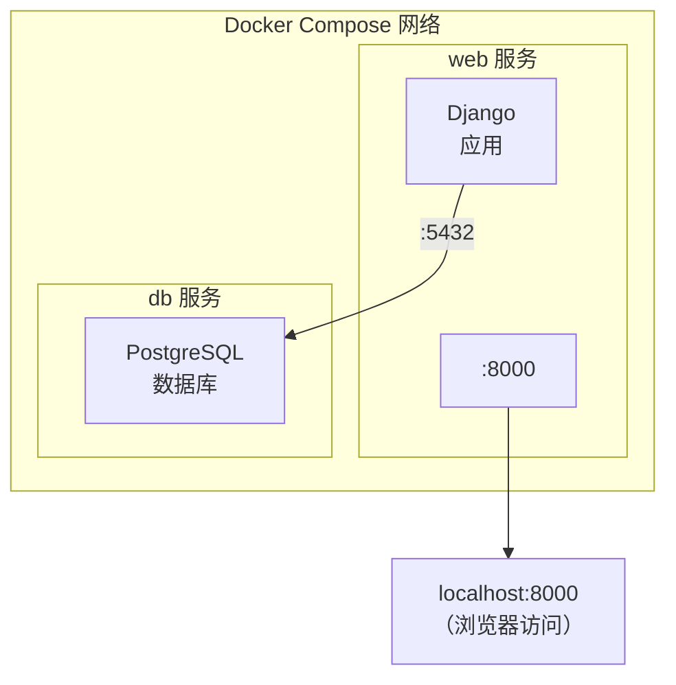

## 10.6 使用 Django

> 本小节内容适合 `Python` 开发人员阅读。

本节将使用 Docker Compose 配置并运行一个 **Django + PostgreSQL** 应用。笔者不仅会介绍具体步骤，还会解释每个配置项的作用，以及开发环境和生产环境的差异。

### 架构概览

在开始之前，先看整体架构 (如图 10-1 所示)：



图 10-1 Django + PostgreSQL 的 Compose 架构

**关键点**：

- `web` 服务运行 Django 应用，对外暴露 8000 端口
- `db` 服务运行 PostgreSQL 数据库，只在内部网络可访问
- 两个服务通过 Docker Compose 自动创建的网络相互通信
- `web` 服务可以通过服务名 `db` 访问数据库 (Docker 内置 DNS)

### 准备工作

创建一个项目目录并进入：

```bash
$ mkdir django-docker && cd django-docker
```

我们需要创建三个文件：`Dockerfile`、`requirements.txt` 和 `compose.yaml`。

### 步骤 1：创建 Dockerfile

如下代码块所示，展示了相关示例：

```docker
FROM python:3.12-slim

## 防止 Python 缓冲 stdout/stderr，让日志实时输出

ENV PYTHONUNBUFFERED=1

## 设置工作目录

WORKDIR /code

## 先复制依赖文件，利用 Docker 缓存加速构建

COPY requirements.txt /code/

## 安装依赖

RUN pip install --no-cache-dir -r requirements.txt

## 复制项目代码

COPY . /code/
```

**逐行解释**：

| 指令 | 作用 | 为什么这样写 |
|------|------|-------------|
| `FROM python:3.12-slim` | 基础镜像 | `slim` 版本比完整版小很多，但包含运行 Python 所需的一切 |
| `ENV PYTHONUNBUFFERED=1` | 关闭输出缓冲 | 让 `print()` 和日志立即显示，便于调试 |
| `WORKDIR /code` | 设置工作目录 | 后续命令都在此目录执行 |
| `COPY requirements.txt` 在前 | 分层复制 | 只有 requirements.txt 变化时才重新安装依赖，加速构建 |
| `--no-cache-dir` | 不缓存 pip 下载 | 减小镜像体积 |

> 💡 **笔者建议**：总是将变化频率低的文件先复制，变化频率高的后复制。这样可以最大化利用 Docker 的构建缓存。

### 步骤 2：创建 requirements.txt

如下代码块所示，展示了相关示例：

```txt
Django>=5.0,<6.0
psycopg[binary]>=3.1,<4.0
gunicorn>=21.0,<22.0
```

**依赖说明**：

| 包名 | 作用 |
|------|------|
| `Django` | Web 框架 |
| `psycopg[binary]` | PostgreSQL 数据库驱动 (推荐使用 psycopg 3)|
| `gunicorn` | 生产环境 WSGI 服务器 (可选，开发时可不用)|

### 步骤 3：创建 compose.yaml

配置如下：

```yaml
services:
  db:
    image: postgres:16
    environment:
      POSTGRES_DB: django_db
      POSTGRES_USER: django_user
      POSTGRES_PASSWORD: django_password
    volumes:
      - postgres_data:/var/lib/postgresql/data
    healthcheck:
      test: ["CMD-SHELL", "pg_isready -U django_user -d django_db"]
      interval: 5s
      timeout: 5s
      retries: 5

  web:
    build: .
    command: python manage.py runserver 0.0.0.0:8000
    volumes:
      - .:/code
    ports:
      - "8000:8000"
    depends_on:
      db:
        condition: service_healthy
    environment:
      DATABASE_URL: postgres://django_user:django_password@db:5432/django_db

volumes:
  postgres_data:
```

**配置详解**：

#### db 服务

db 服务配置如下：

```yaml
db:
  image: postgres:16                    # 使用官方 PostgreSQL 16 镜像
  environment:
    POSTGRES_DB: django_db              # 创建的数据库名
    POSTGRES_USER: django_user          # 数据库用户
    POSTGRES_PASSWORD: django_password  # 数据库密码
  volumes:
    - postgres_data:/var/lib/postgresql/data  # 持久化数据
  healthcheck:                          # 健康检查，确保数据库就绪
    test: ["CMD-SHELL", "pg_isready -U django_user -d django_db"]
    interval: 5s
```

> ⚠️ **笔者提醒**：`volumes` 配置很重要！没有它，每次容器重启数据都会丢失。笔者见过不少新手因为忘记这一步，导致开发数据全部丢失。

#### web 服务

web 服务配置如下：

```yaml
web:
  build: .                              # 从当前目录的 Dockerfile 构建
  command: python manage.py runserver   # 启动 Django 开发服务器
  volumes:
    - .:/code                           # 挂载代码目录，支持热更新
  ports:
    - "8000:8000"                       # 映射端口
  depends_on:
    db:
      condition: service_healthy        # 等待数据库健康后再启动
```

**关键配置说明**：

| 配置项 | 作用 | 笔者建议 |
|--------|------|---------|
| `volumes: .:/code` | 代码挂载 | 开发时必备，修改代码无需重新构建镜像 |
| `depends_on` + `healthcheck` | 启动顺序 | 确保数据库就绪后 Django 才启动，避免连接错误 |
| `environment` | 环境变量 | 推荐用环境变量管理配置，避免硬编码 |

### 步骤 4：创建 Django 项目

运行以下命令创建新的 Django 项目：

```bash
$ docker compose run --rm web django-admin startproject mysite .
```

**命令解释**：

- `docker compose run`：运行一次性命令
- `--rm`：命令执行后删除临时容器
- `web`：在 web 服务环境中执行
- `django-admin startproject mysite .`：在当前目录创建 Django 项目

生成的目录结构：

```bash
django-docker/
├── compose.yaml
├── Dockerfile
├── requirements.txt
├── manage.py
└── mysite/
    ├── __init__.py
    ├── settings.py
    ├── urls.py
    ├── asgi.py
    └── wsgi.py
```

> 💡 **Linux 用户注意**：如果遇到权限问题，执行 `sudo chown -R $USER:$USER .`

### 步骤 5：配置数据库连接

修改 `mysite/settings.py`，配置数据库连接：

```python
import os

DATABASES = {
    'default': {
        'ENGINE': 'django.db.backends.postgresql',
        'NAME': os.environ.get('POSTGRES_DB', 'django_db'),
        'USER': os.environ.get('POSTGRES_USER', 'django_user'),
        'PASSWORD': os.environ.get('POSTGRES_PASSWORD', 'django_password'),
        'HOST': 'db',  # Docker Compose 服务名
        'PORT': 5432,
    }
}

## 允许的主机（开发环境）

ALLOWED_HOSTS = ['*']
```

**为什么 HOST 是 `db` 而不是 `localhost`？**

在 Docker Compose 中，各服务通过服务名相互访问。Docker 内置的 DNS 会将 `db` 解析为 db 服务容器的 IP 地址。这是 Docker Compose 的核心功能之一。

### 步骤 6：启动应用

运行以下命令：

```bash
$ docker compose up
```

你会看到：

1. 首先构建 web 镜像 (第一次运行)
2. 启动 db 服务，等待健康检查通过
3. 启动 web 服务

```bash
db-1   | PostgreSQL init process complete; ready for start up.
db-1   | LOG:  database system is ready to accept connections
web-1  | Watching for file changes with StatReloader
web-1  | Starting development server at http://0.0.0.0:8000/
```

打开浏览器访问 http://localhost:8000，可以看到 Django 欢迎页面！

### 常用开发命令

在另一个终端窗口执行：

```bash
## 执行数据库迁移

$ docker compose exec web python manage.py migrate

## 创建超级用户

$ docker compose exec web python manage.py createsuperuser

## 进入 Django shell

$ docker compose exec web python manage.py shell

## 进入 PostgreSQL 命令行

$ docker compose exec db psql -U django_user -d django_db
```

> 💡 笔者建议使用 `exec` 而不是 `run`。`exec` 在已运行的容器中执行命令，`run` 会创建新容器。

### 常见问题排查

本节涵盖了相关内容与详细描述，主要探讨以下几个方面：

#### Q1：数据库连接失败

**错误信息**：`django.db.utils.OperationalError: could not connect to server` **可能原因与解决方案**：

| 原因 | 解决方案 |
|------|---------|
| 数据库还没启动完成 | 使用 `depends_on` + `healthcheck` |
| HOST 配置错误 | 确保使用服务名 `db` 而不是 `localhost` |
| 网络未创建 | 运行 `docker compose down` 后重新 `up` |

```bash
## 调试：检查数据库是否正常运行

$ docker compose ps
$ docker compose logs db
```

#### Q2：代码修改没有生效

**可能原因**：

1. **开发服务器没有自动重载**：确保使用 `runserver` 而不是 `gunicorn`
2. **Volume 挂载问题**：检查 `compose.yaml` 中的 volumes 配置
3. **缓存问题**：尝试 `docker compose restart web`

#### Q3：权限问题

运行以下命令：

```bash
## 如果容器内创建的文件 root 用户所有

$ sudo chown -R $USER:$USER .
```

### 开发 vs 生产：关键差异

笔者特别提醒，本节的配置是 **开发环境** 配置。生产环境需要以下调整：

| 配置项 | 开发环境 | 生产环境 |
|--------|---------|---------|
| **Web 服务器** | `runserver` | `gunicorn` + Nginx |
| **DEBUG** | `True` | `False` |
| **密码管理** | 明文写在配置 | 使用 Docker Secrets 或环境变量 |
| **Volume** | 挂载代码目录 | 代码直接 COPY 进镜像 |
| **ALLOWED_HOSTS**| `['*']` | 具体域名 |**生产环境 Compose 文件示例**：

```yaml
## compose.prod.yaml

services:
  web:
    build: .
    command: gunicorn mysite.wsgi:application --bind 0.0.0.0:8000
    # 不挂载代码，使用镜像内的代码

    environment:
      DEBUG: 'False'
      ALLOWED_HOSTS: 'example.com,www.example.com'
    # ...

```

### 延伸阅读

- [Compose 模板文件详解](10.5_compose_file.md)：深入理解 Compose 文件的所有配置项
- [使用 WordPress](10.8_wordpress.md)：另一个 Compose 实战案例
- [Dockerfile 最佳实践](../appendix/20.1_best_practices.md)：构建更小、更安全的镜像
- [数据管理](../08_data_network/README.md)：Volume 和数据持久化详解
