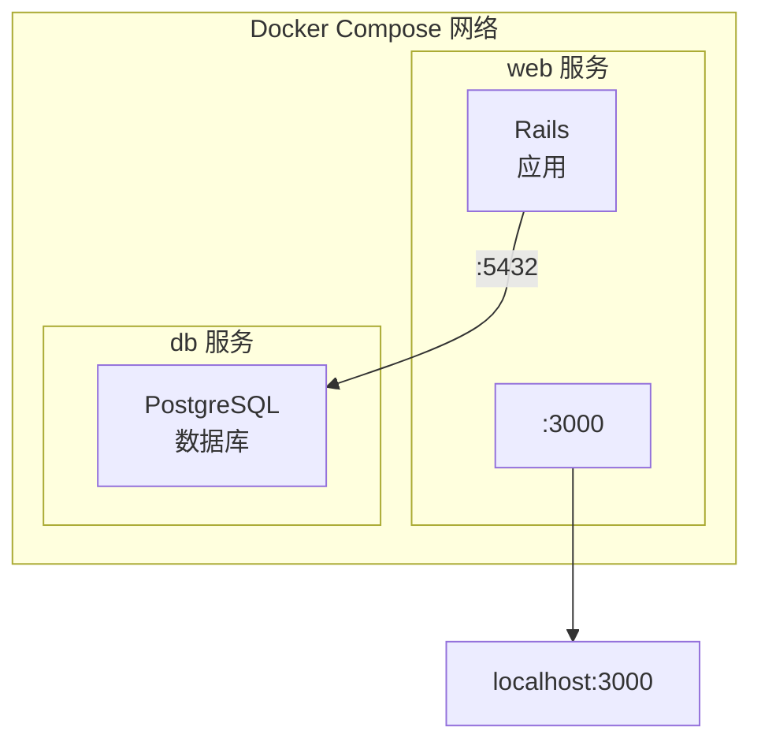

## 11.7 实战 Rails

> 本小节内容适合 Ruby 开发人员阅读。

本节使用 Docker Compose 配置并运行一个 **Rails + PostgreSQL** 应用。

### 11.7.1 架构概览

如图 11-2 所示，Rails 与 PostgreSQL 在同一 Compose 网络中协同工作。


图 11-2：Rails + PostgreSQL 的 Compose 架构

### 11.7.2 准备工作

创建项目目录：

```bash
$ mkdir rails-docker && cd rails-docker
```
需要创建三个文件：`Dockerfile`、`Gemfile` 和 `compose.yaml`。

### 11.7.3 步骤 1：创建 Dockerfile

```docker
FROM ruby:3.2

## 安装系统依赖

RUN apt-get update -qq && \
    apt-get install -y build-essential libpq-dev nodejs && \
    rm -rf /var/lib/apt/lists/*

## 设置工作目录

WORKDIR /myapp

## 先复制 Gemfile，利用缓存加速构建

COPY Gemfile /myapp/Gemfile
COPY Gemfile.lock /myapp/Gemfile.lock
RUN bundle install

## 复制应用代码

COPY . /myapp
```
**配置说明**：

| 指令 | 作用 |
|------|------|
| `build-essential` | 编译原生扩展所需 |
| `libpq-dev` | PostgreSQL 客户端库 |
| `nodejs` | Rails Asset Pipeline 需要 |
| 先复制 Gemfile | 只有依赖变化时才重新 `bundle install` |

### 11.7.4 步骤 2：创建 Gemfile

创建一个初始的 `Gemfile`，稍后会被 `rails new` 覆盖：

```ruby
source 'https://rubygems.org'
gem 'rails', '~> 7.1'
```
创建空的 `Gemfile.lock`：

```bash
$ touch Gemfile.lock
```

### 11.7.5 步骤 3：创建 compose.yaml

配置如下：

```yaml
services:
  db:
    image: postgres:16
    environment:
      POSTGRES_PASSWORD: password
    volumes:
      - postgres_data:/var/lib/postgresql/data

  web:
    build: .
    command: bash -c "rm -f tmp/pids/server.pid && bundle exec rails s -p 3000 -b '0.0.0.0'"
    volumes:
      - .:/myapp
    ports:
      - "3000:3000"
    depends_on:
      - db
    environment:
      DATABASE_URL: postgres://postgres:password@db:5432/myapp_development

volumes:
  postgres_data:
```
**配置详解**：

| 配置项 | 说明 |
|--------|------|
| `rm -f tmp/pids/server.pid` | 清理上次异常退出留下的 PID 文件 |
| `volumes: .:/myapp` | 挂载代码目录，支持热更新 |
| `depends_on: db` | 确保数据库先启动 |
| `DATABASE_URL` | Rails 12-factor 风格的数据库配置 |

### 11.7.6 步骤 4：生成 Rails 项目

使用 `docker compose run` 生成项目骨架：

```bash
$ docker compose run --rm web rails new . --force --database=postgresql --skip-bundle
```
**命令解释**：

- `--rm`：执行后删除临时容器
- `--force`：覆盖已存在的文件
- `--database=postgresql`：配置使用 PostgreSQL
- `--skip-bundle`：暂不安装依赖 (稍后统一安装)

生成的目录结构：

```bash
$ ls
Dockerfile       Gemfile          Rakefile         config           lib              tmp
Gemfile.lock     README.md        app              config.ru        log              vendor
compose.yaml     bin              db               public

```
> ⚠️ **Linux 用户**：如遇权限问题，执行 `sudo chown -R $USER:$USER .`

### 11.7.7 步骤 5：重新构建镜像

由于生成了新的 Gemfile，需要重新构建镜像以安装完整依赖：

```bash
$ docker compose build
```

### 11.7.8 步骤 6：配置数据库连接

修改 `config/database.yml`：

```yaml
default: &default
  adapter: postgresql
  encoding: unicode
  pool: <%= ENV.fetch("RAILS_MAX_THREADS") { 5 } %>
  url: <%= ENV['DATABASE_URL'] %>

development:
  <<: *default

test:
  <<: *default
  database: myapp_test

production:
  <<: *default
```
> 💡 使用 `DATABASE_URL` 环境变量配置数据库，符合 12-factor 应用原则，便于在不同环境间切换。

### 11.7.9 步骤 7：启动应用

```bash
$ docker compose up
```
输出示例：

```bash
db-1   | PostgreSQL init process complete; ready for start up.
db-1   | LOG:  database system is ready to accept connections
web-1  | => Booting Puma
web-1  | => Rails 7.1.0 application starting in development
web-1  | => Run `bin/rails server --help` for more startup options
web-1  | Puma starting in single mode...
web-1  | * Listening on http://0.0.0.0:3000
```

### 11.7.10 步骤 8：创建数据库

在另一个终端执行：

```bash
$ docker compose exec web rails db:create
Created database 'myapp_development'
Created database 'myapp_test'
```
访问 http://localhost:3000 查看 Rails 欢迎页面。

### 11.7.11 常用开发命令

```bash
## 数据库迁移

$ docker compose exec web rails db:migrate

## Rails 控制台

$ docker compose exec web rails console

## 运行测试

$ docker compose exec web rails test

## 生成脚手架

$ docker compose exec web rails generate scaffold Post title:string body:text

## 进入容器 Shell

$ docker compose exec web bash
```

### 11.7.12 常见问题

#### Q：数据库连接失败

检查 `DATABASE_URL` 环境变量格式是否正确，确保 db 服务已启动：

```bash
$ docker compose ps
$ docker compose logs db
```

#### Q：server.pid 文件导致启动失败

错误信息：`A server is already running`

已在 command 中添加 `rm -f tmp/pids/server.pid` 处理。如仍有问题：

```bash
$ docker compose exec web rm -f tmp/pids/server.pid
```

#### Q：Gem 安装失败

可能需要更新 bundler 或清理缓存：

```bash
$ docker compose run --rm web bundle update
```

### 11.7.13 开发 vs 生产

| 配置项 | 开发环境 | 生产环境 |
|--------|---------|---------|
| Rails 服务器 | Puma (开发模式) | Puma + Nginx |
| 代码挂载 | 使用 volumes | 代码打包进镜像 |
| 静态资源 | 动态编译 | 预编译 (`rails assets:precompile`) |
| 数据库密码 | 明文配置 | 使用 Secrets 管理 |

### 11.7.14 延伸阅读

- [使用 Django](11.6_django.md)：Python Web 框架实战
- [Compose 模板文件](11.5_compose_file.md)：配置详解
- [数据管理](../08_data/README.md)：数据持久化
