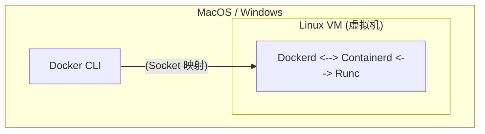

## 12.1 基本架构

Docker 的架构设计简洁而高效，主要由客户端和服务端两部分组成。

### 12.1.1 核心架构图

Docker 采用了 **C/S (客户端/服务端)** 架构。Client 向 Daemon 发送请求，Daemon 负责构建、运行和分发容器。

```mermaid
graph LR
    Client[客户端 (Docker CLI)] -- docker run --> Dockerd
    Client -- docker pull --> Dockerd
    
    subgraph "Docker Host"
        Dockerd(dockerd<br>守护进程)
        Containers(Containers<br>容器)
        Images(Images<br>镜像)
        
        Dockerd -- 管理 --> Containers
        Dockerd -- 管理 --> Images
    end
```

---

### 12.1.2 组件详解

Docker 的内部架构如同洋葱一样分层，每一层专注解决特定问题：

#### 1. Docker CLI (客户端)

用户与 Docker 交互的主要方式。它将用户命令 (如 `docker run`) 转换为 API 请求发送给 dockerd。

#### 2. Dockerd (守护进程)

Docker 的大脑。

- 监听 API 请求
- 管理 Docker 对象 (镜像、容器、网络、卷)
- 编排下层组件完成工作

#### 3. Containerd (高级运行时)

行业标准的容器运行时 (CNCF 毕业项目)。

- 管理容器的完整生命周期 (启动、停止)
- 镜像拉取与存储
- **不包含** 复杂的与容器无关的功能 (如构建、API)
- Kubernetes 也可以直接使用 containerd (跳过 Docker)

#### 4. Runc (低级运行时)

用于创建和运行容器的 CLI 工具。

- 直接与内核交互 (Namespaces，Cgroups)
- 遵循 OCI (Open Container Initiative) 规范
- **主要职责**：根据配置启动一个容器，然后退出 (将控制权交给容器进程)

#### 5. Shim

每个容器都有一个 shim 进程。

- **解耦**：允许 dockerd 重启而不影响容器运行
- **保持 IO**：维持容器的标准输入输出
- **状态汇报**：向 containerd 汇报容器退出状态

---

### 12.1.3 容器启动流程

当执行 `docker run -d nginx` 时，内部发生了什么？

```mermaid
flowchart TD
    User((用户))
    
    subgraph DockerCLI [Docker CLI]
        Cmd[docker run -d nginx]
    end
    
    subgraph DockerHost [Docker Host]
        Dockerd[Dockerd]
        Containerd[Containerd]
        subgraph ContainerRuntime [Runtime]
            Shim[Containerd-shim]
            Runc[Runc]
            Container[容器进程 (nginx)]
        end
    end
    
    User --> Cmd
    Cmd -- 1. REST API --> Dockerd
    Dockerd -- 2. gRPC --> Containerd
    Containerd -- 3. 准备镜像 & Bundle --> Containerd
    Containerd -- 4. Fork --> Shim
    Shim -- 5. Exec --> Runc
    Runc -- 6. Create Namespaces/Cgroups --> Container
    Runc -.-> |7. Exit| Runc
    Shim -.-> |8. Monitor IO/Exit| Container
```

1. **CLI** 发送请求给 **Dockerd**
2. **Dockerd** 解析请求，调用 **Containerd**
3. **Containerd** 准备镜像，转换为 OCI Bundle
4. **Containerd** 创建 **Shim** 进程
5. **Shim** 调用 **Runc**
6. **Runc** 与系统内核交互，创建 Namespaces 和 Cgroups
7. **Runc** 启动 nginx 进程后退出
8. **Shim** 接管容器 IO 和生命周期监控

---

### 12.1.4 Docker Engine v29+ 变化

从 Docker Engine v29 (2025/2026) 开始，架构进一步简化和标准化：

- **Containerd 镜像存储 (Image Store)**：默认启用。Docker 直接使用 Containerd 的镜像管理能力，不再维护自己的一套 graphdriver。
  - **优势**：多平台镜像支持更好、镜像拉取更快 (lazy pulling)、与 K8s 共享镜像。

---

### 12.1.5 Docker Desktop 架构

在 macOS 和 Windows 上，因为内核差异，架构稍微复杂：



- 使用轻量级虚拟机 (Apple Virtualization / WSL 2) 运行 Linux 内核
- 文件挂载 (Bind Mount) 需要跨越 VM 边界 (这也是文件 I/O 慢的原因)
- 网络端口需要从宿主机转发到 VM

---

### 12.1.6 总结

| 组件 | 角色 | 关键职责 |
|------|------|----------|
| **CLI** | 指挥官 | 发送指令，展示结果 |
| **Dockerd** | 大管家 | API 接口，整体调度 |
| **Containerd** | 经理 | 容器生命周期，镜像管理 |
| **Shim** | 监工 | 保持 IO，允许无守护进程重启 |
| **Runc** | 工人 | 真正干活 (创建容器)，干完就走 |

### 12.1.7 延伸阅读

- [命名空间](./12.2_namespace.md)：Runc 如何隔离容器
- [控制组](./12.3_cgroups.md)：Runc 如何限制资源
- [联合文件系统](./12.4_ufs.md)：镜像如何存储
