## 12.2 命名空间

命名空间是 Linux 内核一个强大的特性。每个容器都有自己单独的命名空间，运行在其中的应用都像是在独立的操作系统中运行一样。命名空间保证了容器之间彼此互不影响。

## 12.2 什么是 Namespace

> **Namespace 是 Linux 内核提供的资源隔离机制，它让容器内的进程仿佛运行在独立的操作系统中。** Namespace 是容器技术的核心基础之一。它回答了一个关键问题：**如何让一个进程 “以为” 自己独占整个系统？**

```mermaid
flowchart LR
    subgraph Host ["宿主机视角"]
        direction TB
        H1["PID 1: systemd"]
        H2["PID 2: sshd"]
        H3["PID 3: dockerd"]
        H4["PID 1234: nginx"]
        H5["PID 1235: nginx worker"]
    end
    
    subgraph Container ["容器内视角"]
        direction TB
        C1["PID 1: nginx<br/>← 容器认为自己是 PID 1"]
        C2["PID 2: nginx worker"]
    end
    
    H4 -. "（实际是宿主机的 1234）" .- C1
```



### 12.2.1 Namespace 的类型

Linux 内核提供了以下几种 Namespace，Docker 容器使用了全部：

| Namespace | 隔离内容 | 容器中的效果 |
|-----------|---------|-------------|
| **PID** | 进程 ID | 容器内 PID 从 1 开始，看不到其他容器和宿主机进程 |
| **NET** | 网络栈 | 独立的网卡、IP 地址、端口、路由表 |
| **MNT** | 挂载点 | 独立的文件系统视图，自己的根目录 |
| **UTS** | 主机名 | 独立的主机名和域名 |
| **IPC** | 进程间通信 | 独立的信号量、消息队列、共享内存 |
| **USER** | 用户/组 ID | 容器内的 root 可以映射为宿主机的普通用户 |
| **Cgroup** | Cgroup 根目录 | 隔离 cgroup 层级视图 (Linux 4.6+)|

---

### 12.2.2 PID Namespace

PID Namespace 负责进程 ID 的隔离，使得容器内的进程彼此不可见。

#### PID 的作用

隔离进程 ID，让每个容器有自己的进程编号空间。

#### PID 隔离效果

```bash
## 宿主机上查看进程

$ ps aux | grep nginx
root     12345  0.0  0.1  nginx: master process
root     12346  0.0  0.1  nginx: worker process

## 容器内查看进程

$ docker exec mycontainer ps aux
PID   USER     COMMAND
  1   root     nginx: master process    ← 在容器内是 PID 1
  2   root     nginx: worker process
```

#### PID 关键点

- 容器内的 PID 1 进程特殊重要——它是容器的主进程，退出则容器停止
- 容器内无法看到宿主机或其他容器的进程
- 宿主机可以看到所有容器内的进程 (但 PID 不同)

---

### 12.2.3 NET Namespace

NET Namespace 负责网络栈的隔离，包括网卡、路由表和 iptables 规则等。

#### NET 的作用

隔离网络栈，每个容器拥有独立的网络环境。

#### NET 隔离效果

```mermaid
flowchart LR
    subgraph Host ["宿主机"]
        direction TB
        H1["eth0: 192.168.1.10<br/>端口 80 可用"]
        H2["docker0: 172.17.0.1"]
    end
    
    subgraph Container ["容器"]
        direction TB
        C1["eth0: 172.17.0.2<br/>端口 80 可用"]
        C2["(veth pair 连接)"]
    end
    
    H2 <--> C2
```



#### NET 关键点

- 每个容器有独立的网卡、IP、路由表、iptables 规则
- 多个容器可以监听相同端口 (如都监听 80)
- Docker 使用 veth pair 连接容器网络和宿主机网桥

---

### 12.2.4 MNT Namespace

MNT Namespace 负责文件系统挂载点的隔离，确保容器看到独立的文件系统视图。

#### MNT 的作用

隔离文件系统挂载点，每个容器有自己的根目录。

#### MNT 隔离效果

```bash
宿主机文件系统：                  容器内看到的：
/                               /  ← 容器的根目录
├── bin/                        ├── bin/
├── home/                       ├── home/
├── var/                        ├── var/
│   └── lib/                    │   └── lib/
│       └── docker/             │
│           └── overlay2/       │
│               └── merged/ ────┼─── 这个目录成为容器的 /
└── ...                         └── ...
```

#### 与 chroot 的区别

| 特性 | chroot | MNT Namespace |
|------|--------|---------------|
| 安全性 | 可以逃逸 | 更安全 |
| 挂载隔离 | 无 | 完全隔离 |
| /proc/mounts | 共享 | 独立 |

---

### 12.2.5 UTS Namespace

UTS Namespace 主要用于隔离主机名和域名。

#### UTS 的作用

隔离主机名和域名，让每个容器可以有自己的主机名。

#### UTS 隔离效果

```bash
## 宿主机

$ hostname
my-server

## 容器内

$ docker run --hostname mycontainer ubuntu hostname
mycontainer
```

UTS = “UNIX Time-sharing System”，是历史遗留的名称。

---

### 12.2.6 IPC Namespace

IPC Namespace 用于隔离进程间通信资源，如 System V IPC 和 POSIX 消息队列。

#### IPC 的作用

隔离 System V IPC 和 POSIX 消息队列。

#### 隔离的资源

- 信号量 (semaphores)
- 消息队列 (message queues)
- 共享内存 (shared memory)

#### IPC 关键点

- 同一容器内的进程可以通过 IPC 通信
- 不同容器的进程无法通过 IPC 通信 (除非显式共享)

---

### 12.2.7 USER Namespace

USER Namespace 允许将容器内的用户 ID 映射到宿主机的不同用户 ID。

#### USER 的作用

隔离用户和组 ID，实现权限隔离。

#### USER 隔离效果

```mermaid
flowchart LR
    subgraph Container ["容器内"]
        direction TB
        C1["UID 0 (root)"]
        C2["UID 1 (daemon)"]
    end

    subgraph Host ["宿主机"]
        direction TB
        H1["UID 100000<br/>← 非特权用户"]
        H2["UID 100001"]
    end

    C1 -- 映射 --> H1
    C2 -- 映射 --> H2
```



#### 安全意义

容器内的 root 用户可以映射为宿主机上的普通用户，即使容器被突破，攻击者在宿主机上也只有普通权限。

> 💡 笔者建议：生产环境建议启用 User Namespace，增强安全性。

---

### 12.2.8 动手实验：体验 Namespace

使用 `unshare` 命令可以在不使用 Docker 的情况下体验 Namespace：

#### 实验 1：UTS Namespace

```bash
## 创建新的 UTS namespace 并启动 shell

$ sudo unshare --uts /bin/bash

## 修改主机名（只影响这个 namespace）

$ hostname container-test
$ hostname
container-test

## 退出后查看宿主机主机名（未改变）

$ exit
$ hostname
my-server
```

#### 实验 2：PID Namespace

```bash
## 创建新的 PID 和 MNT namespace

$ sudo unshare --pid --mount --fork /bin/bash

## 挂载新的 /proc

$ mount -t proc proc /proc

## 查看进程（只能看到当前 shell）

$ ps aux
USER       PID %CPU %MEM    VSZ   RSS TTY      STAT START   TIME COMMAND
root         1  0.0  0.0   8960  4516 pts/0    S    10:00   0:00 /bin/bash
root         8  0.0  0.0  10072  3200 pts/0    R+   10:00   0:00 ps aux
```

#### 实验 3：NET Namespace

```bash
## 创建新的网络 namespace

$ sudo unshare --net /bin/bash

## 查看网络接口（只有 lo）

$ ip addr
1: lo: <LOOPBACK> mtu 65536 qdisc noop state DOWN
    link/loopback 00:00:00:00:00:00 brd 00:00:00:00:00:00
```

---

### 12.2.9 Namespace 的局限性

Namespace 提供了隔离但不是安全边界：

| 方面 | 说明 |
|------|------|
| **共享内核** | 所有容器共享宿主机内核，内核漏洞可能影响所有容器 |
| **部分资源未隔离** | /proc、/sys 部分内容仍可见；时间无法隔离 |
| **非虚拟化** | 比虚拟机隔离性弱 |

> 需要更强隔离时，可考虑 gVisor、Kata Containers 等安全容器方案。

---
