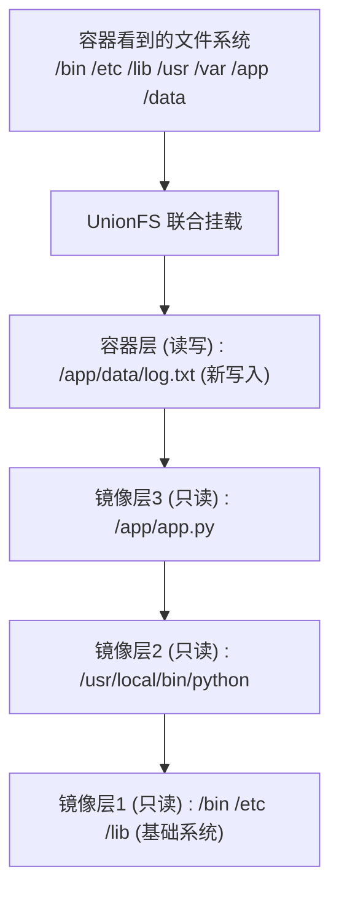
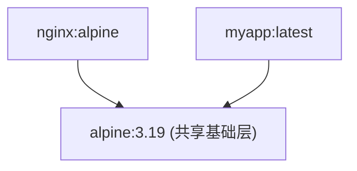
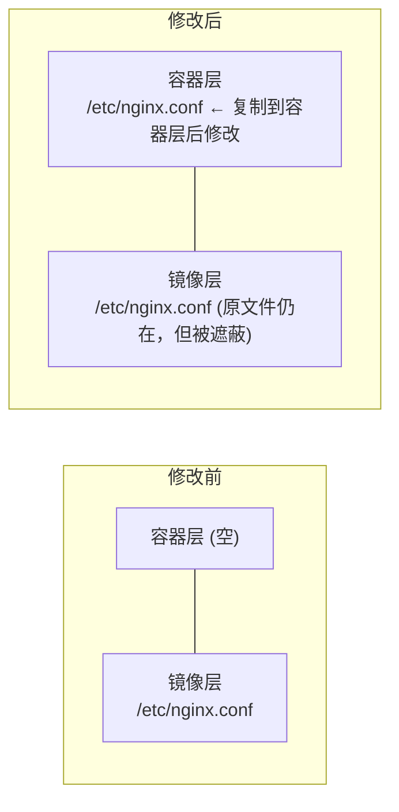
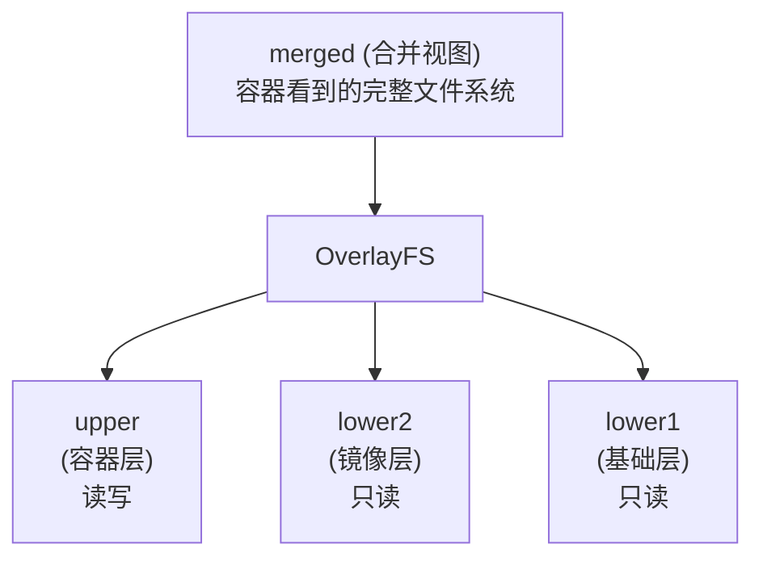

## 12.4 联合文件系统

联合文件系统 (UnionFS) 是 Docker 镜像分层存储的基础，它允许将多个目录挂载为同一个虚拟文件系统。

### 12.4.1 什么是联合文件系统

联合文件系统 (UnionFS) 是一种 **分层、轻量级** 的文件系统，它将多个目录 “联合” 挂载到同一个虚拟目录，形成一个统一的文件系统视图。

> **核心思想**：将多个只读层叠加，最上层可写，形成完整的文件系统。



---

### 12.4.2 为什么 Docker 使用联合文件系统

Docker 选择联合文件系统作为其存储驱动，主要基于以下几个核心优势。

#### 1. 镜像分层复用

如下代码块所示，展示了相关示例：



多个镜像共享相同的底层，节省磁盘空间。

#### 2. 快速构建

每个 Dockerfile 指令创建一层，只有变化的层需要重建：

```docker
FROM node:20          # 层1：基础镜像
COPY package.json ./  # 层2：依赖定义
RUN npm install       # 层3：安装依赖
COPY . .              # 层4：应用代码
```

代码变化时，只需重建层 4，层 1-3 使用缓存。

#### 3. 容器启动快

容器启动时不需要复制镜像，只需：

1. 在镜像层上创建一个薄的可写层
2. 联合挂载所有层

---

### 12.4.3 Copy-on-Write (写时复制)

当容器修改只读层中的文件时：



**流程**：

1. 从只读层读取文件
2. 复制到容器的可写层
3. 在可写层中修改
4. 后续读取使用可写层的版本

---

### 12.4.4 Docker 支持的存储驱动

Docker 可使用多种联合文件系统实现：

| 存储驱动 | 说明 | 推荐程度 |
|---------|------|---------|
| **overlay2**| 现代 Linux 默认驱动，性能优秀 | ✅**推荐** |
| **aufs** | 早期默认，兼容性好 | 遗留系统 |
| **btrfs** | 使用 Btrfs 子卷 | 特定场景 |
| **zfs** | 使用 ZFS 数据集 | 特定场景 |
| **devicemapper** | 块设备级存储 | 遗留系统 |
| **vfs** | 不使用 CoW，每层完整复制 | 仅测试 |

#### 各发行版推荐

相关信息如下表：

| Linux 发行版 | 推荐存储驱动 |
|-------------|-------------|
| Ubuntu 16.04+ | overlay2 |
| Debian Stretch+ | overlay2 |
| CentOS 7+ | overlay2 |
| RHEL 8+ | overlay2 |
| Fedora | overlay2 |

#### 查看当前存储驱动

运行以下命令：

```bash
$ docker info | grep "Storage Driver"
Storage Driver: overlay2
```

---

### 12.4.5 overlay2 工作原理

overlay2 是目前最推荐的存储驱动：



- **lowerdir**：只读的镜像层 (可以有多个)
- **upperdir**：可写的容器层
- **workdir**：OverlayFS 的工作目录
- **merged**：联合挂载后的视图

#### 概述

总体概述了以下内容。

#### 文件操作行为

相关信息如下表：

| 操作 | 行为 |
|------|------|
| **读取** | 从上到下查找第一个匹配的文件 |
| **创建** | 在 upper 层创建 |
| **修改** | 如果在 lower 层，先复制到 upper 层再修改 |
| **删除** | 在 upper 层创建 whiteout 文件标记删除 |

---

### 12.4.6 查看镜像层

运行以下命令：

```bash
## 查看镜像的层信息

$ docker history nginx:alpine
IMAGE          CREATED       CREATED BY                                      SIZE
a6eb2a334a9f   2 weeks ago   CMD ["nginx" "-g" "daemon off;"]                0B
<missing>      2 weeks ago   STOPSIGNAL SIGQUIT                              0B
<missing>      2 weeks ago   EXPOSE map[80/tcp:{}]                           0B
<missing>      2 weeks ago   ENTRYPOINT ["/docker-entrypoint.sh"]            0B
<missing>      2 weeks ago   COPY 30-tune-worker-processes.sh /docker-ent…   4.62kB
...

## 查看层的存储位置

$ docker inspect nginx:alpine --format '{{json .GraphDriver.Data}}' | jq
{
  "LowerDir": "/var/lib/docker/overlay2/.../diff:/var/lib/docker/overlay2/.../diff",
  "MergedDir": "/var/lib/docker/overlay2/.../merged",
  "UpperDir": "/var/lib/docker/overlay2/.../diff",
  "WorkDir": "/var/lib/docker/overlay2/.../work"
}
```

---

### 12.4.7 最佳实践

为了构建高效、轻量的镜像，我们在使用联合文件系统时应注意以下几点。

#### 1. 减少镜像层数

如下代码块所示，展示了相关示例：

```docker
## ❌ 每条命令创建一层

RUN apt-get update
RUN apt-get install -y nginx
RUN rm -rf /var/lib/apt/lists/*

## ✅ 合并为一层

RUN apt-get update && \
    apt-get install -y nginx && \
    rm -rf /var/lib/apt/lists/*
```

#### 2. 避免在容器中写入大量数据

容器层的写入性能低于直接写入。大量数据应使用：

- 数据卷 (Volume)
- 绑定挂载 (Bind Mount)

#### 3. 使用 .dockerignore

排除不需要的文件可以：

- 减小构建上下文
- 避免创建不必要的层

---
