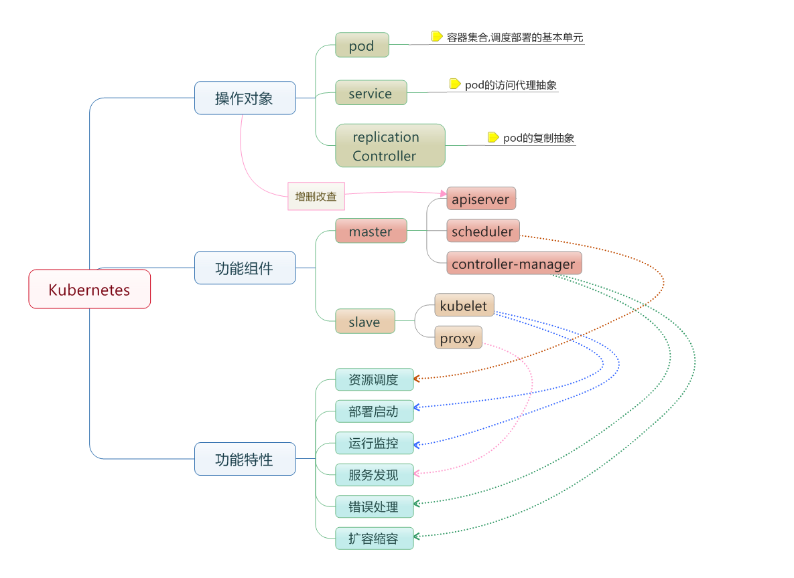

## 13.2 基本概念

如图 13-2 所示，Kubernetes 由控制平面与工作节点构成。



图 13-2：Kubernetes 基本概念示意图

* 节点 (`Node`)：一个节点是一个运行 Kubernetes 中的主机。
* 容器组 (`Pod`)：一个 Pod 对应于由若干容器组成的一个容器组，同个组内的容器共享一个存储卷 (volume)。
* 容器组生命周期 (`pod-states`)：包含所有容器状态集合，包括容器组状态类型，容器组生命周期，事件，重启策略，以及 replication controllers。
* Replication Controllers：主要负责指定数量的 pod 在同一时间一起运行。
* 服务 (`services`)：一个 Kubernetes 服务是容器组逻辑的高级抽象，同时也对外提供访问容器组的策略。
* 卷 (`volumes`)：一个卷就是一个目录，容器对其有访问权限。
* 标签 (`labels`)：标签是用来连接一组对象的，比如容器组。标签可以被用来组织和选择子对象。
* 接口权限 (`accessing_the_api`)：端口，IP 地址和代理的防火墙规则。
* web 界面 (`ux`)：用户可以通过 web 界面操作 Kubernetes。
* 命令行操作 (`cli`)：`kubectl` 命令。

### 13.2.1 节点

在 `Kubernetes` 中，节点是实际工作的点，节点可以是虚拟机或者物理机器，依赖于一个集群环境。每个节点都有一些必要的服务以运行容器组，并且它们都可以通过主节点来管理。必要服务包括 Docker，kubelet 和代理服务。

#### 容器状态

容器状态用来描述节点的当前状态。现在，其中包含三个信息：

##### 主机 IP

主机 IP 需要云平台来查询，`Kubernetes` 把它作为状态的一部分来保存。如果 `Kubernetes` 没有运行在云平台上，节点 ID 就是必需的。IP 地址可以变化，并且可以包含多种类型的 IP 地址，如公共 IP，私有 IP，动态 IP，ipv6 等等。

##### 节点周期

通常来说节点有 `Pending`，`Running`，`Terminated` 三个周期，如果 Kubernetes 发现了一个节点并且其可用，那么 Kubernetes 就把它标记为 `Pending`。然后在某个时刻，Kubernetes 将会标记其为 `Running`。节点的结束周期称为 `Terminated`。一个已经 `Terminated` 的节点不会接受和调度任何请求，并且已经在其上运行的容器组也会删除。

##### 节点状态

节点的状态主要是用来描述处于 `Running` 的节点。当前可用的有 `NodeReachable` 和 `NodeReady`。以后可能会增加其他状态。`NodeReachable` 表示集群可达。`NodeReady` 表示 kubelet 返回 Status Ok 并且 HTTP 状态检查健康。

#### 节点管理

节点并非 Kubernetes 创建，而是由云平台创建，或者就是物理机器、虚拟机。在 Kubernetes 中，节点仅仅是一条记录，节点创建之后，Kubernetes 会检查其是否可用。可以通过 `kubectl` 查看节点信息：

```bash
$ kubectl get nodes
NAME           STATUS   ROLES           AGE   VERSION
control-plane  Ready    control-plane   10d   v1.35.1
worker-1       Ready    <none>          10d   v1.35.1
worker-2       Ready    <none>          10d   v1.35.1
```
每个节点的详细信息以如下结构保存：

```yaml
apiVersion: v1
kind: Node
metadata:
  name: worker-1
  labels:
    kubernetes.io/os: linux
status:
  capacity:
    cpu: "4"
    memory: 8Gi
  conditions:
    - type: Ready
      status: "True"
```

#### 节点控制器

在 Kubernetes 控制平面中，节点控制器 (Node Controller) 负责管理节点的生命周期，主要包含：

* 集群范围内节点状态同步
* 单节点生命周期管理

节点控制器会持续监控节点的健康状态。当节点变为不可达时，控制器会等待一个超时期限，然后将该节点上的 Pod 标记为失败，并触发重新调度。可以使用 `kubectl` 来管理节点，例如标记节点为不可调度或排空节点上的工作负载：

```bash
## 标记节点为不可调度
$ kubectl cordon worker-1

## 排空节点上的 Pod
$ kubectl drain worker-1 --ignore-daemonsets
```

### 13.2.2 容器组

在 Kubernetes 中，使用的最小调度单位是容器组 (Pod)，它是创建、调度、管理的最小单位。一个 Pod 包含一个或多个紧密协作的容器，它们共享网络命名空间和存储卷。

Pod 通常不会被直接创建，而是通过 Deployment 等控制器来管理。当节点发生故障时，控制器会在其他可用节点上重新创建 Pod。

#### 容器组设计的初衷

容器组 (Pod) 的设计主要是为了解决应用间的紧密协作和资源共享问题。

#### 资源共享和通信

容器组主要是为了数据共享和它们之间的通信。

在一个容器组中，容器都使用相同的网络地址和端口，可以通过本地网络来相互通信。每个容器组都有独立的 IP，可用通过网络来和其他物理主机或者容器通信。

容器组有一组存储卷 (挂载点)，主要是为了让容器在重启之后可以不丢失数据。

#### 容器组管理

容器组是一个应用管理和部署的高层次抽象，同时也是一组容器的接口。容器组是部署、水平放缩的最小单位。

#### 容器组的使用

容器组可以通过组合来构建复杂的应用，典型的使用模式包含：

* 内容管理，文件和数据加载以及本地缓存管理等。
* 日志和检查点备份，压缩，快照等。
* 监听数据变化，跟踪日志，日志和监控代理，消息发布等。
* 代理，网桥
* 控制器，管理，配置以及更新

#### 为什么不在一个容器里运行多个程序

1. **透明化**：为了使容器组中的容器保持一致的基础设施和服务，比如进程管理和资源监控。
2. **解耦依赖**：每个容器都可能独立地重新构建和发布。
3. **方便使用**：用户不必运行独立的程序管理，也不用担心每个应用程序的退出状态。
4. **高效**：考虑到基础设施有更多的职责，容器必须要轻量化。

#### 容器组的生命状态

包括若干状态值：`Pending`、`Running`、`Succeeded`、`Failed`。

| 状态 | 说明 |
|------|------|
| **Pending** | Pod 已被集群接受，但有一个或多个容器还没有运行起来（可能在拉取镜像）。|
| **Running** | Pod 已被调度到节点，并且所有容器都已启动。至少有一个容器处于运行状态。|
| **Succeeded** | Pod 中的所有容器都正常退出，且不会被重启。|
| **Failed** | Pod 中的所有容器都已终止，且至少有一个容器以失败状态退出。|

#### 容器组生命周期与重启策略

Pod 的重启策略 (`restartPolicy`) 决定了容器退出后的行为：

| 重启策略 | 容器正常退出 | 容器异常退出 |
|---------|------------|------------|
| **Always** (默认) | 重启容器 | 重启容器 |
| **OnFailure** | 不重启 | 重启容器 |
| **Never** | 不重启 | 不重启 |

当节点故障或不可达时，节点控制器会将该节点上所有 Pod 的状态标记为 `Failed`。如果这些 Pod 由 Deployment 等控制器管理，控制器会自动在其他节点上重新创建。

### 13.2.3 Deployment 与 ReplicaSet

Deployment 是管理无状态应用的推荐方式，它通过 ReplicaSet 来确保指定数量的 Pod 副本始终在运行。

```yaml
apiVersion: apps/v1
kind: Deployment
metadata:
  name: nginx-deployment
spec:
  replicas: 3
  selector:
    matchLabels:
      app: nginx
  template:
    metadata:
      labels:
        app: nginx
    spec:
      containers:
        - name: nginx
          image: nginx:1.30
          ports:
            - containerPort: 80
```
Deployment 的核心能力包括：

* **副本管理**：确保始终有指定数量的 Pod 在运行
* **滚动更新**：逐步替换旧版本 Pod，实现零停机部署
* **回滚**：如果新版本出现问题，可以快速回滚到之前的版本

> 早期 Kubernetes 使用 Replication Controller (RC) 来管理副本，现已被 ReplicaSet/Deployment 取代。

### 13.2.4 StatefulSet

Deployment 适合无状态应用，而 **StatefulSet** 用于管理有状态应用（如数据库、消息队列）。与 Deployment 不同，StatefulSet 为每个 Pod 提供稳定的网络标识和持久化存储。

```yaml
apiVersion: apps/v1
kind: StatefulSet
metadata:
  name: mysql
spec:
  serviceName: mysql
  replicas: 3
  selector:
    matchLabels:
      app: mysql
  template:
    metadata:
      labels:
        app: mysql
    spec:
      containers:
        - name: mysql
          image: mysql:8.0
          volumeMounts:
            - name: data
              mountPath: /var/lib/mysql
  volumeClaimTemplates:
    - metadata:
        name: data
      spec:
        accessModes: ["ReadWriteOnce"]
        resources:
          requests:
            storage: 10Gi
```

StatefulSet 的核心特性：

* **稳定的网络标识**：Pod 名称按顺序编号（mysql-0, mysql-1, mysql-2），配合 Headless Service 提供可预测的 DNS 名称
* **有序部署与删除**：Pod 按序号顺序创建，逆序删除
* **持久化存储**：通过 `volumeClaimTemplates` 为每个 Pod 自动创建独立的 PVC

### 13.2.5 DaemonSet

**DaemonSet** 确保在集群的每个节点（或指定节点）上运行一个 Pod 副本。典型用途包括日志收集、监控代理和网络插件。

```yaml
apiVersion: apps/v1
kind: DaemonSet
metadata:
  name: fluentd
spec:
  selector:
    matchLabels:
      app: fluentd
  template:
    metadata:
      labels:
        app: fluentd
    spec:
      containers:
        - name: fluentd
          image: fluent/fluentd:v1.17
          volumeMounts:
            - name: varlog
              mountPath: /var/log
      volumes:
        - name: varlog
          hostPath:
            path: /var/log
```

当新节点加入集群时，DaemonSet 会自动在该节点上创建 Pod；当节点被移除时，对应的 Pod 也会被回收。

### 13.2.6 Job 与 CronJob

**Job** 用于运行一次性任务，确保指定数量的 Pod 成功完成后自动退出。**CronJob** 则按照 cron 表达式周期性地创建 Job。

```yaml
apiVersion: batch/v1
kind: Job
metadata:
  name: data-migration
spec:
  completions: 1
  template:
    spec:
      containers:
        - name: migrate
          image: myapp/migrate:latest
          command: ["python", "migrate.py"]
      restartPolicy: Never
  backoffLimit: 3
```

```yaml
apiVersion: batch/v1
kind: CronJob
metadata:
  name: daily-backup
spec:
  schedule: "0 2 * * *"
  jobTemplate:
    spec:
      template:
        spec:
          containers:
            - name: backup
              image: myapp/backup:latest
          restartPolicy: OnFailure
```

Job 的 `backoffLimit` 控制失败重试次数，`completions` 指定需要成功完成的 Pod 数量。CronJob 适用于定时备份、报表生成等场景。

### 13.2.7 服务

服务 (Service) 定义了一组 Pod 的逻辑集合和访问策略。由于 Pod 的 IP 地址是动态分配的，Service 提供了一个稳定的访问入口。

```yaml
apiVersion: v1
kind: Service
metadata:
  name: nginx-service
spec:
  selector:
    app: nginx
  ports:
    - port: 80
      targetPort: 80
  type: ClusterIP
```
常见的 Service 类型：

| 类型 | 说明 |
|------|------|
| **ClusterIP** | 默认类型，仅集群内部可访问 |
| **NodePort** | 在每个节点上开放固定端口，集群外部可通过 `节点IP:端口` 访问 |
| **LoadBalancer** | 通过云平台的负载均衡器暴露服务 |

### 13.2.8 卷

卷 (Volume) 为 Pod 中的容器提供持久化存储。Kubernetes 支持多种卷类型：

| 卷类型 | 说明 |
|-------|------|
| **emptyDir** | 临时存储，Pod 删除后数据丢失 |
| **hostPath** | 挂载节点上的文件或目录 |
| **PersistentVolumeClaim** | 使用持久卷声明，与底层存储解耦 |
| **configMap / secret** | 将配置或敏感数据挂载为文件 |

生产环境中，推荐使用 PersistentVolume (PV) 和 PersistentVolumeClaim (PVC) 来管理存储，实现存储资源与使用者的解耦。

### 13.2.9 标签

标签 (Label) 是附加到 Kubernetes 对象上的键值对，用于组织和选择对象子集。标签是 Kubernetes 中实现松耦合的关键机制。

```bash
## 为 Pod 添加标签
$ kubectl label pod my-pod env=production

## 通过标签选择器查询
$ kubectl get pods -l env=production
```
Service、Deployment 等资源都通过标签选择器 (`selector`) 来关联目标 Pod。

### 13.2.10 API 访问控制

Kubernetes API 的访问通过三个阶段进行控制：

1. **认证 (Authentication)**：验证请求者的身份（如证书、Token、OIDC）
2. **授权 (Authorization)**：判断请求者是否有权限执行操作（通常使用 RBAC）
3. **准入控制 (Admission Control)**：在请求被持久化之前对其进行校验或修改

### 13.2.11 Dashboard

Kubernetes Dashboard 是一个基于 Web 的用户界面，用于部署容器化应用、监控集群资源和排查问题。Dashboard 的部署方法详见[部署 Dashboard](../14_kubernetes_setup/14.7_dashboard.md) 章节。

### 13.2.12 命令行工具 kubectl

`kubectl` 是 Kubernetes 的命令行工具，用于与集群进行交互。常用命令如下：

```bash
## 查看集群中的资源
$ kubectl get pods,deployments,services,nodes

## 创建资源
$ kubectl apply -f deployment.yaml

## 查看 Pod 日志
$ kubectl logs my-pod

## 进入 Pod 执行命令
$ kubectl exec -it my-pod -- /bin/sh

## 查看资源详情
$ kubectl describe pod my-pod
```
更多 kubectl 操作详见[kubectl 命令行](../14_kubernetes_setup/14.8_kubectl.md)章节。
