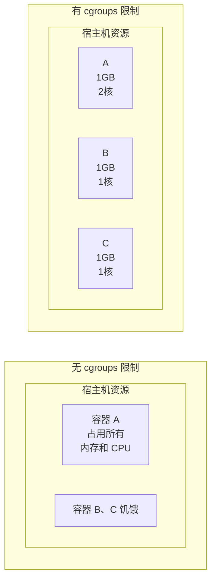

## 14.3 控制组

控制组 (Cgroups) 是 Linux 内核提供的另一种关键机制，主要用于资源的限制和审计。

### 什么是控制组

控制组 (Control Groups，简称 cgroups) 是 Linux 内核的一个特性，用于**限制、记录和隔离**进程组的资源使用 (CPU、内存、磁盘 I/O、网络等)。

> **核心作用**：让多个容器公平共享宿主机资源，防止单个容器耗尽系统资源。



---

### cgroups 的历史

相关信息如下表：

| 时间 | 事件 |
|------|------|
| 2006 | Google 工程师提出 cgroups 概念 |
| 2008 | Linux 2.6.24 正式支持 cgroups v1 |
| 2016 | Linux 4.5 引入 cgroups v2 |
| 现在 | Docker 默认使用 cgroups v2 (如系统支持)|

---

### cgroups 可以限制的资源

相关信息如下表：

| 资源类型 | 子系统 | 说明 |
|---------|--------|------|
| **CPU** | `cpu`, `cpuset` | CPU 使用时间和核心分配 |
| **内存** | `memory` | 内存使用上限和 swap |
| **块设备 I/O** | `blkio` | 磁盘读写速度限制 |
| **网络** | `net_cls`, `net_prio` | 网络带宽优先级 |
| **进程数** | `pids` | 限制进程/线程数量 |

---

### Docker 中的资源限制

Docker 提供了丰富的参数来配置容器的资源限制，主要包括内存、CPU、磁盘 I/O 等。

#### 内存限制

运行以下命令：

```bash
## 限制容器最多使用 512MB 内存

$ docker run -m 512m myapp

## 限制内存 + swap

$ docker run -m 512m --memory-swap 1g myapp

## 软限制（超过时警告，不会 OOM Kill）

$ docker run --memory-reservation 256m myapp
```

| 参数 | 说明 |
|------|------|
| `-m` / `--memory` | 硬限制 (超过会 OOM Kill)|
| `--memory-swap` | 内存 + swap 总限制 |
| `--memory-reservation` | 软限制 (内存竞争时生效)|
| `--oom-kill-disable` | 禁用 OOM Killer (谨慎使用)|

#### CPU 限制

运行以下命令：

```bash
## 限制使用 1.5 个 CPU 核心

$ docker run --cpus=1.5 myapp

## 限制使用 CPU 0 和 1

$ docker run --cpuset-cpus="0,1" myapp

## 设置 CPU 使用权重（相对值，默认 1024）

$ docker run --cpu-shares=512 myapp
```

| 参数 | 说明 |
|------|------|
| `--cpus` | 限制 CPU 核心数 (如 1.5)|
| `--cpuset-cpus` | 绑定到特定 CPU 核心 |
| `--cpu-shares` | CPU 时间片权重 (相对值)|
| `--cpu-period` / `--cpu-quota` | 精细控制 CPU 配额 |

#### 磁盘 I/O 限制

运行以下命令：

```bash
## 限制设备写入速度为 10MB/s

$ docker run --device-write-bps /dev/sda:10mb myapp

## 限制设备读取速度

$ docker run --device-read-bps /dev/sda:10mb myapp

## 限制 IOPS

$ docker run --device-write-iops /dev/sda:100 myapp
```

#### 进程数限制

运行以下命令：

```bash
## 限制最多 100 个进程

$ docker run --pids-limit=100 myapp
```

---

### 查看容器资源使用

运行以下命令：

```bash
## 实时监控所有容器的资源使用

$ docker stats
CONTAINER ID   NAME    CPU %   MEM USAGE / LIMIT   MEM %   NET I/O        BLOCK I/O
abc123         web     0.50%   45.5MiB / 512MiB    8.89%   1.2kB / 0B     0B / 0B
def456         db      2.30%   256MiB / 1GiB       25.00%  5.6kB / 3.2kB  4.1MB / 2.3MB

## 查看特定容器

$ docker stats mycontainer

## 查看容器的 cgroup 配置

$ docker inspect mycontainer --format '{{json .HostConfig}}' | jq
```

---

### 资源限制的效果

本节涵盖了相关内容与详细描述，主要探讨以下几个方面：

#### 内存超限

运行以下命令：

```bash
## 启动限制 100MB 内存的容器

$ docker run -m 100m stress --vm 1 --vm-bytes 200M

## 容器会被 OOM Killer 杀死

$ docker ps -a
CONTAINER ID   STATUS                      NAMES
abc123         Exited (137) 5 seconds ago  hopeful_darwin

## 137 = 128 + 9，表示被 SIGKILL（9） 杀死

...
```

#### CPU 限制验证

运行以下命令：

```bash
## 不限制 CPU

$ docker run --rm stress --cpu 4
## 占满所有 CPU

## 限制为 1 个核心

$ docker run --rm --cpus=1 stress --cpu 4
## 只能使用约 100% CPU（1 个核心）

...
```

---

### cgroups v1 vs v2

相关信息如下表：

| 特性 | cgroups v1 | cgroups v2 |
|------|-----------|-----------|
| 层级结构 | 多层级 (每个资源单独)| 统一层级 |
| 管理复杂度 | 复杂 | 简化 |
| 资源分配 | 基于层级 | 基于子树 |
| PSI (压力监控)| ❌ | ✅ |
| rootless 容器 | 部分支持 | 完整支持 |

#### 概述

总体概述了以下内容。

#### 检查系统使用的版本

运行以下命令：

```bash
## 查看 cgroup 版本

$ mount | grep cgroup
cgroup2 on /sys/fs/cgroup type cgroup2 (rw,nosuid,nodev,noexec,relatime)
## 如果显示 cgroup2 表示 v2

## 或者

$ cat /proc/filesystems | grep cgroup
nodev   cgroup
nodev   cgroup2
```

---

### 在 Compose 中设置限制

在 Compose 中设置限制配置如下：

```yaml
services:
  web:
    image: nginx
    deploy:
      resources:
        limits:
          cpus: '0.5'
          memory: 512M
        reservations:
          cpus: '0.25'
          memory: 256M
```

---

### 最佳实践

在使用 Cgroups 限制资源时，遵循一些最佳实践可以避免潜在的问题。

#### 1。始终设置内存限制

运行以下命令：

```bash
## 防止 OOM 影响宿主机

$ docker run -m 1g myapp
```

#### 2。为关键应用设置 CPU 保证

运行以下命令：

```bash
$ docker run --cpus=2 --cpu-shares=2048 critical-app
```

#### 3。监控资源使用

运行以下命令：

```bash
## 配合 Prometheus + cAdvisor 监控

$ docker run -d --name cadvisor \
    -v /:/rootfs:ro \
    -v /var/run:/var/run:ro \
    -v /sys:/sys:ro \
    -v /var/lib/docker:/var/lib/docker:ro \
    gcr.io/cadvisor/cadvisor
```

---
