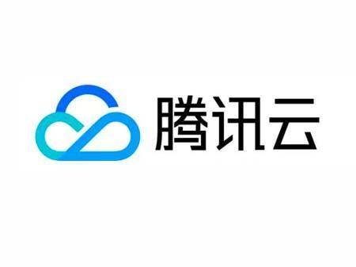

## 16.2 腾讯云

如图 13-5 所示，腾讯云提供完整的云基础设施与容器能力。



图 13-5 腾讯云标识

[腾讯云](https://cloud.tencent.com/act/cps/redirect?redirect=1040\&cps_key=3a5255852d5db99dcd5da4c72f05df61\&from=console)在架构方面经过多年积累，并且有着多年对海量互联网服务的经验。不管是社交、游戏还是其他领域，都有多年的成熟产品来提供产品服务。腾讯在云端完成重要部署，为开发者及企业提供云服务、云数据、云运营等整体一站式服务方案。

具体包括[云服务器](https://cloud.tencent.com/act/cps/redirect?redirect=1001\&cps_key=3a5255852d5db99dcd5da4c72f05df61\&from=console)、[云存储](https://cloud.tencent.com/act/cps/redirect?redirect=1020\&cps_key=3a5255852d5db99dcd5da4c72f05df61\&from=console)、[云数据库](https://cloud.tencent.com/act/cps/redirect?redirect=1003\&cps_key=3a5255852d5db99dcd5da4c72f05df61\&from=console)、[视频与 CDN](https://cloud.tencent.com/act/cps/redirect?redirect=1019\&cps_key=3a5255852d5db99dcd5da4c72f05df61\&from=console) 和[域名注册](https://dnspod.cloud.tencent.com)等基础云服务；腾讯云分析 (MTA)、腾讯云推送 (信鸽) 等腾讯整体大数据能力；以及 QQ 互联、QQ 空间、微云、微社区等云端链接社交体系。这些正是腾讯云可以提供给这个行业的差异化优势，造就了可支持各种互联网使用场景的高品质的腾讯云技术平台。

[腾讯云容器服务 TKE](https://cloud.tencent.com/act/cps/redirect?redirect=10058\&cps_key=3a5255852d5db99dcd5da4c72f05df61) 是高度可扩展的高性能容器管理服务，用户可以在托管的云服务器实例集群上轻松运行应用程序。使用该服务，将无需安装、运维、扩展用户的集群管理基础设施，只需进行简单的 API 调用，便可启动和停止 Docker 应用程序，查询集群的完整状态，以及使用各种云服务。用户可以根据用户的资源需求和可用性要求在用户的集群中安排容器的置放，满足业务或应用程序的特定要求。


图 13-6 腾讯云容器服务示意图

### 腾讯云容器服务 (TKE) 简介

腾讯云容器服务 (TKE, Tencent Kubernetes Engine) 是一款容器编排平台，基于原生 Kubernetes 提供，支持自动扩展、负载均衡、多可用区高可用等企业级功能。TKE 帮助开发者快速部署和管理容器化应用，消除集群运维的复杂度。

### 基本使用步骤

#### 1. 创建集群

登录腾讯云控制台，进入容器服务模块：
- 选择 "创建集群"，配置集群名称、地域和网络
- 选择节点配置（云服务器规格和数量）
- 设置 Kubernetes 版本和安全组
- 完成创建后获得集群 kubeconfig 文件

```bash
# 下载 kubeconfig 文件后，配置本地环境
export KUBECONFIG=/path/to/kubeconfig.yaml
kubectl cluster-info
```

#### 2. 部署容器应用

创建 Deployment 部署应用：

```yaml
apiVersion: apps/v1
kind: Deployment
metadata:
  name: nginx-app
spec:
  replicas: 3
  selector:
    matchLabels:
      app: nginx
  template:
    metadata:
      labels:
        app: nginx
    spec:
      containers:
      - name: nginx
        image: nginx:latest
        ports:
        - containerPort: 80
```

应用配置文件：

```bash
kubectl apply -f deployment.yaml
kubectl get pods
kubectl get svc
```

#### 3. 管理镜像

通过腾讯云容器镜像服务 (TCR) 存储和管理私有镜像：

```bash
# 登录腾讯云镜像仓库
docker login ccr.ccs.tencentyun.com -u <username>

# 标记本地镜像
docker tag my-app:latest ccr.ccs.tencentyun.com/namespace/my-app:latest

# 推送镜像到腾讯云
docker push ccr.ccs.tencentyun.com/namespace/my-app:latest
```

### 腾讯云 Docker 镜像加速器配置

为了加快镜像拉取速度，腾讯云提供了镜像加速服务。配置方法如下：

#### Linux 系统配置

编辑 `/etc/docker/daemon.json` 文件（如果不存在则创建）：

```bash
# 创建或编辑配置文件
sudo mkdir -p /etc/docker
sudo nano /etc/docker/daemon.json
```

添加以下内容：

```json
{
  "registry-mirrors": [
    "https://mirror.ccs.tencentyun.com"
  ],
  "insecure-registries": []
}
```

重启 Docker 服务：

```bash
sudo systemctl daemon-reload
sudo systemctl restart docker
```

验证配置：

```bash
# 查看镜像源是否生效
docker info | grep -A 5 "Registry Mirrors"
```

#### Windows/Mac 配置

对于 Docker Desktop，在设置界面中：
1. 打开 Docker Desktop 设置
2. 导航到 "Docker Engine"
3. 在 JSON 配置中添加上述 `registry-mirrors` 字段
4. 点击 "Apply & Restart"

### 腾讯云容器镜像服务 (TCR)

腾讯云容器镜像服务 (TCR) 提供企业级容器镜像存储和分发能力：

- **私有镜像仓库**：支持命名空间隔离，完整的访问权限控制
- **镜像扫描**：自动扫描镜像漏洞，提供安全建议
- **镜像加速**：支持跨地域镜像分发和加速
- **Webhook 通知**：镜像推送时自动触发 CI/CD 流程
- **镜像版本管理**：标签管理、镜像清理策略、生命周期管理

#### 快速开始

1. 在腾讯云控制台创建个人版或企业版 TCR 实例
2. 创建命名空间和镜像仓库
3. 配置 Docker 登录凭证
4. 本地构建镜像并推送到 TCR
5. 在 TKE 集群部署时引用 TCR 镜像地址

#### 完整推送/拉取示例

```bash
# 登录到腾讯云 TCR（使用 API 密钥）
docker login ccr.ccs.tencentyun.com \
  --username <腾讯云账号ID> \
  --password <API_KEY>

# 拉取公开镜像
docker pull ccr.ccs.tencentyun.com/library/nginx:latest

# 构建本地镜像
docker build -t my-app:v1.0 .

# 标记镜像为 TCR 地址
docker tag my-app:v1.0 \
  ccr.ccs.tencentyun.com/my-namespace/my-app:v1.0

# 推送镜像到 TCR
docker push ccr.ccs.tencentyun.com/my-namespace/my-app:v1.0

# 在 Dockerfile 中使用 TCR 镜像
FROM ccr.ccs.tencentyun.com/my-namespace/my-app:v1.0
RUN echo "使用腾讯云镜像作为基础镜像"
```

#### TKE 集群中使用 TCR 镜像

配置镜像拉取凭证后，在 Deployment 中直接引用 TCR 镜像：

```yaml
apiVersion: apps/v1
kind: Deployment
metadata:
  name: my-app-deployment
  namespace: default
spec:
  replicas: 3
  selector:
    matchLabels:
      app: my-app
  template:
    metadata:
      labels:
        app: my-app
    spec:
      imagePullSecrets:
      - name: tcr-secret  # 需提前创建该 Secret
      containers:
      - name: my-app
        image: ccr.ccs.tencentyun.com/my-namespace/my-app:v1.0
        ports:
        - containerPort: 8080
        resources:
          requests:
            memory: "256Mi"
            cpu: "100m"
          limits:
            memory: "512Mi"
            cpu: "500m"
```
