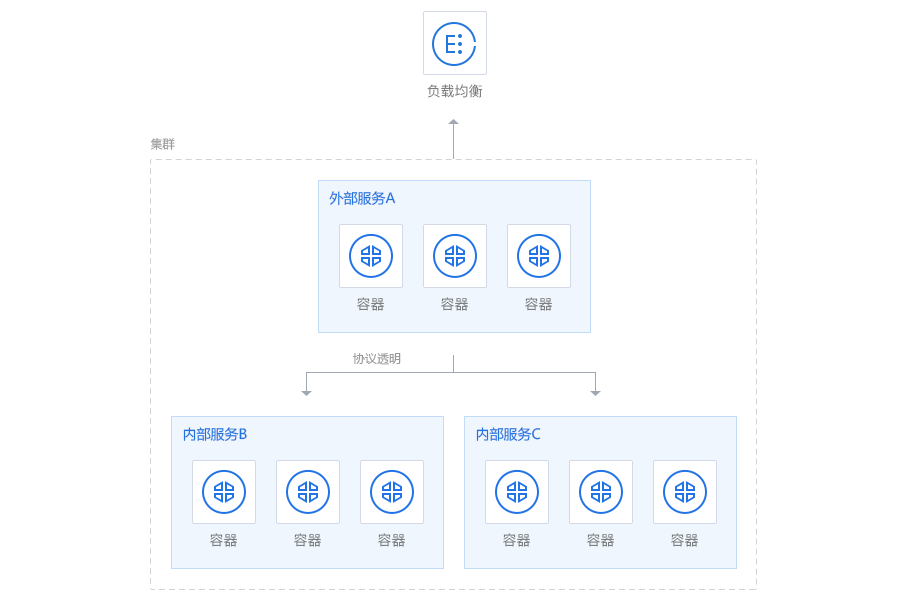

## 16.2 腾讯云

腾讯云容器服务 TKE 是腾讯云提供的 Kubernetes 托管服务，适合把容器化应用部署到云上。官方文档见 [腾讯云容器服务](https://intl.cloud.tencent.com/document/product/457)。


图 16-1：腾讯云标识

下面的示例只保留创建集群、部署应用、管理镜像和配置加速器这几类最常见操作。



图 16-2：腾讯云容器服务示意图

### 腾讯云容器服务：TKE 简介

腾讯云容器服务 (TKE, Tencent Kubernetes Engine) 是一款容器编排平台，基于原生 Kubernetes 提供，支持自动扩展、负载均衡、多可用区高可用等企业级功能。TKE 帮助开发者快速部署和管理容器化应用，消除集群运维的复杂度。

### 基本使用步骤

#### 1. 创建集群

登录腾讯云控制台，进入容器服务模块：
- 选择 “创建集群”，配置集群名称、地域和网络
- 选择节点配置（云服务器规格和数量）
- 设置 Kubernetes 版本和安全组
- 完成创建后获得集群 kubeconfig 文件

```bash
# 下载 kubeconfig 文件后，配置本地环境
export KUBECONFIG=/path/to/kubeconfig.yaml
kubectl cluster-info
```

#### 2. 部署容器应用

创建 Deployment 部署应用：

```yaml
apiVersion: apps/v1
kind: Deployment
metadata:
  name: nginx-app
spec:
  replicas: 3
  selector:
    matchLabels:
      app: nginx
  template:
    metadata:
      labels:
        app: nginx
    spec:
      containers:
      - name: nginx
        image: nginx:latest
        ports:
        - containerPort: 80
```
应用配置文件：

```bash
kubectl apply -f deployment.yaml
kubectl get pods
kubectl get svc
```

#### 3. 管理镜像

使用腾讯云容器镜像服务 (TCR) 存储和分发私有镜像：

```bash
# 登录腾讯云镜像仓库
docker login ccr.ccs.tencentyun.com -u <username>

# 标记本地镜像
docker tag my-app:latest ccr.ccs.tencentyun.com/namespace/my-app:latest

# 推送镜像到腾讯云
docker push ccr.ccs.tencentyun.com/namespace/my-app:latest
```

### 腾讯云 Docker 镜像加速器配置

如果你的账号开通了镜像加速器，可以把控制台给出的地址写入 Docker 配置。

#### Linux 系统配置

编辑 `/etc/docker/daemon.json` 文件（如果不存在则创建）：

```bash
# 创建或编辑配置文件
sudo mkdir -p /etc/docker
sudo nano /etc/docker/daemon.json
```
添加以下内容：

```json
{
  "registry-mirrors": [
    "https://mirror.ccs.tencentyun.com"
  ],
  "insecure-registries": []
}
```
重启 Docker 服务：

```bash
sudo systemctl daemon-reload
sudo systemctl restart docker
```
验证配置：

```bash
docker info | grep -A 5 "Registry Mirrors"
```

#### Windows/Mac 配置

对于 Docker Desktop，在设置界面中打开 `Docker Engine`，把上述 `registry-mirrors` 字段写入 JSON 后重启即可。

### 腾讯云容器镜像服务：TCR

TCR 提供私有镜像仓库、访问控制和镜像分发能力。一个最小示例如下：

```bash
# 登录到腾讯云 TCR
docker login ccr.ccs.tencentyun.com --username <username>

# 构建并推送镜像
docker build -t my-app:v1.0 .
docker tag my-app:v1.0 ccr.ccs.tencentyun.com/my-namespace/my-app:v1.0
docker push ccr.ccs.tencentyun.com/my-namespace/my-app:v1.0
```

#### TKE 集群中使用 TCR 镜像

配置镜像拉取凭证后，在 Deployment 中直接引用 TCR 镜像：

```yaml
apiVersion: apps/v1
kind: Deployment
metadata:
  name: my-app-deployment
  namespace: default
spec:
  replicas: 3
  selector:
    matchLabels:
      app: my-app
  template:
    metadata:
      labels:
        app: my-app
    spec:
      imagePullSecrets:
      - name: tcr-secret
      containers:
      - name: my-app
        image: ccr.ccs.tencentyun.com/my-namespace/my-app:v1.0
        ports:
        - containerPort: 8080
        resources:
          requests:
            memory: "256Mi"
            cpu: "100m"
          limits:
            memory: "512Mi"
            cpu: "500m"
```
