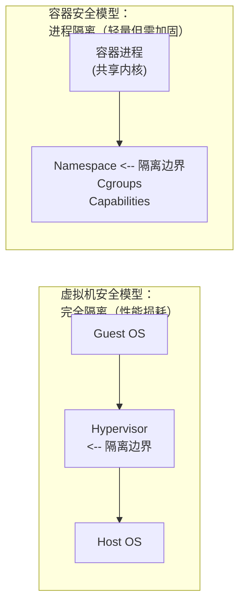

# 第十八章 安全

容器安全是生产环境部署的核心考量。本章介绍 Docker 的安全机制和最佳实践。

## 容器安全的本质

> **核心问题**：容器共享宿主机内核，隔离性弱于虚拟机。如何在便利性和安全性之间取得平衡？



---

## 核心安全机制

### 1. 命名空间

提供进程、网络、文件系统等资源的隔离：

| Namespace | 隔离内容 | 安全作用 |
|-----------|---------|---------|
| PID | 进程 | 容器看不到其他进程 |
| NET | 网络 | 独立网络栈 |
| MNT | 文件系统 | 独立的根目录 |
| USER | 用户 | 容器 root ≠ 宿主机 root |
| IPC | 进程通信 | 隔离共享内存 |
| UTS | 主机名 | 独立主机名 |

详见[命名空间](../12_implementation/12.2_namespace.md)章节。

### 2. 控制组

限制容器的资源使用，防止资源耗尽攻击：

```bash
## 限制内存（超出会被 OOM Kill）

$ docker run -m 512m myapp

## 限制 CPU

$ docker run --cpus=1.5 myapp

## 限制磁盘 I/O

$ docker run --device-write-bps /dev/sda:10mb myapp
```

### 3. 能力机制

Linux 将 root 权限拆分为多个细粒度的能力。Docker 默认禁用危险能力：

| 能力 | 说明 | 默认状态 |
|------|------|---------|
| `CAP_NET_ADMIN` | 网络管理 | ❌ 禁用 |
| `CAP_SYS_ADMIN` | 系统管理 | ❌ 禁用 |
| `CAP_SYS_PTRACE` | 进程追踪 | ❌ 禁用 |
| `CAP_CHOWN` | 更改文件所有者 | ✅ 启用 |
| `CAP_NET_BIND_SERVICE` | 绑定低端口 | ✅ 启用 |

```bash
## 删除所有能力，只添加需要的

$ docker run --cap-drop=all --cap-add=NET_BIND_SERVICE myapp

## 查看容器的能力

$ docker exec myapp cat /proc/1/status | grep Cap
```

---

## 镜像安全

### 使用可信镜像

```bash
## ✅ 使用官方镜像

$ docker pull nginx

## ✅ 使用经过验证的镜像

$ docker pull bitnami/nginx

## ⚠️ 谨慎使用未知来源镜像

$ docker pull randomuser/suspicious-image
```

### 漏洞扫描

扫描镜像中的已知安全漏洞：

```bash
## Docker Scout（官方工具）

$ docker scout cves nginx:latest
$ docker scout recommendations nginx:latest

## Trivy（开源工具）

$ trivy image nginx:latest

## Snyk（商业工具）

$ snyk container test nginx:latest
```

### 镜像签名验证

当前更推荐使用 Sigstore / Notation 体系进行镜像签名。`Docker Content Trust (DCT)` 已进入退场阶段，不建议作为新项目主方案。

> 注意：Cosign 默认会把签名写回镜像所在仓库，请使用你有推送权限的镜像地址。

```bash
## 准备示例镜像
$ export IMAGE=<你的仓库地址>/myimage:latest
$ docker pull nginx:1.27
$ docker tag nginx:1.27 $IMAGE
$ docker push $IMAGE

## 生成签名密钥（会生成 cosign.key / cosign.pub）
$ cosign generate-key-pair

## Cosign: 签名与验证
$ cosign sign --key cosign.key $IMAGE
$ cosign verify --key cosign.pub $IMAGE
```

---

## 运行时安全

### 1. 非 root 用户运行

> 笔者强调：这是最重要的安全实践之一。

```dockerfile
FROM node:22-alpine

## 创建非 root 用户

RUN addgroup -g 1001 appgroup && \
    adduser -u 1001 -G appgroup -D appuser

## 设置工作目录权限

WORKDIR /app
COPY --chown=appuser:appgroup . .

## 切换用户

USER appuser

CMD ["node", "server.js"]
```

或在运行时指定：

```bash
$ docker run -u 1001:1001 myapp
```

### 2. 只读文件系统

```bash
## 根文件系统只读

$ docker run --read-only myapp

## 需要写入的目录使用 tmpfs

$ docker run --read-only --tmpfs /tmp --tmpfs /var/run myapp
```

### 3. 禁用特权模式

```bash
## ❌ 绝对不要在生产环境使用

$ docker run --privileged myapp

## ✅ 只添加必要的能力

$ docker run --cap-add=SYS_TIME myapp
```

### 4. 限制资源

```bash
$ docker run \
    -m 512m \                    # 内存限制
    --cpus=1 \                   # CPU 限制
    --pids-limit=100 \           # 进程数限制
    --ulimit nofile=1024:1024 \  # 文件描述符限制
    myapp
```

### 5. 网络隔离

```bash
## 禁用网络（适用于不需要网络的任务）

$ docker run --network=none myapp

## 使用自定义网络隔离

$ docker network create --internal isolated_net
$ docker run --network=isolated_net myapp
```

---

## Dockerfile 安全实践

### 1. 使用精简基础镜像

```dockerfile
## ✅ 好：使用精简镜像

FROM node:22-alpine        # ~50MB
FROM gcr.io/distroless/nodejs  # ~20MB

## ❌ 差：使用完整镜像

FROM node:22               # ~1GB
FROM ubuntu:24.04          # ~78MB
```

### 2. 多阶段构建

```dockerfile
## 构建阶段

FROM node:22 AS builder
WORKDIR /app
COPY . .
RUN npm install && npm run build

## 生产阶段（不包含开发依赖和源码）

FROM node:22-alpine
COPY --from=builder /app/dist /app
USER node
CMD ["node", "/app/server.js"]
```

### 3. 不存储敏感信息

```dockerfile
## ❌ 错误：敏感信息写入镜像

ENV DB_PASSWORD=secret123
COPY .env /app/

## ✅ 正确：运行时传入

## docker run -e DB_PASSWORD=xxx 或使用 Docker Secrets

...
```

### 4. 固定依赖版本

```dockerfile
## ✅ 固定版本

FROM node:22.12.0-alpine3.21
RUN apk add --no-cache curl=8.5.0-r0

## ❌ 使用 latest

FROM node:latest
RUN apk add curl
```

---

## 安全扫描清单

部署前检查：

| 检查项 | 命令/方法 |
|--------|----------|
| 漏洞扫描 | `docker scout cves` 或 `trivy` |
| 非 root 运行 | 检查 Dockerfile 中的 `USER` |
| 资源限制 | 检查 `-m`, `--cpus` 参数 |
| 只读文件系统 | 检查 `--read-only` |
| 无特权模式 | 确认没有 `--privileged` |
| 最小能力 | 检查 `--cap-drop=all` |
| 网络隔离 | 检查网络配置 |
| 敏感信息 | 确认无硬编码密码 |

---

## 高级安全方案

### Seccomp 系统调用过滤

限制容器可以使用的系统调用：

```bash
$ docker run --security-opt seccomp=/path/to/profile.json myapp
```

### AppArmor / SELinux

使用强制访问控制：

```bash
$ docker run --security-opt apparmor=docker-default myapp
```

### 安全容器 (gVisor / Kata)

需要更强隔离时：

```bash
## 使用 gVisor 运行时

$ docker run --runtime=runsc myapp
```

---

## 软件供应链安全

随着软件供应链攻击日益频繁，仅保障运行时安全已不足够。

### 1. SBOM (软件物料清单)

SBOM 类似于食品的配料表，列出了容器镜像中包含的所有软件包及其版本。

- **生成 SBOM**：使用 `docker buildx build --sbom` 或 `docker scout sbom`。
- **管理 SBOM**：确保持续监控 SBOM 中的组件是否存在新披露的漏洞。

### 2. 镜像签名 (Sigstore / Notary v2)

确保镜像在构建后未被篡改，且确实来自可信的发布者。

- **Cosign**：Sigstore 项目的一部分，用于签署和验证容器镜像。
```bash
## 使用有写权限的仓库地址
$ export IMAGE=<你的仓库地址>/myimage:tag
$ docker pull nginx:1.27
$ docker tag nginx:1.27 $IMAGE
$ docker push $IMAGE

## 生成签名密钥（会生成 cosign.key / cosign.pub）
$ cosign generate-key-pair

## 签署与验证镜像
$ cosign sign --key cosign.key $IMAGE
$ cosign verify --key cosign.pub $IMAGE
```

### 3. SLSA (Supply-chain Levels for Software Artifacts)

遵循 SLSA 框架，确保构建过程的完整性，例如使用 GitHub Actions 等受控环境进行构建，而非在开发者本地机器上构建发布。

---

## 本章小结

| 安全措施 | 重要程度 | 实现方式 |
|---------|---------|---------|
| 非 root 运行 | ⭐⭐⭐ | `USER` 指令 |
| 漏洞扫描 | ⭐⭐⭐ | `docker scout`, `trivy` |
| 资源限制 | ⭐⭐⭐ | `-m`, `--cpus` |
| 只读文件系统 | ⭐⭐ | `--read-only` |
| 最小能力 | ⭐⭐ | `--cap-drop=all` |
| 镜像签名 | ⭐⭐ | `cosign` / Notation |

## 延伸阅读

- [命名空间](../12_implementation/12.2_namespace.md)：隔离机制详解
- [控制组](../12_implementation/12.3_cgroups.md)：资源限制详解
- [最佳实践](../appendix/20.1_best_practices.md)：Dockerfile 安全配置
