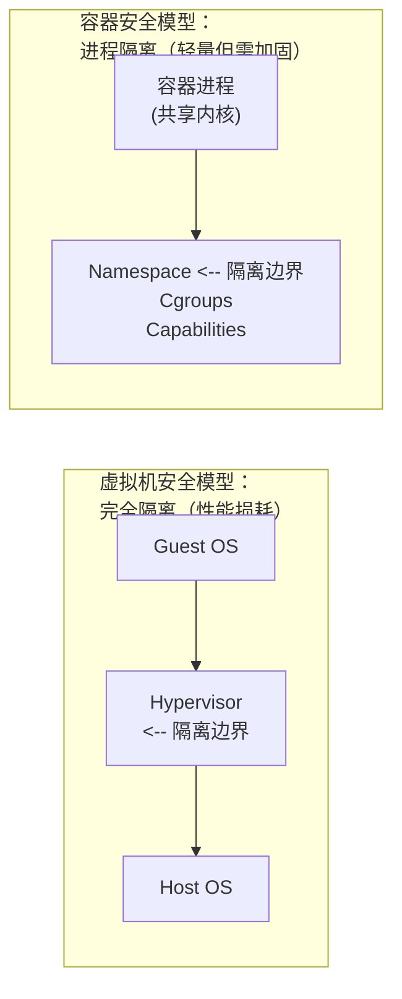

# 第十八章 安全

容器安全是生产环境部署的核心考量。本章介绍 Docker 的安全机制和最佳实践。

## 容器安全的本质

> **核心问题**：容器共享宿主机内核，隔离性弱于虚拟机。如何在便利性和安全性之间取得平衡？

```mermaid
flowchart LR
    subgraph VM ["虚拟机安全模型：<br/>完全隔离（性能损耗）"]
        direction TB
        Guest["Guest OS"]
        Hyper["Hypervisor<br/>&lt;-- 隔离边界"]
        Host["Host OS"]
        Guest --> Hyper --> Host
    end

    subgraph Container ["容器安全模型：<br/>进程隔离（轻量但需加固）"]
        direction TB
        Proc["容器进程<br/>(共享内核)"]
        Mech["Namespace &lt;-- 隔离边界<br/>Cgroups<br/>Capabilities"]
        Proc --> Mech
    end
```

## 本章内容

本章涵盖 Docker 安全的多个层面，从内核隔离机制到运行时防护和供应链安全。

* [内核命名空间](18.1_kernel_ns.md)
  * 命名空间的安全意义、User Namespace 与提权防护。

* [控制组](18.2_control_group.md)
  * 通过 Cgroups 限制容器资源使用，防止资源耗尽攻击。

* [服务端防护](18.3_daemon_sec.md)
  * Docker 守护进程的安全配置与网络访问控制。

* [内核能力机制](18.4_kernel_capability.md)
  * Linux Capabilities 的细粒度权限控制。

* [其它安全特性](18.5_other_feature.md)
  * 镜像安全（漏洞扫描、签名验证）、运行时安全（非 root 运行、只读文件系统、Seccomp、AppArmor）、Dockerfile 安全实践、软件供应链安全（SBOM、SLSA）。

* [镜像安全](18.6_image_security.md)
  * 容器镜像的安全扫描、漏洞检测与签名验证。

## 安全扫描清单

部署前检查：

| 检查项 | 命令/方法 |
|--------|----------|
| 漏洞扫描 | `docker scout cves` 或 `trivy` |
| 非 root 运行 | 检查 Dockerfile 中的 `USER` |
| 资源限制 | 检查 `-m`, `--cpus` 参数 |
| 只读文件系统 | 检查 `--read-only` |
| 无特权模式 | 确认没有 `--privileged` |
| 最小能力 | 检查 `--cap-drop=all` |
| 网络隔离 | 检查网络配置 |
| 敏感信息 | 确认无硬编码密码 |
