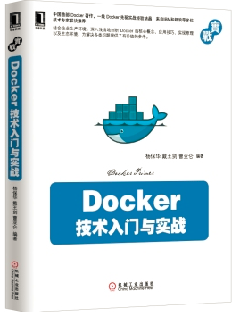

# Docker — 从入门到实践

0.8.1

[Docker](http://www.docker.com) 是个划时代的开源项目，它彻底释放了计算虚拟化的威力，极大提高了应用的运行效率，降低了云计算资源供应的成本！ 使用 Docker，可以让应用的部署、测试和分发都变得前所未有的高效和轻松！

无论是应用开发者、运维人员、还是其他信息技术从业人员，都有必要认识和掌握 Docker，以在有限的时间内做更多有意义的事。

本开源书籍既适用于具备基础 Linux 知识的 Docker 初学者，也希望可供理解原理和实现的高级用户参考。同时，书中给出的实践案例，可供在进行实际部署时借鉴。前六章为基础内容，供用户理解 Docker 的基本概念和操作；7 ~ 9 章介绍一些高级操作；第 10 章给出典型的应用场景和实践案例；11、12 章介绍关于 Docker 安全和实现技术等高级话题。后续章节则分别介绍一些相关的热门开源项目。

在线阅读：[GitBook](https://www.gitbook.io/book/yeasy/docker_practice) 或 [Github](https://github.com/yeasy/docker_practice/blob/master/SUMMARY.md)。

* pdf 版本 [下载](https://www.gitbook.com/download/pdf/book/yeasy/docker_practice)
* epub 版本 [下载](https://www.gitbook.com/download/epub/book/yeasy/docker_practice)

Docker 自身仍在快速发展中，生态环境也在蓬勃成长。欢迎参与维护项目：[如何贡献](contribute.md)。

* [修订记录](revision.md)
* [贡献者名单](https://github.com/yeasy/docker_practice/graphs/contributors)

## 技术交流
欢迎关注 DockerPool 社区微博 [@dockerpool](http://weibo.com/u/5345404432)，或加入 Docker 技术交流 QQ 群或微信组，分享 Docker 资源，交流 Docker 技术。

* QQ 群 I   （已满）：341410255
* QQ 群 II  （已满）：419042067
* QQ 群 III （已满）：210028779
* QQ 群 IV  （已满）：483702734
* QQ 群 V   （已满）：460598761
* QQ 群 VI  （已满）：581983671
* QQ 群 VII （已满）：252403484
* QQ 群 VIII（已满）：544818750
* QQ 群 IX  （已满）：571502246
* QQ 群 X   （可加）：366203473

## 进阶学习

《[Docker 技术入门与实战](http://item.jd.com/11598400.html)》一书已经正式出版，包含大量第一手实战案例和更为深入的技术剖析，欢迎大家阅读使用并反馈建议。

* [China-Pub](http://product.china-pub.com/3770833)
* [京东图书](http://item.jd.com/11598400.html)
* [当当图书](http://product.dangdang.com/23620853.html)
* [亚马逊图书](http://www.amazon.cn/%E5%9B%BE%E4%B9%A6/dp/B00R5MYI7C/ref=lh_ni_t?ie=UTF8&psc=1&smid=A1AJ19PSB66TGU)

## 鼓励项目

欢迎鼓励项目一杯 coffee~

