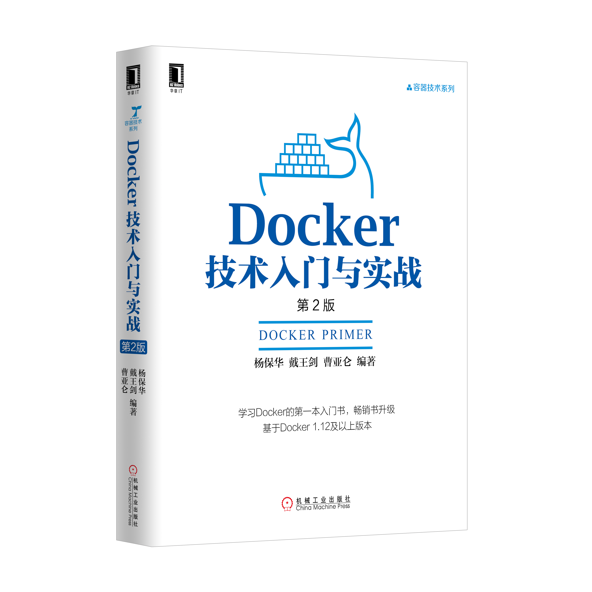

# Docker — 从入门到实践

0.8.3

[Docker](http://www.docker.com) 是个划时代的开源项目，它彻底释放了计算虚拟化的威力，极大提高了应用的运行效率，降低了云计算资源供应的成本！使用 Docker，可以让应用的部署、测试和分发都变得前所未有的高效和轻松！

无论是应用开发者、运维人员、还是其他信息技术从业人员，都有必要认识和掌握 Docker，以在有限的时间内做更多有意义的事。

本开源书籍既适用于具备基础 Linux 知识的 Docker 初学者，也希望可供理解原理和实现的高级用户参考。同时，书中给出的实践案例，可供在进行实际部署时借鉴。前六章为基础内容，供用户理解 Docker 的基本概念和操作；7 ~ 9 章介绍一些高级操作；第 10 章给出典型的应用场景和实践案例；11、12 章介绍关于 Docker 安全和实现技术等高级话题。后续章节则分别介绍一些相关的热门开源项目。

在线阅读：[GitBook](https://www.gitbook.io/book/yeasy/docker_practice) 或 [Github](https://github.com/yeasy/docker_practice/blob/master/SUMMARY.md)。

* pdf 版本 [下载](https://www.gitbook.com/download/pdf/book/yeasy/docker_practice)
* epub 版本 [下载](https://www.gitbook.com/download/epub/book/yeasy/docker_practice)

离线阅读：

```bash
$ git clone --depth=1 https://github.com/yeasy/docker_practice.git

$ cd docker_practice

$ docker-compose pull

$ docker-compose up
```

Docker 自身仍在快速发展中，生态环境也在蓬勃成长。建议初学者使用 Linux 上最新版的 Docker (v17.11) 进行学习实践。欢迎参与维护项目：[如何贡献](.github/CONTRIBUTING.md)。

* [修订记录](revision.md)
* [贡献者名单](https://github.com/yeasy/docker_practice/graphs/contributors)

## 技术交流
欢迎加入 Docker 技术交流 QQ 群，分享 Docker 资源，交流 Docker 技术。

* QQ 群 I   （已满）：341410255
* QQ 群 II  （已满）：419042067
* QQ 群 III （已满）：210028779
* QQ 群 IV  （已满）：483702734
* QQ 群 V   （已满）：460598761
* QQ 群 VI  （已满）：581983671
* QQ 群 VII （已满）：252403484
* QQ 群 VIII（已满）：544818750
* QQ 群 IX  （可加）：571502246

## 进阶学习


《[Docker 技术入门与实战](http://item.jd.com/12121728.html)》第二版已经正式出版，针对初版进行内容升级，欢迎大家阅读使用并反馈建议。

* [京东图书](https://item.jd.com/12121728.html)
* [China-Pub](http://product.china-pub.com/5089907)

## 鼓励项目

欢迎鼓励项目一杯 coffee~


