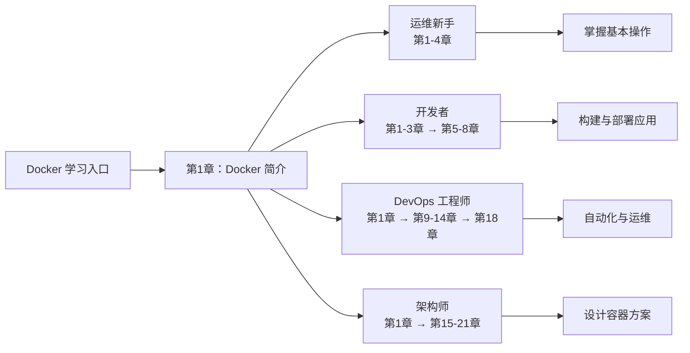
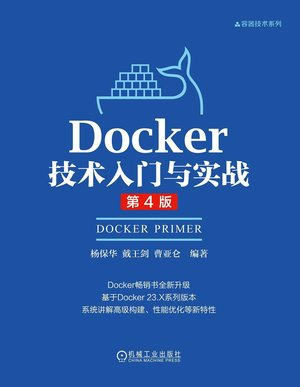

# Docker 从入门到实践

[](https://github.com/yeasy/docker_practice) [](https://github.com/yeasy/docker_practice/releases) [](https://docs.docker.com/engine/release-notes/) [][1]

**v1.7.0** | [PDF 下载](https://github.com/yeasy/docker_practice/releases/latest/download/docker_practice.pdf)

[Docker](https://www.docker.com) 是个划时代的开源项目，它彻底释放了计算虚拟化的威力，极大提高了应用的维护效率，降低了云计算应用开发的成本！使用 Docker，可以让应用的部署、测试和分发都变得前所未有的高效和轻松！

无论是应用开发者、运维人员、还是其他信息技术从业人员，都有必要认识和掌握 Docker，节约有限的生命。

本书既适用于具备基础 Linux 知识的 Docker 初学者，也希望可供理解原理和实现的高级用户参考。同时，书中给出的实践案例，可供在进行实际部署时借鉴。

## 内容特色

*   **入门基础**：第 1 ~ 6 章为基础内容，帮助深入理解 Docker 的基本概念 (镜像、容器、仓库) 和核心操作。
*   **进阶应用**：第 7 ~ 11 章涵盖 Dockerfile 指令详解、数据与网络管理、Buildx、Compose 等高级配置和管理操作。
*   **深入原理**：第 12 ~ 17 章介绍其底层实现技术，深入探讨容器编排体系 (Kubernetes、Etcd)，并延伸涉及容器与云计算及其它关键生态项目 (Fedora CoreOS、Podman 等)。
*   **实战扩展**：第 18 ~ 21 章重点讨论容器安全防护机制、监控与日志聚合系统 (Prometheus、ELK)，并展示操作系统、CI/CD 自动化构建等典型实践案例。

## 五分钟快速上手

“5分钟运行第一个容器”——跟随以下步骤快速体验 Docker：

1. **安装 Docker**（第3章）：根据操作系统完成 Docker 的安装与验证
2. **第一个容器**（第1章 `1.1`）：快速体验构建镜像与启动容器的完整流程
3. **交互式容器**（第5章）：执行 `docker run -it ubuntu bash`，进入容器内部与系统交互
4. **镜像与仓库**（第2章、第4章、第6章）：理解核心概念，并学会拉取、使用与管理镜像和仓库
5. **自定义镜像**（第7章）：学习如何编写 Dockerfile 创建自己的镜像

## 学习路线图


```mermaid
graph LR
    Start[Docker 学习入口] --> Ch1[第1章：Docker 简介]

    Ch1 --> Role1["运维新手<br/>第1-4章"]
    Ch1 --> Role2["开发者<br/>第1-3章 → 第5-8章"]
    Ch1 --> Role3["DevOps 工程师<br/>第1章 → 第9-14章 → 第18章"]
    Ch1 --> Role4["架构师<br/>第1章 → 第15-21章"]

    Role1 --> End1["掌握基本操作"]
    Role2 --> End2["构建与部署应用"]
    Role3 --> End3["自动化与运维"]
    Role4 --> End4["设计容器方案"]
```
| 读者角色 | 学习重点 | 核心成果 |
|---------|---------|---------|
| **运维新手** | 第1-4章 | 掌握容器的基本概念与操作 |
| **开发者** | 第1-3章 → 第5-8章 | 学会容器化应用的构建与部署 |
| **DevOps 工程师** | 第1章 → 第9-14章 → 第18章 | 实现容器编排与自动化部署流程 |
| **架构师** | 第1章 → 第15-21章 | 设计高可用、高性能的容器基础设施 |

## 阅读方式

本书按需提供多种阅读模式，具体如下：

### 在线阅读

*   **GitBook**: [在线阅读](https://yeasy.gitbook.io/docker_practice/)
*   **GitHub**: [仓库目录](https://github.com/yeasy/docker_practice/blob/master/SUMMARY.md)
*   **Mirror**: [镜像站点](https://vuepress.mirror.docker-practice.com/)

### 本地阅读

您也可以选择以下方式在本地离线阅读。

#### 方式 1：mdPress（推荐）

先安装 [mdPress](https://github.com/yeasy/mdpress)：

```bash
brew tap yeasy/tap && brew install mdpress
npm run serve
```
启动后访问 [本地阅读地址](http://localhost:4000)。

#### 方式 2：Docker 镜像

无需安装任何依赖，一条命令即可启动。

```bash
docker run -it --rm -p 4000:80 ccr.ccs.tencentyun.com/dockerpracticesig/docker_practice:vuepress
```
启动后访问 [本地阅读地址](http://localhost:4000)。
[离线阅读说明](https://github.com/yeasy/docker_practice/wiki/%E7%A6%BB%E7%BA%BF%E9%98%85%E8%AF%BB%E5%8A%9F%E8%83%BD%E8%AF%A6%E8%A7%A3)

## 社区交流

欢迎加入 Docker 技术交流群，分享 Docker 资源，交流 Docker 技术。

*   **GitHub Discussions**：[点击前往](https://github.com/yeasy/docker_practice/discussions) (技术问答、交流)
*   **GitHub Issues**：[提交 Bug](https://github.com/yeasy/docker_practice/issues/new/choose) (内容错误、建议)

> **交流 QQ 群** (部分已满，建议优先使用 GitHub Discussions)：
> *   341410255 (I), 419042067 (II), 210028779 (III), 483702734 (IV), 460598761 (V)
> *   581983671 (VI), 252403484 (VII), 544818750 (VIII), 571502246 (IX), 145983035 (X)

## 参与贡献

欢迎[参与项目维护](CONTRIBUTING.md)。

*   [修订记录](CHANGELOG.md)
*   [贡献者名单](https://github.com/yeasy/docker_practice/graphs/contributors)

## 进阶学习

<p align="center">
  <a href="https://item.jd.com/10200902362001.html">
    
  </a>
</p>

《[Docker 技术入门与实战][1]》已更新到第 4 版，讲解最新容器技术栈知识，欢迎大家阅读并反馈建议。

*   [京东图书][1]
*   [天猫图书](https://detail.tmall.com/item.htm?id=997383773726&skuId=6143496614475)

## 推荐阅读

本书是技术丛书的一部分。以下书籍与本书形成互补：

| 书名 | 与本书的关系 |
|------|------------|
| [《区块链技术指南》](https://github.com/yeasy/blockchain_guide) | 利用 Docker 部署区块链节点 |
| [《OpenClaw 从入门到精通》](https://github.com/yeasy/openclaw_guide) | 利用 Docker 部署 AI 智能体 |

## 鼓励项目

<p align="center">

</p>

<p align="center"><strong>欢迎鼓励项目一杯 coffee~</strong></p>

## Star History

<p align="center">
  <a href="https://star-history.com/#yeasy/docker_practice&Date">
    
  </a>
</p>

[1]: https://item.jd.com/10200902362001.html
