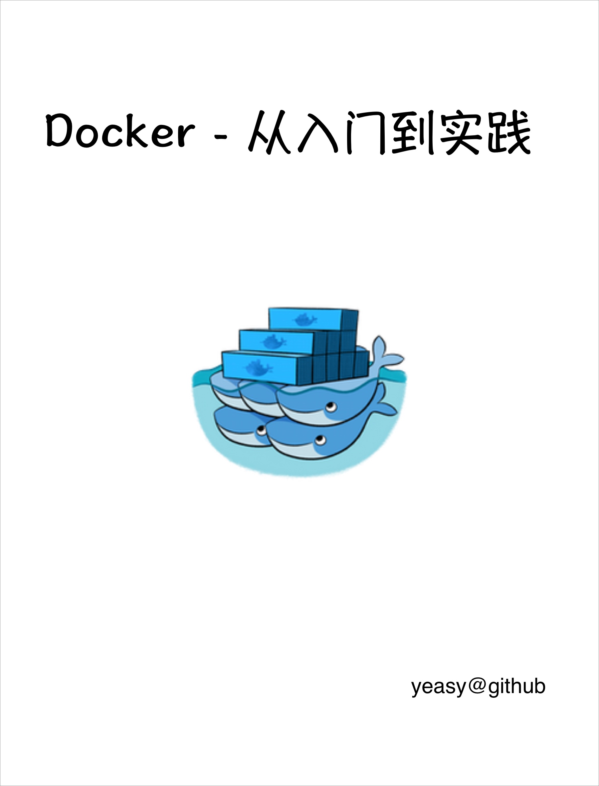
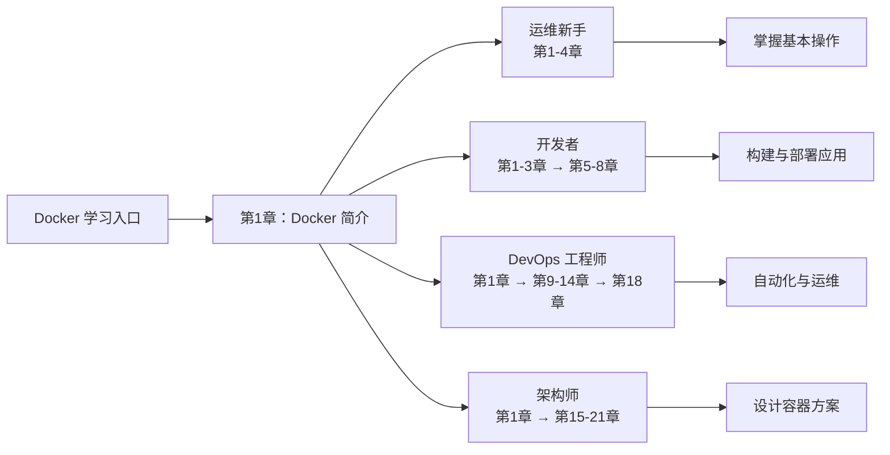

<div align="center">

# Docker 从入门到实践

[](https://creativecommons.org/licenses/by-nc-sa/4.0/)
[](https://github.com/yeasy/docker_practice)
[](https://github.com/yeasy/docker_practice/releases)
[](https://yeasy.gitbook.io/docker_practice)
[](https://github.com/yeasy/docker_practice/releases/latest)
[](https://docs.docker.com/engine/release-notes/)

> 从零开始，系统掌握 Docker 容器技术的核心概念、原理与实战技巧



</div>

---

## 关于本书

[Docker](https://www.docker.com) 是个划时代的开源项目，它彻底释放了计算虚拟化的威力，极大提高了应用的维护效率，降低了云计算应用开发的成本！使用 Docker，可以让应用的部署、测试和分发都变得前所未有的高效和轻松！

无论是应用开发者、运维人员、还是其他信息技术从业人员，都有必要认识和掌握 Docker，节约有限的生命。

本书既适用于具备基础 Linux 知识的 Docker 初学者，也希望可供理解原理和实现的高级用户参考。同时，书中给出的实践案例，可供在进行实际部署时借鉴。

## 内容特色

*   **入门基础**：第 1 ~ 6 章为基础内容，帮助深入理解 Docker 的基本概念 (镜像、容器、仓库) 和核心操作。
*   **进阶应用**：第 7 ~ 11 章涵盖 Dockerfile 指令详解、数据与网络管理、Buildx、Compose 等高级配置和管理操作。
*   **深入原理**：第 12 ~ 17 章介绍其底层实现技术，深入探讨容器编排体系 (Kubernetes、Etcd)，并延伸涉及容器与云计算及其它关键生态项目 (Fedora CoreOS、Podman 等)。
*   **实战扩展**：第 18 ~ 21 章重点讨论容器安全防护机制、监控与日志聚合系统 (Prometheus、ELK)，并展示操作系统、CI/CD 自动化构建等典型实践案例。

## 五分钟快速上手

“5分钟运行第一个容器”——跟随以下步骤快速体验 Docker：

1. **安装 Docker**（第3章）：根据操作系统完成 Docker 的安装与验证
2. **第一个容器**（第1章 `1.1`）：快速体验构建镜像与启动容器的完整流程
3. **交互式容器**（第5章）：执行 `docker run -it ubuntu bash`，进入容器内部与系统交互
4. **镜像与仓库**（第2章、第4章、第6章）：理解核心概念，并学会拉取、使用与管理镜像和仓库
5. **自定义镜像**（第7章）：学习如何编写 Dockerfile 创建自己的镜像

## 学习路线图


```mermaid
graph LR
    Start[Docker 学习入口] --> Ch1[第1章：Docker 简介]

    Ch1 --> Role1["运维新手<br/>第1-4章"]
    Ch1 --> Role2["开发者<br/>第1-3章 → 第5-8章"]
    Ch1 --> Role3["DevOps 工程师<br/>第1章 → 第9-14章 → 第18章"]
    Ch1 --> Role4["架构师<br/>第1章 → 第15-21章"]

    Role1 --> End1["掌握基本操作"]
    Role2 --> End2["构建与部署应用"]
    Role3 --> End3["自动化与运维"]
    Role4 --> End4["设计容器方案"]
```
| 读者角色 | 学习重点 | 核心成果 |
|---------|---------|---------|
| **运维新手** | 第1-4章 | 掌握容器的基本概念与操作 |
| **开发者** | 第1-3章 → 第5-8章 | 学会容器化应用的构建与部署 |
| **DevOps 工程师** | 第1章 → 第9-14章 → 第18章 | 实现容器编排与自动化部署流程 |
| **架构师** | 第1章 → 第15-21章 | 设计高可用、高性能的容器基础设施 |

## 在线阅读

本书在线阅读，可直接访问 [GitBook](https://yeasy.gitbook.io/docker_practice/)。也可访问 [GitHub 仓库目录](https://github.com/yeasy/docker_practice/blob/master/SUMMARY.md) 或 [镜像站点](https://vuepress.mirror.docker-practice.com/)。

## 下载离线版本

本书提供 PDF 版本供离线阅读，可前往 [GitHub Releases](https://github.com/yeasy/docker_practice/releases/latest) 页面下载最新版本。

如需获取默认分支自动更新的预览版，可直接下载 [docker_practice.pdf](https://github.com/yeasy/docker_practice/releases/download/preview-pdf/docker_practice.pdf)。该文件会随主线更新覆盖，不代表正式发布版本。

## 本地阅读

先安装 [mdPress](https://github.com/yeasy/mdpress)：

```bash
brew tap yeasy/tap && brew install mdpress
mdpress serve
```

或使用 Docker 镜像一条命令启动：

```bash
docker run -it --rm -p 4000:80 ccr.ccs.tencentyun.com/dockerpracticesig/docker_practice:vuepress
```

## 社区交流

- [GitHub Discussions](https://github.com/yeasy/docker_practice/discussions)（技术问答、交流）
- [GitHub Issues](https://github.com/yeasy/docker_practice/issues/new/choose)（内容错误、建议）

## 推荐阅读

本书是技术丛书的一部分。以下书籍与本书形成互补：

| 书名 | 与本书的关系 |
|------|------------|
| [《智能体 Harness 工程指南》](https://yeasy.gitbook.io/harness_engineering_guide) | Agent 基础设施中的容器化部署与隔离 |
| [《大模型安全权威指南》](https://yeasy.gitbook.io/ai_security_guide) | 容器安全与 AI 系统安全的交叉实践 |
| [《区块链技术指南》](https://yeasy.gitbook.io/blockchain_guide) | 区块链节点的容器化部署 |

## 参与贡献

欢迎[参与项目维护](CONTRIBUTING.md)。

*   [修订记录](CHANGELOG.md)
*   [贡献者名单](https://github.com/yeasy/docker_practice/graphs/contributors)

## 进阶学习

《[Docker 技术入门与实战][1]》已更新到第 4 版，讲解最新容器技术栈知识，欢迎大家阅读并反馈建议。[京东图书][1] | [天猫图书](https://detail.tmall.com/item.htm?id=997383773726&skuId=6143496614475)

## 支持鼓励

欢迎鼓励项目一杯 coffee~

<p align="center">

</p>

## Star History

<p align="center">
  <a href="https://star-history.com/#yeasy/docker_practice&Date">
    
  </a>
</p>

## 许可证

本书采用 [CC BY-NC-SA 4.0](https://creativecommons.org/licenses/by-nc-sa/4.0/) 许可证。

您可以自由分享和演绎，但需署名、非商业使用、相同方式共享。

[1]: https://item.jd.com/10200902362001.html
