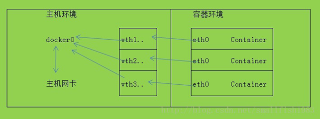

#docker高级网络配置
当docker启动时，会在主机上创建一个docker0的虚拟网卡。他随机挑选RFC1918私有网络中的一段地址给docker0。比如172.17.42.1/16,16位掩码的网段可以拥有65534个地址可以使用，这对主机和容器来说应该足够了。
注意：本章介绍docker的高级网络配置，一般情况下你不需要知道这些也可以使docker正常工作。简单的网络配置和介绍请看第五章内容。
docker0 不是普通的网卡，他是桥接到其他网卡的虚拟网卡，容器使用它来和主机相互通信。当创建一个docker容器的时候，它就创建了一个对接口，当数据包发送到一个接口时，另外一个接口也可以收到相同的数据包，它们是绑在一起的一对孪生接口。这对接口在容器中那一端的的名字是eth0，宿主主机端的会指定一个唯一的名字，比如vethAQI2QT这样的名字，这种接口名字不再主机的命名空间中。所有的veth*的接口都会桥接到docker0，这样docker就创建了在主机和所有容器之间一个虚拟共享网络。

接下来的部分将介绍在一些场景中，docker所有的网络定制配置。linux的原生命令将调整、补充、甚至替换docker默认的网络配置。
