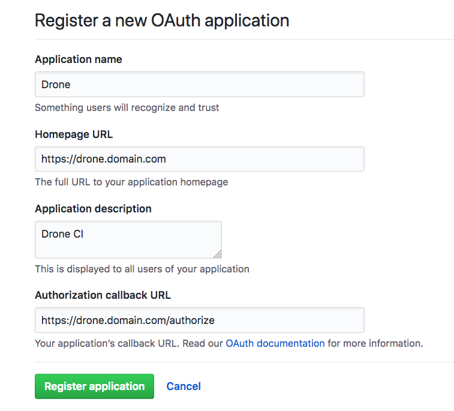

## Drone

基于 `Docker` 的 `CI/CD` 工具 `Drone` 所有编译、测试的流程都在 `Docker` 容器中进行。

开发者只需在项目中包含 `.drone.yml` 文件，将代码推送到 git 仓库，`Drone` 就能够自动化的进行编译、测试、发布。

本小节以 `GitHub` + `Drone` 来演示 `Drone` 的工作流程。当然在实际开发过程中，你的代码也许不在 GitHub 托管，那么你可以尝试使用 `Gogs` + `Drone` 来进行 `CI/CD`。

### 要求

* 拥有公网 IP、域名 (如果你不满足要求，可以尝试在本地使用 Gogs + Drone)

* 域名 SSL 证书 (目前国内有很多云服务商提供免费证书)

* 熟悉 `Docker` 以及 `Docker Compose`

* 熟悉 `Git` 基本命令

* 对 `CI/CD` 有一定了解

### 新建 GitHub 应用

登录 GitHub，在 https://github.com/settings/applications/new 新建一个应用。



接下来点击这个应用详情，记录 `Client ID` 和 `Client Secret`，之后配置 Drone 会用到。

### 配置 Drone

我们通过使用 `Docker Compose` 来启动 `Drone`，编写 `docker-compose.yml` 文件。

```yaml
version: '3'
services:

  drone-server:
    image: drone/drone:0.8-alpine
    ports:
      - 443:443
      # - "${PRO_PUBLIC_IP}:8000:8000"
    volumes:
      - drone-data:/var/lib/drone/:rw
      - ${SSL_PATH}:/etc/certs:rw
    restart: always
    environment:
      - DRONE_SECRET=drone
      - DRONE_OPEN=false
      - DRONE_ADMIN=${GITHUB_SERNAME}
      - DRONE_HOST=${DRONE_HOST}
      - DRONE_GITHUB=true
      - DRONE_GITHUB_CLIENT=${DRONE_GITHUB_CLIENT}
      - DRONE_GITHUB_SECRET=${DRONE_GITHUB_SECRET}
      - DRONE_SERVER_CERT=/etc/certs/drone.domain.com.crt
      - DRONE_SERVER_KEY=/etc/certs/drone.domain.com.key

  drone-agent:
    image: drone/agent:0.8-alpine
    restart: always
    depends_on:
      - drone-server
    volumes:
      - /var/run/docker.sock:/var/run/docker.sock:rw
    environment:
      - DRONE_SECRET=drone
      - DRONE_SERVER=drone-server:9000
    dns: 114.114.114.114

volumes:
  drone-data:    
```

替换 `${SSL_PATH}` 为你网站的 SSL 证书路径。

替换 `${GITHUB_SERNAME}` 为你部署 GitHub 的用户名，该用户将成为 Drone 的管理员。

替换 `${DRONE_HOST}` 为你部署 Drone 的域名。

替换 `${DRONE_GITHUB_CLIENT}` 为你 GitHub 应用的 `CLIENT`

替换 `${DRONE_GITHUB_SECRET}` 为你 GitHub 应用的 `SECRET`

*注意：* 如果你的服务器占用了 `443` 端口，请配置 Nginx 代理，这里不再赘述。

#### 启动 Drone

```bash
$ docker-compose up -d
```

### Drone 关联项目

在 Github 新建一个名为 `drone-demo` 的仓库。

打开我们已经部署好的 Drone 网站，使用 GitHub 登录，在界面中关联刚刚新建的 `drone-demo` 仓库。

### 编写项目源代码

在本机初始化一个 git 仓库

```bash
$ mkdir drone-demo

$ cd drone-demo

$ git init

$ git remote add origin git@github.com/username/drone-demo.git
```

这里以一个简单的 `Go` 程序为例，该程序输出 `Hello World!`

编写 `app.go` 文件

```go
package main

import "fmt"

func main(){  
    fmt.Printf("Hello World!");
}
```

编写 `.drone.yml` 文件

```yaml
workspace:
  base: /srv/drone-demo
  path: .

pipeline:
  build:
     image: golang:alpine
     # pull: true
     environment:
       - KEY=VALUE
     secrets: [key1, key2]
     commands:
       - echo $$KEY
       - pwd
       - ls
       - CGO_ENABLED=0 GOOS=linux go build -a -installsuffix cgo -o app .
       - ./app
```

`workspace` 指明 git 源代码克隆的目标路径，本例中 git 源代码将被克隆到 golang 容器中的 `/srv/drone-demo` 目录中。

`pipeline` 指明构建所需的 Docker 镜像，环境变量，编译指令等。

现在目录结构如下

```bash
.
├── .drone.yml
└── app.go
```

### 推送项目源代码到 GitHub

```bash
$ git add .

$ git commit -m "test drone ci"

$ git push origin master
```

### 查看项目构建过程及结果

打开我们部署好的 `Drone` 网站，即可看到构建结果。


当然我们也可以把构建结果上传到 GitHub，Docker Registry，云服务商提供的对象存储，或者生产环境中。

本书 GitBook 也使用 Drone 进行 CI/CD，具体配置信息请查看本书根目录 [`.drone.yml`](https://github.com/yeasy/docker_practice/blob/master/.drone.yml) 文件。

## 参考链接

* [Drone Github](https://github.com/drone/drone)

* [Drone 文档](http://docs.drone.io/)
