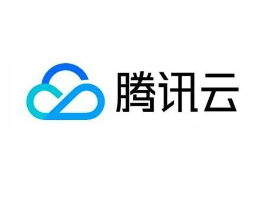

# 腾讯云

[腾讯云](https://cloud.tencent.com/act/cps/redirect?redirect=1040&cps_key=3a5255852d5db99dcd5da4c72f05df61&from=console) 在架构方面经过多年积累，并且有着多年对海量互联网服务的经验。不管是社交、游戏还是其他领域，都有多年的成熟产品来提供产品服务。腾讯在云端完成重要部署，为开发者及企业提供云服务、云数据、云运营等整体一站式服务方案。

具体包括 [云服务器](https://cloud.tencent.com/act/cps/redirect?redirect=1001&cps_key=3a5255852d5db99dcd5da4c72f05df61&from=console)、[云存储](https://cloud.tencent.com/act/cps/redirect?redirect=1020&cps_key=3a5255852d5db99dcd5da4c72f05df61&from=console)、[云数据库](https://cloud.tencent.com/act/cps/redirect?redirect=1003&cps_key=3a5255852d5db99dcd5da4c72f05df61&from=console)、[视频与CDN](https://cloud.tencent.com/act/cps/redirect?redirect=1019&cps_key=3a5255852d5db99dcd5da4c72f05df61&from=console) 和 [域名注册](https://dnspod.cloud.tencent.com) 等基础云服务；腾讯云分析（MTA）、腾讯云推送（信鸽）等腾讯整体大数据能力；以及 QQ互联、QQ 空间、微云、微社区等云端链接社交体系。这些正是腾讯云可以提供给这个行业的差异化优势，造就了可支持各种互联网使用场景的高品质的腾讯云技术平台。

[腾讯云容器服务 TKE](https://cloud.tencent.com/act/cps/redirect?redirect=10058&cps_key=3a5255852d5db99dcd5da4c72f05df61) 是高度可扩展的高性能容器管理服务，用户可以在托管的云服务器实例集群上轻松运行应用程序。使用该服务，将无需安装、运维、扩展用户的集群管理基础设施，只需进行简单的 API 调用，便可启动和停止 Docker 应用程序，查询集群的完整状态，以及使用各种云服务。用户可以根据用户的资源需求和可用性要求在用户的集群中安排容器的置放，满足业务或应用程序的特定要求。

