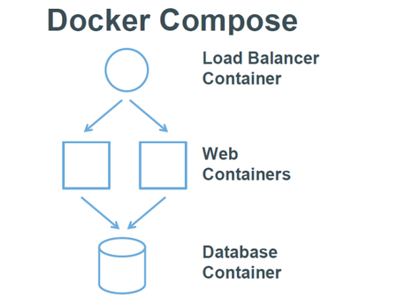

## 简介
Compose 项目目前在 [Github](https://github.com/docker/compose) 上进行维护，目前最新版本是 1.2.0。

Compose 定位是“defining and running complex applications with Docker”，前身是 Fig，兼容 Fig 的模板文件。

Dockerfile 可以让用户管理一个单独的应用容器；而 Compose 则允许用户在一个模板（YAML 格式）中定义一组相关联的应用容器（被称为一个 `project`，即项目），例如一个 Web 服务容器再加上后端的数据库服务容器等。

该项目由 Python 编写，实际上调用了 Docker 提供的 API 来实现。
