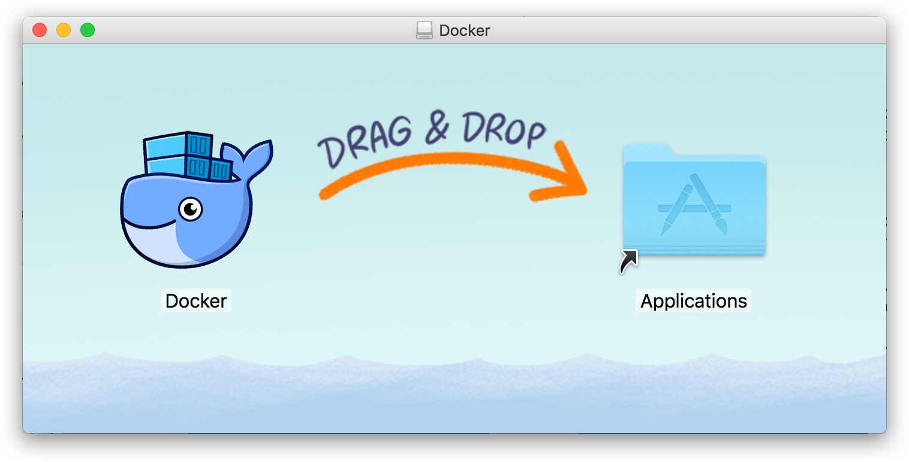

# macOS 安装 Docker Desktop CE

## 系统要求

[Docker Desktop for Mac](https://docs.docker.com/docker-for-mac/) 要求系统最低为 macOS Catalina 10.13。

## 安装

### 使用 Homebrew 安装

[Homebrew](https://brew.sh/) 的 [Cask](https://github.com/Homebrew/homebrew-cask) 已经支持 Docker Desktop for Mac，因此可以很方便的使用 Homebrew Cask 来进行安装：

```bash
$ brew cask install docker
```

### 手动下载安装

如果需要手动下载，请点击以下链接下载 [Stable](https://download.docker.com/mac/stable/Docker.dmg) 或 [Edge](https://download.docker.com/mac/edge/Docker.dmg) 版本的 Docker Desktop for Mac。

如同 macOS 其它软件一样，安装也非常简单，双击下载的 `.dmg` 文件，然后将那只叫 [Moby](https://www.docker.com/blog/call-me-moby-dock/) 的鲸鱼图标拖拽到 `Application` 文件夹即可（其间需要输入用户密码）。



## 运行

从应用中找到 Docker 图标并点击运行。


运行之后，会在右上角菜单栏看到多了一个鲸鱼图标，这个图标表明了 Docker 的运行状态。


第一次点击图标，可能会看到这个安装成功的界面，点击 "Got it!" 可以关闭这个窗口。


以后每次点击鲸鱼图标会弹出操作菜单。


启动终端后，通过命令可以检查安装后的 Docker 版本。

```bash
$ docker --version
Docker version 19.03.1, build 74b1e89
$ docker-compose --version
docker-compose version 1.24.1, build 4667896b
$ docker-machine --version
docker-machine version 0.16.1, build cce350d7
```

如果 `docker version`、`docker info` 都正常的话，可以尝试运行一个 [Nginx 服务器](https://hub.docker.com/_/nginx/)：

```bash
$ docker run -d -p 80:80 --name webserver nginx
```

服务运行后，可以访问 <http://localhost>，如果看到了 "Welcome to nginx!"，就说明 Docker Desktop for Mac 安装成功了。


要停止 Nginx 服务器并删除执行下面的命令：

```bash
$ docker stop webserver
$ docker rm webserver
```

## 镜像加速

如果在使用过程中发现拉取 Docker 镜像十分缓慢，可以配置 Docker [国内镜像加速](mirror.md)。

## 参考链接

* [官方文档](https://docs.docker.com/docker-for-mac/install/)
