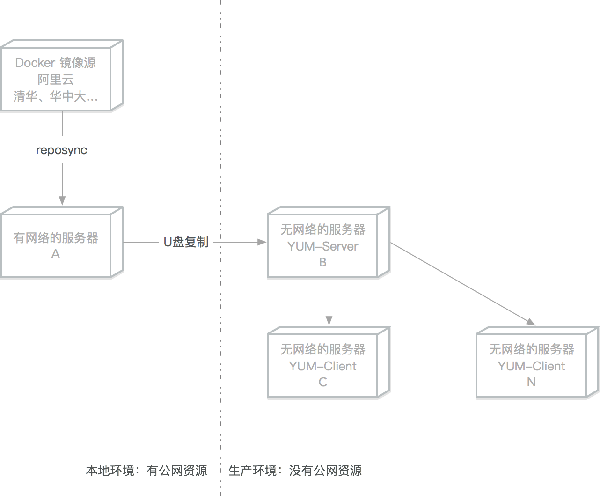

# 离线部署Docker

[TOC]

生产环境中一般都是没有公网资源的，本文介绍如何在生产服务器上离线部署`Docker`


括号内的字母表示该操作需要在哪些服务器上执行



## Centos7 离线安装Docker

### YUM本地文件安装（推荐）

推荐这种方式，是因为在生产环境种一般会选定某个指定的文档软件版本使用。

####  查询可用的软件版本(A)

```bash
#下载清华的镜像源文件
wget -O /etc/yum.repos.d/docker-ce.repo https://download.docker.com/linux/centos/docker-ce.repo

sudo sed -i 's+download.docker.com+mirrors.tuna.tsinghua.edu.cn/docker-ce+' /etc/yum.repos.d/docker-ce.repo

yum update
```

```bash
sudo yum list docker-ce --showduplicates|sort -r

Loading mirror speeds from cached hostfile
Loaded plugins: fastestmirror
docker-ce.x86_64            3:19.03.8-3.el7                     docker-ce-stable
docker-ce.x86_64            3:19.03.7-3.el7                     docker-ce-stable
docker-ce.x86_64            3:19.03.6-3.el7                     docker-ce-stable
docker-ce.x86_64            3:19.03.5-3.el7                     docker-ce-stable
docker-ce.x86_64            3:19.03.4-3.el7                     docker-ce-stable
docker-ce.x86_64            3:19.03.3-3.el7                     docker-ce-stable
docker-ce.x86_64            3:19.03.2-3.el7                     docker-ce-stable
docker-ce.x86_64            3:19.03.1-3.el7                     docker-ce-stable
....
```

#### 下载到指定文件夹(A)

```bash
sudo yum install --downloadonly --downloaddir=/tmp/docker-19.03 docker-ce-19.03.8-3.el7 docker-ce-cli-19.03.8-3.el7 
```

```bash
Dependencies Resolved

====================================================================================================================================================================================
 Package                                          Arch                                  Version                                         Repository                             Size
====================================================================================================================================================================================
Installing:
 docker-ce                                        x86_64                                3:19.03.8-3.el7                                 docker                                 25 M
Installing for dependencies:
 container-selinux                                noarch                                2:2.107-3.el7                                   extras                                 39 k
 containerd.io                                    x86_64                                1.2.13-3.1.el7                                  docker                                 23 M
 docker-ce-cli                                    x86_64                                1:19.03.8-3.el7                                 docker                                 40 M

Transaction Summary
====================================================================================================================================================================================
Install  1 Package (+3 Dependent packages)

Total download size: 87 M
Installed size: 363 M
Background downloading packages, then exiting:
(1/4): container-selinux-2.107-3.el7.noarch.rpm                                                                                                              |  39 kB  00:00:00
(2/4): containerd.io-1.2.13-3.1.el7.x86_64.rpm                                                                                                               |  23 MB  00:00:00
(3/4): docker-ce-19.03.8-3.el7.x86_64.rpm                                                                                                                    |  25 MB  00:00:00
(4/4): docker-ce-cli-19.03.8-3.el7.x86_64.rpm                                                                                                                |  40 MB  00:00:00
------------------------------------------------------------------------------------------------------------------------------------------------------------------------------------
Total                                                                                                                                               118 MB/s |  87 MB  00:00:00
exiting because "Download Only" specified
```
#### 复制到目标服务器之后进入文件夹安装(C-N)

```bash
yum install *.rpm
```

#### 锁定软件版本(C-N)

##### 下载锁定版本软件
可参考下文的网络源搭建
```bash
sudo yum install yum-plugin-versionlock
```

##### 锁定软件版本

```bash
sudo yum versionlock add docker
```

##### 查看锁定列表

```bash
sudo yum versionlock list
```

```bash
Loaded plugins: fastestmirror, versionlock
3:docker-ce-18.09.9-3.el7.*
versionlock list done
```

##### 锁定后无法再更新

```bash
sudo yum install docker-ce
Loaded plugins: fastestmirror, versionlock
Loading mirror speeds from cached hostfile
Excluding 1 update due to versionlock (use "yum versionlock status" to show it)
Package 3:docker-ce-18.09.9-3.el7.x86_64 already installed and latest version
Nothing to do
```

##### 解锁指定软件

```bash
sudo yum versionlock delete docker-ce
```

```bash
Loaded plugins: fastestmirror, versionlock
Deleting versionlock for: 3:docker-ce-18.09.9-3.el7.*
versionlock deleted: 1
```

##### 解锁所有软件

```bash
sudo yum versionlock delete all
```


### YUM 本地源服务器搭建安装Docker

#### 挂载 ISO 镜像搭建本地 File 源（AB）

```bash
# 删除其他网络源
rm -f /etc/yum.repo.d/*
# 挂载光盘或者iso镜像
mount /dev/cdrom /mnt
```

```bash
# 添加本地源
cat >/etc/yum.repos.d/local_files.repo<< EOF
[Local_Files]
name=Local_Files
baseurl=file:///mnt
enable=1
gpgcheck=0
gpgkey=file:///mnt/RPM-GPG-KEY-CentOS-7
EOF
```

```bash
# 测试刚才的本地源,安装createrepo软件
yum clean all 
yum install createrepo -y
```


#### 根据本地文件搭建BASE网络源（B）

```bash
# 安装apache 服务器
yum install httpd -y
# 挂载光盘
mount /dev/cdrom /mnt
# 新建centos目录
mkdir /var/www/html/base
# 复制光盘内的文件到刚才新建的目录
cp -R /mnt/Packages/* /var/www/html/base/
createrepo  /var/www/html/centos/
systemctl enable httpd
systemctl start httpd
```

#### 下载Docker-CE 镜像仓库（A）

在有网络的服务器上下载Docker-ce镜像

```bash
# 下载清华的镜像源文件
wget -O /etc/yum.repos.d/docker-ce.repo https://download.docker.com/linux/centos/docker-ce.repo
sudo sed -i 's+download.docker.com+mirrors.tuna.tsinghua.edu.cn/docker-ce+' /etc/yum.repos.d/docker-ce.repo
```

```bash
# 新建 docker-ce目录
mkdir /tmp/docker-ce/
# 把镜像源同步到镜像文件中
reposync -r docker-ce-stable -p /tmp/docker-ce/
```

#### 创建仓库索引（B）

把下载的 docker-ce 文件夹复制到离线的服务器

```bash
# 把docker-ce 文件夹复制到/var/www/html/docker-ce
# 重建索引
createrepo  /var/www/html/docker-ce/
```

#### YUM 客户端设置（C...N）

```bash
rm -f /etc/yum.repo.d/*
cat >/etc/yum.repos.d/local_files.repo<< EOF
[local_base]
name=local_base
# 改成B服务器地址
baseurl=http://x.x.x.x/base
enable=1
gpgcheck=0
proxy=_none_
[docker_ce]
name=docker_ce
# 改成B服务器地址
baseurl=http://x.x.x.x/base
enable=1
gpgcheck=0
proxy=_none_
EOF

```

#### Docker 安装（C...N）

```bash
sudo yum makecache fast
sudo yum install docker-ce docker-ce-cli containerd.io
sudo systemctl enable docker
```


