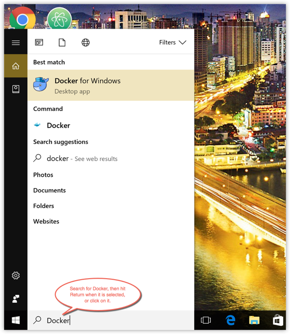
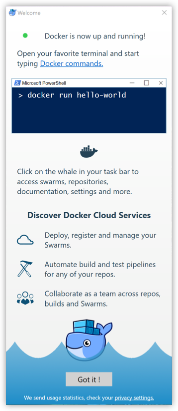

# Windows 10 安装 Docker Desktop CE

## 系统要求

[Docker Desktop for Windows](https://docs.docker.com/docker-for-windows/install/) 支持 64 位版本的 Windows 10 Pro，且必须开启 Hyper-V（若版本为 v2004 及以上则无需开启 Hyper-V），或者 64 位版本的 Windows 10 Home v2004 及以上版本。

## 安装

**手动下载安装**

点击以下链接下载 [Stable](https://download.docker.com/win/stable/Docker%20Desktop%20Installer.exe) 或 [Edge](https://download.docker.com/win/edge/Docker%20Desktop%20Installer.exe) 版本的 Docker Desktop for Windows。

下载好之后双击 `Docker Desktop Installer.exe` 开始安装。

**使用 [winget](https://docs.microsoft.com/zh-cn/windows/package-manager/) 安装**

```powershell
# stable
$ winget install Docker.DockerDesktop

# edge
$ winget install Docker.DockerDesktopEdge
```

## 运行

在 Windows 搜索栏输入 **Docker** 点击 **Docker Desktop** 开始运行。



Docker CE 启动之后会在 Windows 任务栏出现鲸鱼图标。


等待片刻，点击 Got it 开始使用 Docker CE。



## 镜像加速

如果在使用过程中发现拉取 Docker 镜像十分缓慢，可以配置 Docker [国内镜像加速](mirror.md)。

## 参考链接

* [官方文档](https://docs.docker.com/docker-for-windows/install/)
* [Docker Desktop WSL 2 backend](https://docs.docker.com/docker-for-windows/wsl/)
