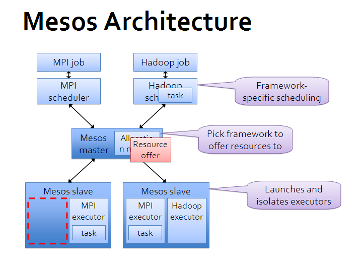

## 原理与架构

首先，再次需要强调 Mesos 自身只是一个资源调度框架，并非一整套完整的应用管理平台，所以只有 Mesos 自己是不能干活的。但是基于 Mesos，可以比较容易地为各种应用管理框架或者中间件平台（作为 Mesos 的应用）提供分布式运行能力；同时多个框架也可以同时运行在一个 Mesos 集群中，提高整体的资源使用效率。

Mesos 对自己定位范围的划分，使得它要完成的任务很明确，其它任务框架也可以很容易的与它进行整合。

### 架构
下面这张基本架构图来自 Mesos 官方。

可以看出，Mesos 采用了经典的主-从（master-slave）架构，其中主节点（管理节点）可以使用 zookeeper 来做 HA。

Mesos master 服务将运行在主节点上，Mesos slave 服务则需要运行在各个计算任务节点上。

负责完成具体任务的应用框架们，跟 Mesos master 进行交互，来申请资源。

### 基本单元
Mesos 中有三个基本的组件：管理服务（master）、任务服务（slave）以及应用框架（framework）。

#### 管理服务 - master
跟大部分分布式系统中类似，主节点起到管理作用，将看到全局的信息，负责不同应用框架之间的资源调度和逻辑控制。应用框架需要注册到管理服务上才能被使用。

用户和应用需要通过主节点提供的 API 来获取集群状态和操作集群资源。

#### 任务服务 - slave
负责汇报本从节点上的资源状态（空闲资源、运行状态等等）给主节点，并负责隔离本地资源来执行主节点分配的具体任务。

隔离机制目前包括各种容器机制，包括 LXC、Docker 等。

#### 应用框架 - framework
应用框架是实际干活的，包括两个主要组件：

* 调度器（scheduler）：注册到主节点，等待分配资源；
* 执行器（executor）：在从节点上执行框架指定的任务（框架也可以使用 Mesos 自带的执行器，包括 shell 脚本执行器和 Docker 执行器）。

应用框架可以分两种：一种是对资源的需求是会扩展的（比如 Hadoop、Spark 等），申请后还可能调整；一种是对资源需求大小是固定的（MPI 等），一次申请即可。

### 调度
对于一个资源调度框架来说，最核心的就是调度机制，怎么能快速高效地完成对某个应用框架资源的分配，是核心竞争力所在。最理想情况下（大部分时候都无法实现），最好是能猜到应用们的实际需求，实现最大化的资源使用率。

Mesos 为了实现尽量优化的调度，采取了两层（two-layer）的调度算法。

#### 算法基本过程
调度的基本思路很简单，master 先全局调度一大块资源给某个 framework，framework 自己再实现内部的细粒度调度，决定哪个任务用多少资源。两层调度简化了 Mesos master 自身的调度过程，通过将复杂的细粒度调度交由 framework 实现，避免了 Mesos master 成为性能瓶颈。

调度机制支持插件机制来实现不同的策略。默认是 Dominant Resource Fairness（DRF）。

*注：DRF 算法细节可以参考论文《Dominant Resource Fairness: Fair Allocation of Multiple Resource Types》。其核心思想是对不同类型资源的多个请求，计算请求的主资源类型，然后根据主资源进行公平分配。*

#### 调度过程
调度通过 offer 发送的方式进行交互。一个 offer 是一组资源，例如 `<1 CPU, 2 GB Mem>`。

基本调度过程如下：

* 首先，slave 节点会周期性汇报自己可用的资源给 master；
* 某个时候，master 收到应用框架发来的资源请求，根据调度策略，计算出来一个资源 offer 给 framework；
* framework 收到 offer 后可以决定要不要，如果接受的话，返回一个描述，说明自己希望如何使用和分配这些资源来运行某些任务（可以说明只希望使用部分资源，则多出来的会被 master 收回）；
* 最后，master 则根据 framework 答复的具体分配情况发送给 slave，以使用 framework 的 executor 来按照分配的资源策略执行任务。

具体给出一个例子，某从节点向主节点汇报自己有 `<4 CPU, 8 GB Mem>` 的空闲资源，同时，主节点看到某个应用框架请求 `<3 CPU, 6 GB Mem>`，就创建一个 offer `<slave#1, 4 CPU, 8 GB Mem>` 把满足的资源发给应用框架。应用框架（的调度器）收到 offer 后觉得可以接受，就回复主节点，并告诉主节点希望运行两个任务：一个占用 `<1 CPU, 2 GB Mem>`，一个占用 一个占用 `<2 CPU, 4 GB Mem>`。主节点收到任务信息后分配任务到从节点上进行运行（实际上是应用框架的执行器来负责执行任务）。任务运行结束后资源可以被释放出来。

剩余的资源还可以继续分配给其他应用框架或任务。

应用框架在收到 offer 后，如果 offer 不满足自己的偏好（例如希望继续使用上次的 slave 节点），则可以选择拒绝 offer，等待 master 发送新的 offer 过来。另外，可以通过过滤器机制来加快资源的分配过程。

#### 过滤器
framework 可以通过过滤器机制告诉 master 它的资源偏好，比如希望分配过来的 offer 有哪个资源，或者至少有多少资源等。

过滤器可以避免某些应用资源长期分配不到所需要的资源的情况，加速整个资源分配的交互过程。

#### 回收机制
为了避免某些任务长期占用集群中资源，Mesos 也支持回收机制。

主节点可以定期回收计算节点上的任务所占用的资源，可以动态调整长期任务和短期任务的分布。

### HA

从架构上看，最为核心的节点是 master 节点。除了使用 ZooKeeper 来解决单点失效问题之外，Mesos 的 master 节点自身还提供了很高的鲁棒性。

Mesos master 节点在重启后，可以动态通过 slave 和 framework 发来的消息重建内部状态，虽然可能导致一定的时延，但这避免了传统控制节点对数据库的依赖。

当然，为了减少 master 节点的负载过大，在集群中 slave 节点数目较多的时候，要避免把各种通知的周期配置的过短。实践中，可以通过部署多个 Mesos 集群来保持单个集群的规模不要过大。
