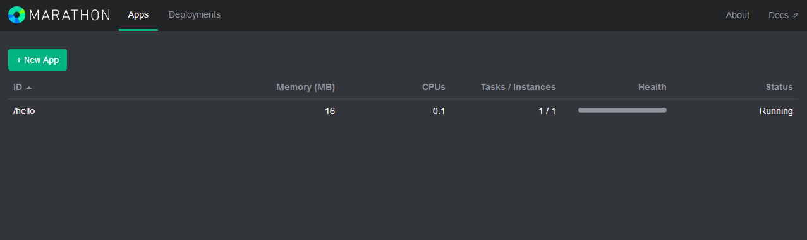

## Mesos + Marathon 安装与使用

Marathon 是可以跟 Mesos 一起协作的一个 framework，用来运行持久性的应用。

### 安装
一共需要安装四种组件，mesos-master、marathon、zookeeper 需要安装到所有的主节点，mseos-slave 需要安装到从节点。

mesos 利用 zookper 来进行主节点的同步，以及从节点发现主节点的过程。

#### 源码编译

下载源码
```sh
git clone https://git-wip-us.apache.org/repos/asf/mesos.git
```

安装依赖

```sh
#jdk-7
sudo apt-get update && sudo apt-get install -y openjdk-7-jdk
#autotools
sudo apt-get install -y autoconf libtool
#Mesos dependencies.
sudo apt-get -y install build-essential python-dev python-boto libcurl4-nss-dev libsasl2-dev maven libapr1-dev libsvn-dev
```

编译&安装
```sh
$ cd mesos

# Bootstrap (Only required if building from git repository).
$ ./bootstrap

$ mkdir build
$ cd build && ../configure
$ make
$ make check && make install
```

#### [软件源安装](https://mesosphere.com/downloads/)
以 ubuntu 系统为例。

安装 Docker，不再赘述，可以参考 [这里](http://yeasy.gitbooks.io/docker_practice/content/install/index.html)。

```sh
# Setup
sudo apt-key adv --keyserver keyserver.ubuntu.com --recv E56151BF
DISTRO=$(lsb_release -is | tr '[:upper:]' '[:lower:]')
CODENAME=$(lsb_release -cs)

# Add the repository
echo "deb http://repos.mesosphere.io/${DISTRO} ${CODENAME} main" | \
  sudo tee /etc/apt/sources.list.d/mesosphere.list

sudo apt-get -y update && sudo apt-get -y install zookeeper mesos marathon
```

#### [基于 Docker](https://github.com/sekka1/mesosphere-docker)
将基于如下镜像：

* ZooKeeper：https://registry.hub.docker.com/u/garland/zookeeper/
* Mesos：https://registry.hub.docker.com/u/garland/mesosphere-docker-mesos-master/
* Marathon：https://registry.hub.docker.com/u/garland/mesosphere-docker-marathon/

其中 mesos-master 镜像将作为 master 和 slave 容器使用。

导出本地机器的地址到环境变量。
```sh
HOST_IP=10.11.31.7
```

启动 Zookeepr 容器。
```sh
docker run -d \
-p 2181:2181 \
-p 2888:2888 \
-p 3888:3888 \
garland/zookeeper
```

启动 Mesos Master 容器。
```sh
docker run --net="host" \
-p 5050:5050 \
-e "MESOS_HOSTNAME=${HOST_IP}" \
-e "MESOS_IP=${HOST_IP}" \
-e "MESOS_ZK=zk://${HOST_IP}:2181/mesos" \
-e "MESOS_PORT=5050" \
-e "MESOS_LOG_DIR=/var/log/mesos" \
-e "MESOS_QUORUM=1" \
-e "MESOS_REGISTRY=in_memory" \
-e "MESOS_WORK_DIR=/var/lib/mesos" \
-d \
garland/mesosphere-docker-mesos-master
```

启动 Marathon。
```sh
docker run \
-d \
-p 8080:8080 \
garland/mesosphere-docker-marathon --master zk://${HOST_IP}:2181/mesos --zk zk://${HOST_IP}:2181/marathon
```

启动 Mesos slave 容器。
```sh
docker run -d \
--name mesos_slave_1 \
--entrypoint="mesos-slave" \
-e "MESOS_MASTER=zk://${HOST_IP}:2181/mesos" \
-e "MESOS_LOG_DIR=/var/log/mesos" \
-e "MESOS_LOGGING_LEVEL=INFO" \
garland/mesosphere-docker-mesos-master:latest
```

接下来，可以通过访问本地 8080 端口来使用 Marathon 启动任务了。


### 配置说明

#### ZooKeepr

ZooKeepr 是一个分布式应用的协调工具，用来管理多个 Master 节点的选举和冗余，监听在 2181 端口。

配置文件在 /etc/zookeeper/conf/ 目录下。

首先，要修改 myid，手动为每一个节点分配一个自己的 id（1-255之间）。

zoo.cfg 是主配置文件，主要修改如下的三行（如果你启动三个 zk 节点）。
```sh
server.1=zookeeper1:2888:3888
server.2=zookeeper2:2888:3888
server.3=zookeeper3:2888:3888
```

主机名需要自己替换，并在 /etc/hosts 中更新。

第一个端口负责从节点连接到主节点的；第二个端口负责主节点的选举通信。

#### Mesos

Mesos 的默认配置目录分别为：

* /etc/mesos：共同的配置文件，最关键的是 zk 文件；
* /etc/mesos-master：主节点的配置，等价于启动 mesos-master 时候的默认选项；
* /etc/mesos-slave：从节点的配置，等价于启动 mesos-master 时候的默认选项。

###### 主节点
首先在所有节点上修改 /etc/mesos/zk，为 主节点的 zookeeper 地址列表，例如：
```sh
zk://ip1:2181,ip2:2181/mesos
```
创建 /etc/mesos-master/ip 文件，写入主节点监听的地址。

还可以创建 /etc/mesos-master/cluster 文件，写入集群的别名。

之后，启动服务：
```sh
sudo service mesos-master start
```
更多选项可以参考[这里](http://open.mesosphere.com/reference/mesos-master/)。

###### 从节点

在从节点上，修改 /etc/mesos-slave/ip 文件，写入跟主节点通信的地址。

之后，启动服务。
```sh
sudo service mesos-slave start
```

更多选项可以参考[这里](http://open.mesosphere.com/reference/mesos-slave/)。

此时，通过浏览器访问本地 5050 端口，可以看到节点信息。


#### Marathon
启动 marathon 服务。
```sh
sudo service marathon start
```

启动成功后，在 mesos 的 web界面的 frameworks 标签页下面将能看到名称为 marathon 的框架出现。

同时可以通过浏览器访问 8080 端口，看到 marathon 的管理界面。



此时，可以通过界面或者 REST API 来创建一个应用，Marathon 会保持该应用的持续运行。
