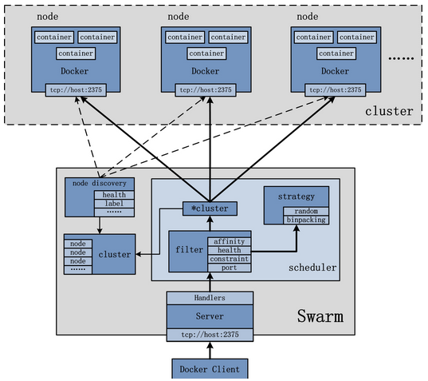

## Swarm 简介

Docker Swarm 是 Docker 公司推出的官方容器集群平台，基于 Go 语言实现，代码开源在 [https://github.com/docker/swarm](https://github.com/docker/swarm)。目前，包括 Rackspace 等平台都采用了 Swarm，用户也很容易在 AWS 等公有云平台使用 Swarm。

Swarm 的前身是 Beam 项目和 libswarm 项目，首个正式版本（Swarm V1）在 2014 年 12 月初发布。为了提高可扩展性，2016 年 2 月对架构进行重新设计，推出了 V2 版本，支持超过 1K 个节点。最新的 Docker Engine 已经集成了 SwarmKit，加强了对 Swarm 的协作支持。

作为容器集群管理器，Swarm 最大的优势之一就是 100% 支持标准的 Docker API。各种基于标准 API 的工具比如 Compose、docker-py、各种管理软件，甚至 Docker 本身等都可以很容易的与 Swarm 进行集成。这大大方便了用户将原先基于单节点的系统移植到 Swarm 上。同时 Swarm 内置了对 Docker 网络插件的支持，用户可以很容易地部署跨主机的容器集群服务。

上图是来自官方的 V1 结构图。可以看出，Swarm 是典型的 master-slave 结构，通过发现服务来选举 manager。manager 是中心管理节点，各个 node 上运行 agent 接受 manager 的统一管理。

在 V2 中，集群中会自动通过 Raft 协议分布式选举出 manager 节点，无需额外的发现服务支持，避免了单点瓶颈。同时，V2 中内置了基于 DNS 的负载均衡和对外部负载均衡机制的集成支持。

目前，Swarm V1 支持 Docker 版本为 1.6.0+，V2 支持 Docker 版本为 1.12.0+。本章将以 Swarm V1 为主进行介绍，并结合 V2 的部分最新特性。
