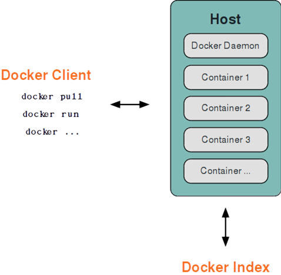

# 基本架构

Docker 采用了 `C/S`（客户端/服务端）架构，包括客户端和服务端。Docker 守护进程（`Daemon`）作为服务端接受来自客户端的请求，并处理这些请求（创建、运行、分发容器）。

客户端和服务端既可以运行在一个机器上，也可通过 `socket` 或者 `RESTful API` 来进行通信。



## 核心组件

Docker 的核心组件形成了一个层次化的架构：

```
┌─────────────────────────────────────────────────┐
│                  Docker CLI                      │
│              (docker 命令行工具)                  │
├─────────────────────────────────────────────────┤
│                   dockerd                        │
│            (Docker 守护进程/引擎)                 │
├─────────────────────────────────────────────────┤
│                  containerd                      │
│          (容器生命周期管理器)                     │
├─────────────────────────────────────────────────┤
│                    runc                          │
│           (OCI 容器运行时)                        │
└─────────────────────────────────────────────────┘
```

* **Docker CLI**：用户与 Docker 交互的命令行工具
* **dockerd**：Docker 守护进程，提供 Docker API，管理镜像、网络、存储等
* **containerd**：高级容器运行时，管理容器的完整生命周期
* **runc**：低级容器运行时，根据 OCI 规范创建和运行容器

## Docker Desktop 架构

在 macOS 和 Windows 上，Docker Desktop 使用轻量级虚拟机运行 Linux 内核：

* **macOS**：使用 Apple Hypervisor Framework 或 QEMU
* **Windows**：使用 WSL 2（推荐）或 Hyper-V

这意味着容器实际运行在虚拟机内的 Linux 环境中，而非直接运行在宿主系统上。

## Docker Engine v29 重要变化

自 Docker Engine v29 起，**Containerd 镜像存储**成为新安装的默认配置。这一变化：

* 简化了 Docker 的内部架构
* 提升了与 Kubernetes 等 containerd 平台的互操作性
* 为 Lazy Pulling 等新特性奠定基础

Docker 守护进程一般在宿主主机后台运行，等待接收来自客户端的消息。Docker 客户端则为用户提供一系列可执行命令，用户用这些命令实现跟 Docker 守护进程交互。
